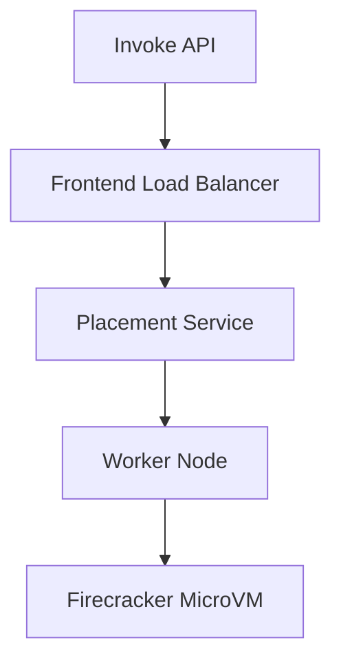

# Section 4 – AWS Lambda Architecture

## 1. Learning Objectives
* Master the internal architecture of AWS Lambda, including control/data planes and runtimes.

## 2. Introduction (with Real-World Analogy)
The Lambda architecture is like a restaurant kitchen. The Hostess (Control Plane) assigns orders, the Chefs (Data Plane) execute cooking inside isolated stations, and the Dishwasher cleans up.

## 3. Why This Topic Exists
To guarantee process isolation, security boundaries, and near-instant runtime execution scales.

## 4. Theory & Internal Mechanics
The control plane receives configurations and deploys code. The data plane manages triggers and runs code inside secure Firecracker MicroVMs using custom runtimes.

## 5. Component Flow / Architecture Diagram (Mermaid)

## 6. Commands Reference (Purpose, Syntax, Arguments, Example, Output, Production usage)
| Tool | Path | Detail |
|---|---|---|
| API | `POST /2015-03-31/functions/` | Internal Invoke API endpoint |
| AWS CLI | `aws lambda invoke` | Directly execute code |

## 7. Practical Labs (Lab 4.1 - Goal, Steps, Expected Output)
**Lab 4.1**: Trace request execution IDs using CloudWatch logging.

## 8. Real Projects / Configurations (Step-by-step setup)
**Project 4**: Setup a trace route pattern across microservice APIs.

## 9. Troubleshooting & Diagnostics (Symptom, Root Cause, Solution)
**Symptom**: Cold start latency.  
**Root Cause**: Placement service finding worker host and booting Firecracker.  
**Solution**: Pre-warm functions using Provisioned Concurrency.

## 10. Production Examples
AWS internally uses the Lambda architecture to run security checks and audit log streams for cloud services.

## 11. Best Practices
* Do not store persistent state in global runtime variables.

## 12. Interview Preparation (Q1, Q2, Q3 - QA-style)

### Q1: What are the two main planes in Lambda architecture?
*Answer*: The Control Plane (manages configurations/deployments) and the Data Plane (handles invocations/executions).

### Q2: What is the execution environment?
*Answer*: An isolated runtime environment (microVM) containing the OS, runtime (e.g. Python), and function code.

## 13. Cheat Sheet (Summary Table)
| Layer | Purpose |
|---|---|
| Firecracker | Jail isolation layer |
| Runtime | Evaluates handler code |

## 14. Assignments (Beginner and Intermediate)
* Write a summary of Firecracker microVM benefits over traditional Docker containers.

## 15. Mini Project (Practical coding/scripting task)
* Draw the data flow from an S3 bucket upload to a Lambda runtime environment.

## 16. References & Further Reading
* Firecracker Whitepaper (firecracker-microvm.github.io).
