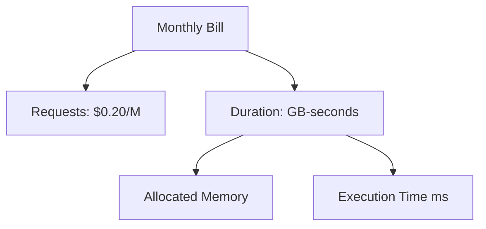

# Section 5 – Lambda Pricing

## 1. Learning Objectives
* Calculate Lambda costs using requests, memory size, and execution duration.

## 2. Introduction (with Real-World Analogy)
Lambda pricing is like paying for a cloud utility meter. You pay for the thickness of the pipe (allocated memory) multiplied by the seconds the water is running.

## 3. Why This Topic Exists
To charge users for actual computing consumed down to the millisecond, rather than charging flat hourly rates.

## 4. Theory & Internal Mechanics
Charges are based on: Total Requests ($0.20 per million) + GB-Seconds (Memory in GB multiplied by execution duration in seconds).

## 5. Component Flow / Architecture Diagram (Mermaid)

## 6. Commands Reference (Purpose, Syntax, Arguments, Example, Output, Production usage)
| Metric | Unit Price | Free Tier |
|---|---|---|
| Requests | $0.20 per million | 1 Million |
| Duration | $0.0000166667 per GB-Sec | 400,000 GB-Sec |

## 7. Practical Labs (Lab 5.1 - Goal, Steps, Expected Output)
**Lab 5.1**: Use the AWS Pricing Calculator to estimate monthly serverless API costs.

## 8. Real Projects / Configurations (Step-by-step setup)
**Project 5**: Budget model tracking cost changes when shifting memory allocation from 128MB to 1024MB.

## 9. Troubleshooting & Diagnostics (Symptom, Root Cause, Solution)
**Symptom**: Unusually high Lambda billing.  
**Root Cause**: Function got stuck in an infinite recursion loop with another service.  
**Solution**: Configure execution limits or concurrency caps.

## 10. Production Examples
A financial enterprise saved 80% on server costs by migrating their overnight batch processing engines to Lambda.

## 11. Best Practices
* Use memory tuning tools (like AWS Lambda Power Tuning) to find the sweet spot of cost vs performance.

## 12. Interview Preparation (Q1, Q2, Q3 - QA-style)

### Q1: How does memory allocation affect CPU performance in Lambda?
*Answer*: CPU scales proportionally with allocated memory. Increasing memory grants more CPU power, which can speed up execution time and decrease costs.

### Q2: What is the billing granularity of AWS Lambda?
*Answer*: 1 millisecond.

## 13. Cheat Sheet (Summary Table)
| Memory | CPU (vCPU Equivalent) |
|---|---|
| 1769 MB | 1 vCPU |
| 10240 MB | 6 vCPUs |

## 14. Assignments (Beginner and Intermediate)
* Calculate the bill for 10 million requests running for 50ms each with 512MB RAM.

## 15. Mini Project (Practical coding/scripting task)
* Configure a billing alarm on CloudWatch to monitor budget targets.

## 16. References & Further Reading
* AWS Lambda Pricing Official Page.
