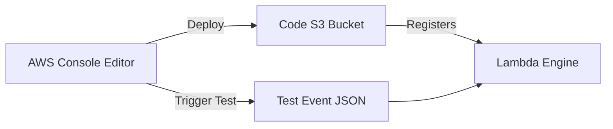

# Section 6 – Creating Lambda Function (AWS Console)

## 1. Learning Objectives
* Configure, write, deploy, and test an AWS Lambda function using the AWS Web Console interface.

## 2. Introduction (with Real-World Analogy)
Creating a function in the Console is like baking using a pre-packaged cake mix kit. Everything is visual, guided, and structured to get you cooking immediately.

## 3. Why This Topic Exists
Provides an intuitive GUI for beginners to quickly build, write code, run tests, and see immediate outputs without terminal tools.

## 4. Theory & Internal Mechanics
The console packages code edits behind the scenes, uploads them to S3, and registers the deployment artifact with the Lambda control plane.

## 5. Component Flow / Architecture Diagram (Mermaid)


## 6. Commands Reference (Purpose, Syntax, Arguments, Example, Output, Production usage)
| Step | Action | Expected Result |
|---|---|---|
| 1 | Click 'Create Function' | Configuration screen loads |
| 2 | Write code in editor | Auto-saves draft |
| 3 | Click 'Deploy' | Code version is published |

## 7. Practical Labs (Lab 6.1 - Goal, Steps, Expected Output)
**Lab 6.1**: Create your first 'Author from scratch' Python function and configure a test payload.

## 8. Real Projects / Configurations (Step-by-step setup)
**Project 6**: Deploy a calculator backend that evaluates basic arithmetic inputs from the test console.

## 9. Troubleshooting & Diagnostics (Symptom, Root Cause, Solution)
**Symptom**: 'Changes not deployed' warning.  
**Root Cause**: Code was edited but the 'Deploy' button was not clicked.  
**Solution**: Click 'Deploy' before executing the test event.

## 10. Production Examples
Developers use the AWS Console for rapid prototyping before writing Infrastructure-as-Code scripts.

## 11. Best Practices
* Use the console only for testing and debugging, not for deploying production enterprise systems.

## 12. Interview Preparation (Q1, Q2, Q3 - QA-style)

### Q1: Can you edit code directly in the AWS Console for all deployment package types?
*Answer*: No. Direct editing is only available for packages under 3MB and functions not deployed as container images.

### Q2: What is a test event?
*Answer*: A custom JSON object that mimics the event structure of real event triggers (like S3 or API Gateway).

## 13. Cheat Sheet (Summary Table)
| Feature | Default Location |
|---|---|
| Console Code Editor | Under 'Code' tab |
| Environment Variables | Configuration -> Environment variables |

## 14. Assignments (Beginner and Intermediate)
* Create a function in the console, add an environment variable, and verify it prints in execution logs.

## 15. Mini Project (Practical coding/scripting task)
* Build and run a test suite in the console with 3 distinct JSON input payloads.

## 16. References & Further Reading
* AWS Console Documentation.


---

### Original Preserved Section Code & Configurations

  ```python
  import json
  import os

  def lambda_handler(event, context):
      env = os.environ.get('APP_ENV', 'production')
      return {
          'statusCode': 200,
          'body': json.dumps({
              'status': 'Connected',
              'environment': env
          })
      }
  ```

