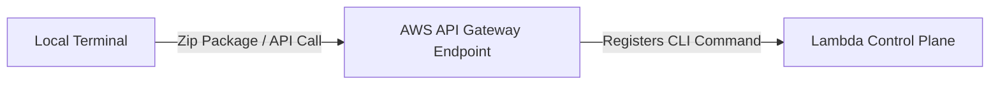

# Section 7 – Creating Lambda using AWS CLI

## 1. Learning Objectives
* Create, package, deploy, update, and invoke Lambda functions from the command line using AWS CLI.

## 2. Introduction (with Real-World Analogy)
Using the CLI is like using a professional command terminal. Instead of clicking buttons, you issue precise commands to orchestrate deployments instantly.

## 3. Why This Topic Exists
To automate deployments, script pipeline jobs, and enable infrastructure management without manual clicks.

## 4. Theory & Internal Mechanics
The CLI maps text commands to AWS REST APIs, transfers zip packages to AWS, and returns JSON-formatted API responses.

## 5. Component Flow / Architecture Diagram (Mermaid)


## 6. Commands Reference (Purpose, Syntax, Arguments, Example, Output, Production usage)
| Action | CLI Command |
|---|---|
| Create | `aws lambda create-function --function-name MyFunc --runtime python3.12 --role arn... --handler lambda_function.lambda_handler --zip-file fileb://function.zip` |
| Update | `aws lambda update-function-code --function-name MyFunc --zip-file fileb://function.zip` |
| Invoke | `aws lambda invoke --function-name MyFunc --payload '{"key":"val"}' output.json` |

## 7. Practical Labs (Lab 7.1 - Goal, Steps, Expected Output)
**Lab 7.1**: Write a local bash script to zip, deploy, and invoke a Python Lambda function automatically.

## 8. Real Projects / Configurations (Step-by-step setup)
**Project 7**: Build a command-line deployment pipeline script that updates your Lambda code and checks status.

## 9. Troubleshooting & Diagnostics (Symptom, Root Cause, Solution)
**Symptom**: `InvalidParameterValueException` on `--zip-file`.  
**Root Cause**: Missing the `fileb://` prefix required for binary uploads.  
**Solution**: Prepend `fileb://` to the local zip file path.

## 10. Production Examples
CI/CD pipeline scripts (e.g. GitHub Actions, Jenkins) use the AWS CLI to deploy code to production stages.

## 11. Best Practices
* Always configure credentials securely using environment variables or IAM roles, never hardcode them.

## 12. Interview Preparation (Q1, Q2, Q3 - QA-style)

### Q1: What does the fileb:// prefix represent in the AWS CLI?
*Answer*: It indicates that the file must be read as raw binary data rather than text format, which is required for zip archives.

### Q2: How do you direct CLI console logs to stdout during invocation?
*Answer*: Use the `--log-type Tail` parameter and decode the Base64 response output.

## 13. Cheat Sheet (Summary Table)
| CLI Argument | Meaning |
|---|---|
| `--handler` | File name and entry method (`file.method`) |
| `--role` | IAM execution role ARN |

## 14. Assignments (Beginner and Intermediate)
* Create a script that lists all regional functions and filters the names to a text file.

## 15. Mini Project (Practical coding/scripting task)
* Build an automated CLI cleanup script that deletes a specified list of testing functions.

## 16. References & Further Reading
* AWS CLI Lambda Command Reference.


---

### Original Preserved Section Code & Configurations

```bash
aws lambda create-function \
    --function-name CLIProductFetcher \
    --runtime python3.12 \
    --role arn:aws:iam::123456789012:role/MyLambdaExecutionRole \
    --handler lambda_function.lambda_handler \
    --zip-file fileb://function.zip \
    --timeout 10 \
    --memory-size 256
```

```bash
aws lambda update-function-code \
    --function-name CLIProductFetcher \
    --zip-file fileb://function_v2.zip
```

```bash
aws lambda invoke \
    --function-name CLIProductFetcher \
    --payload '{"productId": "prod-1002"}' \
    --cli-binary-format raw-in-base64-out \
    output.json
```

```bash
aws lambda delete-function \
    --function-name CLIProductFetcher
```

