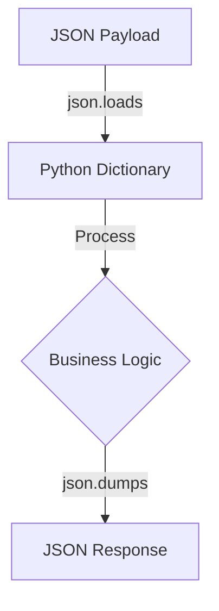

# Section 8 – Python Basics for Lambda

## 1. Learning Objectives
* Master essential Python syntax, imports, dictionary structures, and exception handlers for Lambda.

## 2. Introduction (with Real-World Analogy)
Python syntax is like writing instructions in plain English. Dicts are like catalog indexes, and try-except blocks are safety nets for when things break.

## 3. Why This Topic Exists
Python is the most popular language for serverless due to its fast startup times, readability, and rich AWS SDK support (`boto3`).

## 4. Theory & Internal Mechanics
The Python interpreter evaluates files, loads imported libraries, parses JSON payloads into dictionary formats, and executes handler functions.

## 5. Component Flow / Architecture Diagram (Mermaid)


## 6. Commands Reference (Purpose, Syntax, Arguments, Example, Output, Production usage)
| Code Syntax | Purpose | Example |
|---|---|---|
| `import json` | Load JSON manipulation tools | `import json` |
| `dict.get()` | Fetch key safely without throwing errors | `event.get('key', 'default')` |

## 7. Practical Labs (Lab 8.1 - Goal, Steps, Expected Output)
**Lab 8.1**: Write a script that parses a complex JSON dictionary and handles missing keys safely.

## 8. Real Projects / Configurations (Step-by-step setup)
**Project 8**: Develop a local Python script simulating Lambda payload transformations.

## 9. Troubleshooting & Diagnostics (Symptom, Root Cause, Solution)
**Symptom**: `KeyError` crashes function runtime.  
**Root Cause**: Directly accessing keys (e.g. `event['key']`) that do not exist in the payload.  
**Solution**: Use `event.get('key')` to provide a fallback default.

## 10. Production Examples
Developers write lightweight Python handlers to validate incoming REST payloads before forwarding them to databases.

## 11. Best Practices
* Keep your runtime dependencies minimal. Use standard library modules whenever possible.

## 12. Interview Preparation (Q1, Q2, Q3 - QA-style)

### Q1: Why is python.get() preferred over dict indexing in Lambda?
*Answer*: It prevents KeyError crashes by returning None or a fallback default if the key is missing from the event.

### Q2: What library is used to interact with AWS services in Python?
*Answer*: boto3.

## 13. Cheat Sheet (Summary Table)
| Method | Input | Output |
|---|---|---|
| `json.loads(str)` | JSON String | Dict |
| `json.dumps(dict)` | Dict | JSON String |

## 14. Assignments (Beginner and Intermediate)
* Create a dictionary containing list configurations, modify values, and output as a JSON string.

## 15. Mini Project (Practical coding/scripting task)
* Write a payload validator function that checks if 'email' is present and valid.

## 16. References & Further Reading
* Python Documentation (python.org).


---

### Original Preserved Section Code & Configurations

```python
import json
import os
import math

item_count = 15                  # Integer
unit_price = 5.99                # Float
product_name = "Premium Apple"   # String
is_in_stock = True               # Boolean
```

```python
# Lists (Arrays)
categories = ["Fruits", "Vegetables", "Organic"]

# Dictionary (Key-Value)
payload = {
    "item_id": "item-901",
    "quantity": 3
}

# Convert JSON string to Python Dictionary
json_data = '{"user": "nishu", "age": 28}'
parsed_data = json.loads(json_data)
user = parsed_data["user"]

# Convert Dictionary to JSON string
raw_payload = json.dumps(payload)
```

```python
if unit_price > 10.0:
    tax_rate = 0.15
else:
    tax_rate = 0.08

for category in categories:
    print(f"Processing category: {category}")
```

```python
import logging
logger = logging.getLogger()
logger.setLevel(logging.INFO)

try:
    value = payload["missing_key"]
except KeyError as e:
    logger.error(f"Missing required parameter: {str(e)}")
```

