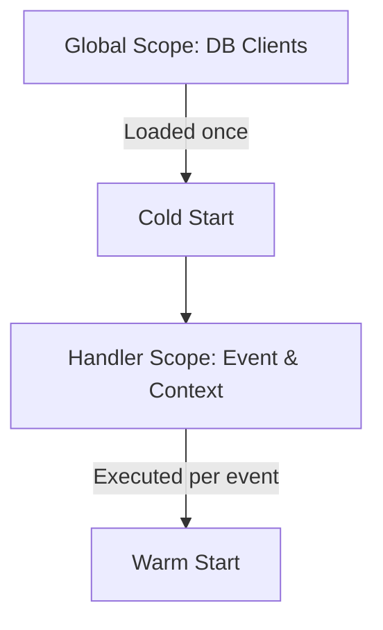

# Section 9 – Lambda Function Structure

## 1. Learning Objectives
* Understand the entrypoint handler, event/context parameters, and global vs local initialization scoping.

## 2. Introduction (with Real-World Analogy)
The Lambda structure is like an office workspace. The global scope is the desk drawer (items are kept ready to use), and the local handler is your notebook (opened and thrown away per task).

## 3. Why This Topic Exists
Defines a strict contract between the AWS execution environment and user code to enable event routing and execution trace tracking.

## 4. Theory & Internal Mechanics
AWS invokes the handler method. The event parameter holds event data. The context parameter provides runtime metadata (request ID, remaining time). Global variables persist across warm starts.

## 5. Component Flow / Architecture Diagram (Mermaid)


## 6. Commands Reference (Purpose, Syntax, Arguments, Example, Output, Production usage)
| Variable | Type | Purpose |
|---|---|---|
| `event` | `dict` / `list` | Holds the trigger event payload |
| `context` | `LambdaContext` | Provides runtime metadata and timeout info |

## 7. Practical Labs (Lab 9.1 - Goal, Steps, Expected Output)
**Lab 9.1**: Write a function that logs the remaining execution time before timeout using `context.get_remaining_time_in_millis()`.

## 8. Real Projects / Configurations (Step-by-step setup)
**Project 9**: Build a connection recycler that instantiates a database client globally.

## 9. Troubleshooting & Diagnostics (Symptom, Root Cause, Solution)
**Symptom**: Database connection pools leak or exhaust in warm cycles.  
**Root Cause**: Creating a new database client instance inside the handler function instead of globally.  
**Solution**: Instantiate the database client in the global scope.

## 10. Production Examples
Enterprise APIs declare clients globally to reuse TCP connections, improving latency.

## 11. Best Practices
* Always initialize logging and heavyweight SDK clients (like boto3) in the global scope.

## 12. Interview Preparation (Q1, Q2, Q3 - QA-style)

### Q1: What happens to global variables during subsequent Lambda invocations?
*Answer*: They are preserved during warm starts, allowing state recycling (e.g. database client reuse).

### Q2: What does context.get_remaining_time_in_millis() return?
*Answer*: The remaining execution time before the function will be terminated due to timeout.

## 13. Cheat Sheet (Summary Table)
| Context Property | Description |
|---|---|
| `aws_request_id` | Unique UUID for the execution |
| `log_stream_name` | CloudWatch log destination |

## 14. Assignments (Beginner and Intermediate)
* Write a mock lambda script that prints all available properties of the context object.

## 15. Mini Project (Practical coding/scripting task)
* Build an execution logger tracking function durations over 5 consecutive local runs.

## 16. References & Further Reading
* AWS Lambda Context Interface specifications.


---

### Original Preserved Section Code & Configurations

```python
import json
import logging

# Instantiate heavy clients globally for warm start reusability
logger = logging.getLogger()
logger.setLevel(logging.INFO)

def lambda_handler(event, context):
    """
    Core Lambda Entrypoint.
    
    :param event: The JSON event trigger payload (dict)
    :param context: Runtime context helper object (instance of LambdaContext)
    :return: Return values or status responses
    """
    logger.info("Executing function handler execution...")
    
    # Extract Request Metadata from context
    request_id = context.aws_request_id
    remaining_time = context.get_remaining_time_in_millis()
    
    logger.info(f"Request ID: {request_id} | Remaining Execution Window: {remaining_time}ms")
    
    # Access Event Payload
    user_name = event.get('name', 'Guest')
    
    response = {
        'message': f"Hello, {user_name}!",
        'request_id': request_id
    }
    
    return {
        'statusCode': 200,
        'body': json.dumps(response)
    }
```

