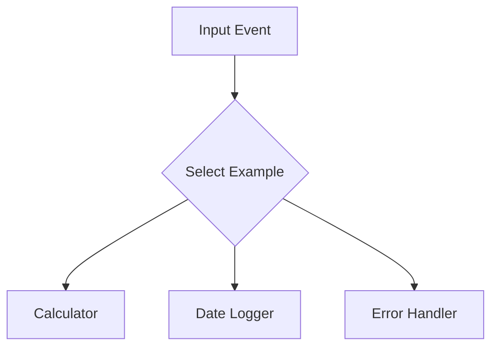

# Section 10 – Python Lambda Examples

## 1. Learning Objectives
* Write baseline Lambda implementations for basic computations, headers, and status code formatting.

## 2. Introduction (with Real-World Analogy)
These basic examples are like learning scale exercises on an instrument. They build the muscle memory required for complex orchestration.

## 3. Why This Topic Exists
Provides quick templates for common operations: mathematical formulas, text parsing, logging, and error validation.

## 4. Theory & Internal Mechanics
The runtime imports standard libraries, executes logic pathways, traps errors, and returns structured API Gateway responses.

## 5. Component Flow / Architecture Diagram (Mermaid)


## 6. Commands Reference (Purpose, Syntax, Arguments, Example, Output, Production usage)
| Output Field | Purpose | Example |
|---|---|---|
| `statusCode` | HTTP status response code | `200` |
| `body` | JSON string representation of body payload | `'{"status": "ok"}'` |

## 7. Practical Labs (Lab 10.1 - Goal, Steps, Expected Output)
**Lab 10.1**: Build a math evaluation handler returning calculated responses.

## 8. Real Projects / Configurations (Step-by-step setup)
**Project 10**: Deploy a suite of test scripts verifying output mappings.

## 9. Troubleshooting & Diagnostics (Symptom, Root Cause, Solution)
**Symptom**: API Gateway throws 502 Bad Gateway.  
**Root Cause**: Lambda did not return a dictionary containing `statusCode` and `body` as strings.  
**Solution**: Ensure you return a dict with `'statusCode'` and `'body'` keys (stringified).

## 10. Production Examples
Production microservices utilize structured response formats to match front-end client schemas.

## 11. Best Practices
* Always return stringified JSON inside the response body payload.

## 12. Interview Preparation (Q1, Q2, Q3 - QA-style)

### Q1: What fields must a Lambda return when integrated with API Gateway Proxy?
*Answer*: A dictionary containing at least 'statusCode' (integer) and 'body' (string).

### Q2: How do you handle exceptions inside a Lambda function?
*Answer*: Wrap code in try-except blocks and return appropriate HTTP status codes (e.g. 400 for input errors, 500 for backend faults).

## 13. Cheat Sheet (Summary Table)
| Code | Status | Meaning |
|---|---|---|
| 200 | OK | Successful operation |
| 400 | Bad Request | Input validation failure |
| 500 | Server Error | Internal code execution exception |

## 14. Assignments (Beginner and Intermediate)
* Write a function that calculates total interest on a loan using inputs from the event payload.

## 15. Mini Project (Practical coding/scripting task)
* Design a user validation microservice checking email format and age eligibility.

## 16. References & Further Reading
* API Gateway Proxy Integration specs.


---

### Original Preserved Section Code & Configurations

```python
def lambda_handler(event, context):
    return "Hello World"
```

```python
import json

def lambda_handler(event, context):
    num_a = event.get('a', 0)
    num_b = event.get('b', 0)
    result = num_a + num_b
    return {
        "statusCode": 200,
        "body": json.dumps({"sum": result})
    }
```

```python
def lambda_handler(event, context):
    name = event.get('name', 'User')
    return f"Hello {name}"
```

```python
from datetime import datetime

def lambda_handler(event, context):
    return {
        "timestamp": datetime.utcnow().isoformat() + "Z"
    }
```

```python
import random

def lambda_handler(event, context):
    low = event.get('min', 1)
    high = event.get('max', 100)
    number = random.randint(low, high)
    return {
        "number": number
    }
```

```python
import os

def lambda_handler(event, context):
    environment = os.environ.get('ENVIRONMENT_NAME', 'development')
    return {
        "env": environment
    }
```

```python
import json

def lambda_handler(event, context):
    email = event.get('email')
    if not email:
        return {
            "statusCode": 400,
            "body": json.dumps({"error": "Missing parameter: email"})
        }
    return {
        "statusCode": 200,
        "body": json.dumps({"status": "Authorized"})
    }
```

```python
import logging

logger = logging.getLogger()
logger.setLevel(logging.INFO)

def lambda_handler(event, context):
    logger.info("Executing function initialization tasks")
    logger.warning("Resource warnings detected during runtime execution")
    return "Logs successfully dispatched"
```

