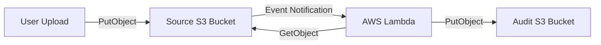

# Section 11 – Lambda with S3

## 1. Learning Objectives
* Process file upload events from Amazon S3, read object data, and write reports using boto3.

## 2. Introduction (with Real-World Analogy)
Lambda with S3 is like an automated sorting clerk. When a box (file) is placed on the shelf (S3 bucket), it triggers an alert (S3 event). The clerk (Lambda) opens the box, logs contents, and files a report.

## 3. Why This Topic Exists
Enables real-time serverless file processing (e.g. media resizing, CSV imports, data audits) immediately upon file arrival.

## 4. Theory & Internal Mechanics
S3 dispatches an event configuration JSON containing bucket details and file keys. Lambda retrieves the object via API call and processes the content.

## 5. Component Flow / Architecture Diagram (Mermaid)


## 6. Commands Reference (Purpose, Syntax, Arguments, Example, Output, Production usage)
| Command | Action | Example |
|---|---|---|
| `s3.get_object` | Fetch file contents | `s3.get_object(Bucket=b, Key=k)` |
| `s3.put_object` | Write file content | `s3.put_object(Bucket=b, Key=k, Body=d)` |

## 7. Practical Labs (Lab 11.1 - Goal, Steps, Expected Output)
**Lab 11.1**: Deploy a function that triggers on S3 uploads, parses file metadata, and logs file sizes.

## 8. Real Projects / Configurations (Step-by-step setup)
**Project 11**: Build an automated text log aggregator that writes summary reports to an S3 bucket.

## 9. Troubleshooting & Diagnostics (Symptom, Root Cause, Solution)
**Symptom**: `AccessDenied` on `get_object`.  
**Root Cause**: The function's IAM execution role lacks `s3:GetObject` permission.  
**Solution**: Add S3 read policies to the function's execution role.

## 10. Production Examples
Media platforms (like Instagram or YouTube) trigger Lambda on video upload to transcode formats and build thumbnails.

## 11. Best Practices
* Avoid writing logs or processed files back to the *same* bucket without key filters to prevent infinite triggering loops.

## 12. Interview Preparation (Q1, Q2, Q3 - QA-style)

### Q1: What happens if a Lambda triggers on S3 uploads and writes back to the same bucket?
*Answer*: It can trigger an infinite invocation loop, generating high AWS charges. Fix it by writing to a different bucket or filtering by prefix/suffix.

### Q2: How does Lambda receive the S3 file path?
*Answer*: Via the 'Records' array inside the event parameter (extracting bucket name and object key).

## 13. Cheat Sheet (Summary Table)
| Event Field Path | Meaning |
|---|---|
| `Records[0].s3.bucket.name` | Triggering bucket name |
| `Records[0].s3.object.key` | File path key |

## 14. Assignments (Beginner and Intermediate)
* Write a script that validates file extensions (only allowing .png) before processing.

## 15. Mini Project (Practical coding/scripting task)
* Build an image metadata parser reporting image resolutions to an audit file.

## 16. References & Further Reading
* Using AWS Lambda with Amazon S3 Developer Guide.


---

### Original Preserved Section Code & Configurations

```python
import json
import urllib.parse
import boto3
import logging

logger = logging.getLogger()
logger.setLevel(logging.INFO)

s3_client = boto3.client('s3')

def lambda_handler(event, context):
    # 1. Parse bucket and file keys from S3 trigger event
    bucket = event['Records'][0]['s3']['bucket']['name']
    key = urllib.parse.unquote_plus(event['Records'][0]['s3']['object']['key'], encoding='utf-8')
    
    try:
        # 2. Get Object from S3
        response = s3_client.get_object(Bucket=bucket, Key=key)
        size_bytes = response['ContentLength']
        content_type = response['ContentType']
        
        logger.info(f"File processed: Bucket: {bucket} | Key: {key} | Size: {size_bytes} bytes | Type: {content_type}")
        
        # 3. Create Audit report dictionary
        audit_payload = {
            "source_bucket": bucket,
            "filename": key,
            "file_size": size_bytes,
            "content_type": content_type,
            "status": "PROCESSED_SUCCESSFULLY"
        }
        
        # 4. Upload summary to target audit bucket
        target_bucket = f"{bucket}-audit-logs"
        target_key = f"audit-{key}.json"
        
        s3_client.put_object(
            Bucket=target_bucket,
            Key=target_key,
            Body=json.dumps(audit_payload, indent=2),
            ContentType='application/json'
        )
        logger.info(f"Audit log saved: {target_bucket}/{target_key}")
        
        return {
            'statusCode': 200,
            'body': json.dumps('S3 Event processed successfully')
        }
        
    except Exception as e:
        logger.error(f"Error handling S3 object: {str(e)}")
        raise e
```

