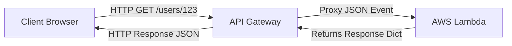

# Section 12 – Lambda with API Gateway

## 1. Learning Objectives
* Build RESTful APIs with AWS Lambda and Amazon API Gateway Proxy Integration.

## 2. Introduction (with Real-World Analogy)
API Gateway is like a front-desk receptionist. They receive the visitor (HTTP request), translate details into a standard form (JSON event), pass it to the back office (Lambda), and deliver the reply.

## 3. Why This Topic Exists
To expose Lambda functions as public HTTP endpoints, enabling web and mobile applications to trigger backend logic.

## 4. Theory & Internal Mechanics
API Gateway receives HTTP requests, packs request details into a JSON object, invokes the Lambda, and translates the response dict back to the user.

## 5. Component Flow / Architecture Diagram (Mermaid)


## 6. Commands Reference (Purpose, Syntax, Arguments, Example, Output, Production usage)
| Field | Purpose | Example |
|---|---|---|
| `httpMethod` | HTTP Verb executed | `'GET', 'POST', 'DELETE'` |
| `pathParameters` | URL path path variables | `{'userId': '123'}` |
| `queryStringParameters` | URL query parameters | `{'q': 'search_term'}` |

## 7. Practical Labs (Lab 12.1 - Goal, Steps, Expected Output)
**Lab 12.1**: Set up a REST API Gateway proxying to a greeting Lambda function.

## 8. Real Projects / Configurations (Step-by-step setup)
**Project 12**: Design a mock product database API mapping GET/POST verbs to logical handlers.

## 9. Troubleshooting & Diagnostics (Symptom, Root Cause, Solution)
**Symptom**: `502 Bad Gateway` error.  
**Root Cause**: The Lambda response did not match the API Gateway structure requirement.  
**Solution**: Ensure you return a dict with `statusCode` (int) and `body` (string).

## 10. Production Examples
Organizations host entire serverless web applications using API Gateway linked to Python Lambda microservices.

## 11. Best Practices
* Enable CORS in the Lambda response headers to allow web frontend client connections.

## 12. Interview Preparation (Q1, Q2, Q3 - QA-style)

### Q1: What is the difference between Proxy and Custom API Gateway integration?
*Answer*: Proxy integration sends the raw HTTP request details as-is to Lambda. Custom integration allows mapping and transforming requests before invoking the function.

### Q2: What is the maximum timeout limit of API Gateway?
*Answer*: 29 seconds. Even if Lambda runs longer, API Gateway will close the connection.

## 13. Cheat Sheet (Summary Table)
| Required Header Key | Value | Reason |
|---|---|---|
| `Access-Control-Allow-Origin` | `'*'` | Enable CORS |

## 14. Assignments (Beginner and Intermediate)
* Create a function that checks query parameters and returns a 400 status code if a required query key is missing.

## 15. Mini Project (Practical coding/scripting task)
* Build an API Gateway gateway configuration serving user product search queries.

## 16. References & Further Reading
* API Gateway Developer Guide.


---

### Original Preserved Section Code & Configurations

```python
import json
import logging

logger = logging.getLogger()
logger.setLevel(logging.INFO)

def lambda_handler(event, context):
    logger.info("Parsing incoming API HTTP request event")
    
    # Extract headers and request context
    method = event.get('httpMethod', 'GET')
    path_parameters = event.get('pathParameters') or {}
    query_parameters = event.get('queryStringParameters') or {}
    
    # Get user identifier
    user_id = path_parameters.get('userId', 'anonymous')
    search_query = query_parameters.get('q', 'all')
    
    # Read POST payload if present
    post_payload = {}
    if method == 'POST' and event.get('body'):
        try:
            post_payload = json.loads(event['body'])
        except Exception as e:
            return {
                'statusCode': 400,
                'headers': {'Content-Type': 'application/json'},
                'body': json.dumps({'error': 'Malformed JSON payload'})
            }
            
    response_body = {
        "status": "SUCCESS",
        "userId": user_id,
        "searchQuery": search_query,
        "requestMethod": method,
        "parsedPayload": post_payload
    }
    
    return {
        'statusCode': 200,
        'headers': {
            'Content-Type': 'application/json',
            'Access-Control-Allow-Origin': '*' # Enable CORS for browser clients
        },
        'body': json.dumps(response_body)
    }
```

