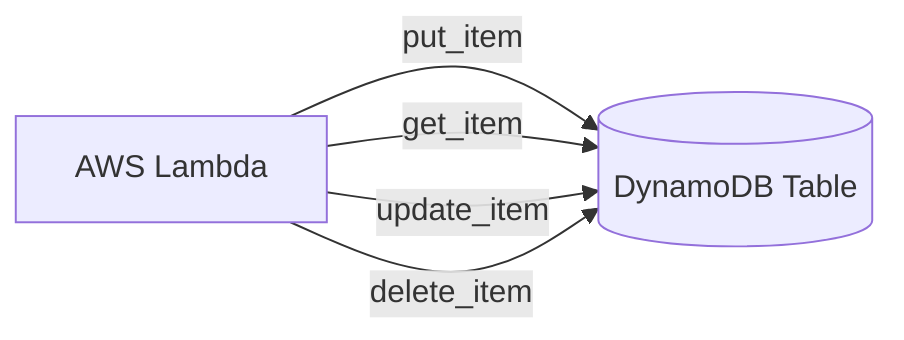

# Section 13 – Lambda with DynamoDB

## 1. Learning Objectives
* Execute CRUD database operations on DynamoDB tables from inside Lambda using boto3.

## 2. Introduction (with Real-World Analogy)
DynamoDB is like a digital filing cabinet. Lambda is the clerk who walks over, reads files (GetItem), writes new files (PutItem), or removes old folders (DeleteItem).

## 3. Why This Topic Exists
Provides a serverless, highly performant, and automatically scalable database companion to FaaS compute functions.

## 4. Theory & Internal Mechanics
The boto3 library executes DynamoDB actions over HTTPS. Records are structured as key-value JSON documents. Scaling limits are managed via throughput allocations.

## 5. Component Flow / Architecture Diagram (Mermaid)


## 6. Commands Reference (Purpose, Syntax, Arguments, Example, Output, Production usage)
| Boto3 Method | Action | Example |
|---|---|---|
| `table.put_item` | Write a record | `table.put_item(Item={'userId': '1'})` |
| `table.get_item` | Read a record | `table.get_item(Key={'userId': '1'})` |
| `table.delete_item` | Remove a record | `table.delete_item(Key={'userId': '1'})` |

## 7. Practical Labs (Lab 13.1 - Goal, Steps, Expected Output)
**Lab 13.1**: Create a DynamoDB table and build a Lambda function that registers user signups.

## 8. Real Projects / Configurations (Step-by-step setup)
**Project 13**: Build a CRUD API backend processing catalog items with error recovery.

## 9. Troubleshooting & Diagnostics (Symptom, Root Cause, Solution)
**Symptom**: `ResourceNotFoundException`.  
**Root Cause**: The DynamoDB table name configured in the Lambda variable does not exist.  
**Solution**: Create the table or update the environment variable.

## 10. Production Examples
Airbnb uses DynamoDB and Lambda to capture user listings and catalog edits in real time.

## 11. Best Practices
* Define table client instances globally to recycle database connections during warm starts.

## 12. Interview Preparation (Q1, Q2, Q3 - QA-style)

### Q1: How do you handle DynamoDB errors in boto3?
*Answer*: Wrap actions in try-except blocks, importing ClientError from botocore.exceptions to parse database exceptions.

### Q2: What is a Partition Key in DynamoDB?
*Answer*: The primary hash key used to distribute data items across physical partitions.

## 13. Cheat Sheet (Summary Table)
| Action | boto3 Resource Method |
|---|---|
| Write | `table.put_item(Item=...)` |
| Read | `table.get_item(Key=...)` |

## 14. Assignments (Beginner and Intermediate)
* Write a Lambda function that queries DynamoDB items and returns the total item count.

## 15. Mini Project (Practical coding/scripting task)
* Build an inventory tracker update handler adjusting item stock levels.

## 16. References & Further Reading
* Boto3 DynamoDB API Reference.


---

### Original Preserved Section Code & Configurations

```python
import json
import os
import boto3
from botocore.exceptions import ClientError
import logging

logger = logging.getLogger()
logger.setLevel(logging.INFO)

TABLE_NAME = os.environ.get('USERS_TABLE', 'UsersTable')
dynamodb_resource = boto3.resource('dynamodb')
table = dynamodb_resource.Table(TABLE_NAME)

def lambda_handler(event, context):
    # Parse transaction request
    action = event.get('action')
    user_id = event.get('userId')
    
    if not action or not user_id:
        return {
            'statusCode': 400,
            'body': json.dumps({'error': 'Missing parameters: action and userId'})
        }
        
    try:
        if action == 'CREATE':
            name = event.get('name', 'N/A')
            email = event.get('email', 'N/A')
            table.put_item(
                Item={
                    'userId': user_id,
                    'name': name,
                    'email': email,
                    'status': 'ACTIVE'
                }
            )
            return {'statusCode': 201, 'body': json.dumps('User added successfully')}
            
        elif action == 'READ':
            response = table.get_item(Key={'userId': user_id})
            user_data = response.get('Item')
            if not user_data:
                return {'statusCode': 404, 'body': json.dumps({'error': 'User record not found'})}
            return {'statusCode': 200, 'body': json.dumps(user_data)}
            
        elif action == 'UPDATE':
            new_email = event.get('email')
            if not new_email:
                return {'statusCode': 400, 'body': json.dumps('Missing email parameter')}
            
            table.update_item(
                Key={'userId': user_id},
                UpdateExpression="set email = :val",
                ExpressionAttributeValues={':val': new_email},
                ReturnValues="UPDATED_NEW"
            )
            return {'statusCode': 200, 'body': json.dumps('User record updated')}
            
        elif action == 'DELETE':
            table.delete_item(Key={'userId': user_id})
            return {'statusCode': 200, 'body': json.dumps('User record deleted')}
            
        else:
            return {'statusCode': 400, 'body': json.dumps(f'Unsupported action operation: {action}')}
            
    except ClientError as e:
        logger.error(f"DynamoDB transaction failed: {e.response['Error']['Message']}")
        return {
            'statusCode': 500,
            'body': json.dumps({'error': 'Database transaction error occurred'})
        }
```

