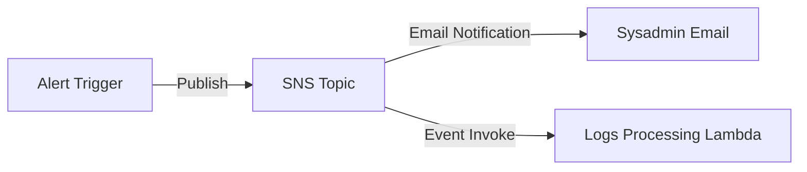

# Section 14 – Lambda with SNS

## 1. Learning Objectives
* Publish messages to SNS Topics and trigger Lambda execution in response to SNS notifications.

## 2. Introduction (with Real-World Analogy)
SNS is like a public loudspeaker. A service (or Lambda) talks into the microphone (publishes to SNS), and multiple listeners (emails, other Lambdas) hear and react.

## 3. Why This Topic Exists
Provides pub/sub messaging patterns to decouple services and broadcast messages to multiple consumers simultaneously.

## 4. Theory & Internal Mechanics
Lambda calls the SNS client to publish. Alternatively, SNS invokes the Lambda synchronously, passing the message payload within the event records.

## 5. Component Flow / Architecture Diagram (Mermaid)


## 6. Commands Reference (Purpose, Syntax, Arguments, Example, Output, Production usage)
| Boto3 Method | Purpose | Example |
|---|---|---|
| `sns.publish` | Send message to topic | `sns.publish(TopicArn=arn, Message=msg, Subject=sub)` |

## 7. Practical Labs (Lab 14.1 - Goal, Steps, Expected Output)
**Lab 14.1**: Set up an SNS topic, subscribe an email address, and write a Lambda that publishes system alerts.

## 8. Real Projects / Configurations (Step-by-step setup)
**Project 14**: Build an emergency alert broadcast system dispatching server outages.

## 9. Troubleshooting & Diagnostics (Symptom, Root Cause, Solution)
**Symptom**: Email alerts are not received.  
**Root Cause**: The recipient email address has not clicked the 'Confirm Subscription' link in their inbox.  
**Solution**: Confirm the SNS subscription via the received email.

## 10. Production Examples
Monitoring platforms publish system alarms to SNS topics, which call Lambdas to dispatch alerts to Slack channels.

## 11. Best Practices
* Avoid publishing large data packages to SNS. Store details in S3 and pass the file path instead.

## 12. Interview Preparation (Q1, Q2, Q3 - QA-style)

### Q1: What is the difference between SQS and SNS?
*Answer*: SNS is a pub/sub system (push messaging to many). SQS is a queue system (pull messaging, one consumer per message).

### Q2: How does Lambda receive an SNS payload?
*Answer*: Through the event parameter under the path event['Records'][0]['Sns']['Message'].

## 13. Cheat Sheet (Summary Table)
| SNS Parameter | Required | Purpose |
|---|---|---|
| `TopicArn` | Yes | Target topic destination |
| `Message` | Yes | Body content payload |

## 14. Assignments (Beginner and Intermediate)
* Create a script that parses event severity and only publishes to SNS if the status matches 'CRITICAL'.

## 15. Mini Project (Practical coding/scripting task)
* Build a central notification dispatcher forwarding alert formats to administrative emails.

## 16. References & Further Reading
* Amazon SNS developer documentation.


---

### Original Preserved Section Code & Configurations

```python
import json
import os
import boto3
import logging

logger = logging.getLogger()
logger.setLevel(logging.INFO)

sns = boto3.client('sns')
SNS_TOPIC_ARN = os.environ.get('SNS_TOPIC_ARN')

def lambda_handler(event, context):
    logger.info("Parsing event error details...")
    
    # Extract error payload
    source = event.get('source', 'ApplicationEngine')
    error_msg = event.get('error', 'Execution pipeline failure.')
    severity = event.get('severity', 'CRITICAL')
    
    subject = f"[{severity} ALERT] System Failure in {source}"
    message_body = (
        f"Alert: Critical system exception triggered.\n\n"
        f"- Source Component: {source}\n"
        f"- Error Message: {error_msg}\n"
        f"- Request ID: {context.aws_request_id}\n\n"
        f"Check CloudWatch Log Streams immediately."
    )
    
    try:
        response = sns.publish(
            TopicArn=SNS_TOPIC_ARN,
            Message=message_body,
            Subject=subject
        )
        logger.info(f"Published alert to SNS. Message ID: {response['MessageId']}")
        return {
            'statusCode': 200,
            'body': json.dumps('Alert sent successfully')
        }
    except Exception as e:
        logger.error(f"SNS Publish failed: {str(e)}")
        return {
            'statusCode': 500,
            'body': json.dumps('Alert routing failure')
        }
```

