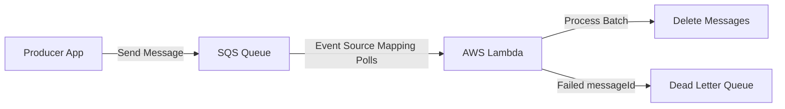

# Section 15 – Lambda with SQS

## 1. Learning Objectives
* Integrate Lambda with Amazon SQS to process message queues and handle partial batch failures.

## 2. Introduction (with Real-World Analogy)
SQS is like a post office inbox. Mail arrives (messages are queued). The mail carrier (Lambda) takes a batch of envelopes, opens them, and processes the mail.

## 3. Why This Topic Exists
To queue tasks, buffer traffic spikes, decouple microservices, and ensure asynchronous processing reliability.

## 4. Theory & Internal Mechanics
An Event Source Mapping polls SQS. It invokes Lambda with batches of messages. Lambda processes items and returns failures using batchItemFailures.

## 5. Component Flow / Architecture Diagram (Mermaid)


## 6. Commands Reference (Purpose, Syntax, Arguments, Example, Output, Production usage)
| Config Option | Purpose | Minimum Value |
|---|---|---|
| `BatchSize` | Max records polled per invocation | 1 (Max: 10,000) |
| `VisibilityTimeout` | Time message is locked during execution | 6x Lambda Timeout |

## 7. Practical Labs (Lab 15.1 - Goal, Steps, Expected Output)
**Lab 15.1**: Build a queue consumer that parses order details and handles malformed payloads using partial batch failure returns.

## 8. Real Projects / Configurations (Step-by-step setup)
**Project 15**: Build a transaction processing workflow queue routing failures to a Dead Letter Queue (DLQ).

## 9. Troubleshooting & Diagnostics (Symptom, Root Cause, Solution)
**Symptom**: SQS messages are processed multiple times.  
**Root Cause**: Queue visibility timeout is shorter than the function's execution time, allowing other pollers to lock the message.  
**Solution**: Increase visibility timeout to at least 6x function timeout.

## 10. Production Examples
E-commerce checkout platforms queue orders in SQS, utilizing Lambda to process payments asynchronously.

## 11. Best Practices
* Implement idempotent logic in your handler code to prevent duplicate execution processing errors.

## 12. Interview Preparation (Q1, Q2, Q3 - QA-style)

### Q1: How does Lambda report partial batch failures to SQS?
*Answer*: By returning a dictionary: {'batchItemFailures': [{'itemIdentifier': messageId}]} listing only the failed message IDs. Successful ones are deleted from the queue.

### Q2: What is the visibility timeout?
*Answer*: The period SQS prevents other consumers from seeing and processing a message currently locked by an active handler.

## 13. Cheat Sheet (Summary Table)
| SQS Metric | Limit |
|---|---|
| Max Message Size | 256 KB |
| Max Retention | 14 Days |

## 14. Assignments (Beginner and Intermediate)
* Create a queue, send a test batch of 5 messages, and build a script to process and print them.

## 15. Mini Project (Practical coding/scripting task)
* Design a retry-policy schema mapping failed checkout tasks to a DLQ.

## 16. References & Further Reading
* Using AWS Lambda with Amazon SQS Guide.


---

### Original Preserved Section Code & Configurations

```python
import json
import logging

logger = logging.getLogger()
logger.setLevel(logging.INFO)

def lambda_handler(event, context):
    logger.info(f"Received batch of {len(event['Records'])} messages.")
    
    batch_item_failures = []
    
    for record in event['Records']:
        message_id = record['messageId']
        payload = record['body']
        
        try:
            # 1. Parse JSON payload
            data = json.loads(payload)
            order_id = data.get('orderId')
            quantity = data.get('quantity')
            
            logger.info(f"Processing message {message_id} | Order ID: {order_id} | Qty: {quantity}")
            
            if int(quantity) <= 0:
                raise ValueError("Order quantity must be positive")
                
        except Exception as e:
            logger.error(f"Failed to process message {message_id}: {str(e)}")
            # Record failed message ID to preserve in the queue for DLQ processing
            batch_item_failures.append({"itemIdentifier": message_id})
            
    # SQS reads this list to determine which items failed processing
    return {
        "batchItemFailures": batch_item_failures
    }
```

