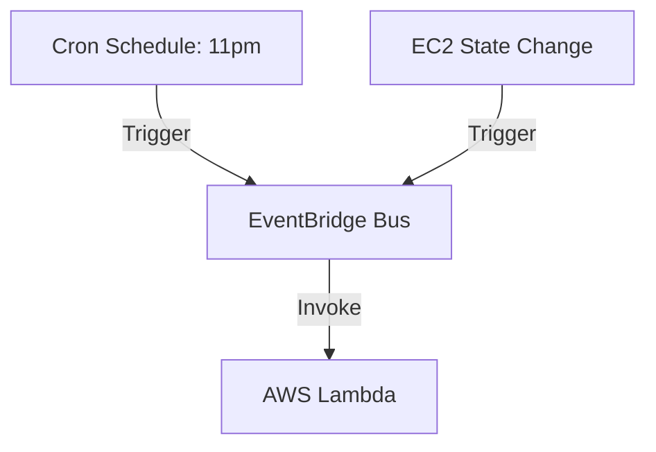

# Section 16 – Lambda with EventBridge

## 1. Learning Objectives
* Configure scheduled events (cron) and pattern-matching rules to trigger Lambda functions.

## 2. Introduction (with Real-World Analogy)
EventBridge is like an alarm clock or calendar scheduler. You set it to ring at a specific time (cron) or when a specific calendar event occurs, waking up the butler (Lambda) to execute a task.

## 3. Why This Topic Exists
To automate infrastructure tasks (scheduled backups, security audits) and route multi-source system state changes.

## 4. Theory & Internal Mechanics
EventBridge matches patterns or schedules, generates a standard event payload, and invokes the target Lambda function asynchronously.

## 5. Component Flow / Architecture Diagram (Mermaid)


## 6. Commands Reference (Purpose, Syntax, Arguments, Example, Output, Production usage)
| Schedule Format | Meaning | Example |
|---|---|---|
| `rate(value unit)` | Periodic rate triggers | `rate(5 minutes)` |
| `cron(fields)` | Specific date/time configurations | `cron(0 23 * * ? *)` |

## 7. Practical Labs (Lab 16.1 - Goal, Steps, Expected Output)
**Lab 16.1**: Create a scheduled EventBridge rule that runs a Lambda function every 5 minutes to audit system logs.

## 8. Real Projects / Configurations (Step-by-step setup)
**Project 16**: Deploy a snapshot engine that automatically creates backups of active AWS resources.

## 9. Troubleshooting & Diagnostics (Symptom, Root Cause, Solution)
**Symptom**: Scheduled function fails to trigger.  
**Root Cause**: The EventBridge rule is disabled or has incorrect target IAM permissions.  
**Solution**: Enable the rule and verify the resource-based invoke policy on the target Lambda.

## 10. Production Examples
Enterprise IT teams run daily resource audits via EventBridge schedules to shut down non-production servers, saving thousands.

## 11. Best Practices
* Ensure scheduled Lambdas are designed to handle timeouts gracefully.

## 12. Interview Preparation (Q1, Q2, Q3 - QA-style)

### Q1: What is the difference between rate and cron expressions?
*Answer*: Rate expressions define simple periodic intervals (e.g. every 10 minutes). Cron expressions allow precise scheduling (e.g. Mondays at 8 AM).

### Q2: What is an event bus in EventBridge?
*Answer*: A router that receives events from sources and matches them against rules to route payloads to target destinations.

## 13. Cheat Sheet (Summary Table)
| Expression | Trigger Frequency |
|---|---|
| `rate(1 hour)` | Once every hour |
| `cron(0 0 * * ? *)` | Daily at midnight UTC |

## 14. Assignments (Beginner and Intermediate)
* Write a cron pattern that triggers a function every Friday at 5:00 PM.

## 15. Mini Project (Practical coding/scripting task)
* Build a server status checker that queries system health endpoints and reports results.

## 16. References & Further Reading
* Amazon EventBridge developer guide.


---

### Original Preserved Section Code & Configurations

```python
import json
import boto3
import logging

logger = logging.getLogger()
logger.setLevel(logging.INFO)

ec2_client = boto3.client('ec2')

def lambda_handler(event, context):
    logger.info("Initiating automated EC2 EBS snapshot sequence")
    
    try:
        # Find instances with the 'Backup=True' tag
        reservations = ec2_client.describe_instances(
            Filters=[
                {'Name': 'tag:Backup', 'Values': ['True']},
                {'Name': 'instance-state-name', 'Values': ['running']}
            ]
        )['Reservations']
        
        created_snapshots = []
        
        for res in reservations:
            for instance in res['Instances']:
                instance_id = instance['InstanceId']
                
                # Iterate over attached volumes
                for device in instance.get('BlockDeviceMappings', []):
                    volume_id = device['Ebs']['VolumeId']
                    logger.info(f"Found Volume {volume_id} on Instance {instance_id}")
                    
                    # Create EBS Snapshot
                    snapshot = ec2_client.create_snapshot(
                        VolumeId=volume_id,
                        Description=f"AutoBackup snapshot for instance {instance_id}"
                    )
                    
                    snapshot_id = snapshot['SnapshotId']
                    logger.info(f"Snapshot created: {snapshot_id}")
                    created_snapshots.append(snapshot_id)
                    
        return {
            'statusCode': 200,
            'body': json.dumps({
                'status': 'BACKUP_COMPLETE',
                'snapshots': created_snapshots
            })
        }
        
    except Exception as e:
        logger.error(f"Backup operation failed: {str(e)}")
        raise e
```

