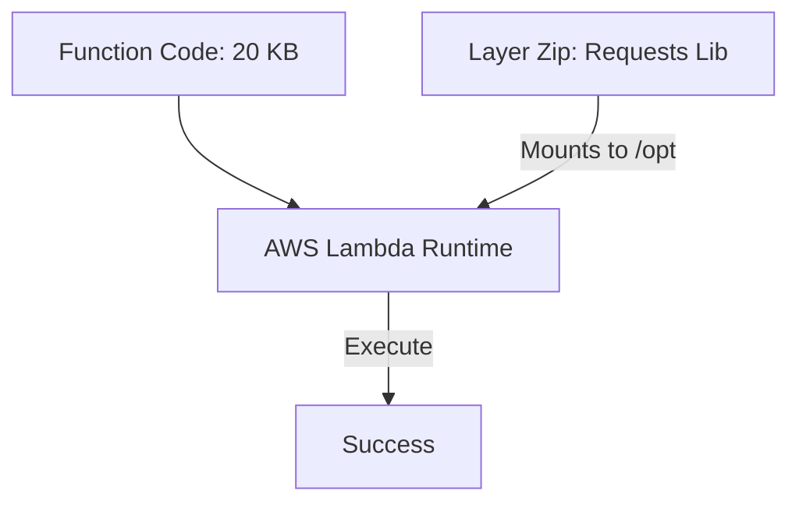

# Section 17 – Lambda Layers

## 1. Learning Objectives
* Package and deploy external dependency libraries (e.g., pandas, requests) as reusable Lambda Layers.

## 2. Introduction (with Real-World Analogy)
A Lambda Layer is like a shared toolshed. Instead of carrying heavy tools in every worker's personal backpack (deployment package), they just borrow the tool from the common shed.

## 3. Why This Topic Exists
To reduce deployment package sizes, enable faster code updates, and share libraries across multiple functions.

## 4. Theory & Internal Mechanics
Layers are unzipped into the `/opt` directory at runtime. The runtime search path (like `sys.path` in Python) is configured to discover packages inside `/opt/python`.

## 5. Component Flow / Architecture Diagram (Mermaid)


## 6. Commands Reference (Purpose, Syntax, Arguments, Example, Output, Production usage)
| Step | CLI / Shell Operation | Expected Target Path |
|---|---|---|
| 1 | `pip install requests -t python/` | Local directory named `python/` |
| 2 | `zip -r layer.zip python/` | Zip archive ready for upload |
| 3 | `aws lambda publish-layer-version` | Published Layer version in AWS |

## 7. Practical Labs (Lab 17.1 - Goal, Steps, Expected Output)
**Lab 17.1**: Package the Python `requests` library into a Lambda Layer and import it in a test function.

## 8. Real Projects / Configurations (Step-by-step setup)
**Project 17**: Build a shared utility layer containing common authentication and database helpers.

## 9. Troubleshooting & Diagnostics (Symptom, Root Cause, Solution)
**Symptom**: `ModuleNotFoundError` inside Lambda.  
**Root Cause**: Dependencies were not placed in the exact directory structure required by the runtime (e.g., missing the `python/` directory prefix before zipping).  
**Solution**: Ensure dependencies are installed under the folder path `python/` before zipping.

## 10. Production Examples
Organizations host standard analytics layers (NumPy/Pandas) attached to data processing microservices.

## 11. Best Practices
* Keep layers single-purpose and version-locked to prevent breaking changes in dependent functions.

## 12. Interview Preparation (Q1, Q2, Q3 - QA-style)

### Q1: What is the maximum number of layers you can attach to a Lambda function?
*Answer*: 5 layers.

### Q2: What folder path must Python layers use inside the zip archive?
*Answer*: The 'python/' directory.

## 13. Cheat Sheet (Summary Table)
| Runtime | Target Folder Path |
|---|---|
| Python | `python/` or `python/lib/python3.12/site-packages/` |
| Node.js | `nodejs/node_modules/` |

## 14. Assignments (Beginner and Intermediate)
* Create a layer zip containing a custom Python module and call its methods in a test function.

## 15. Mini Project (Practical coding/scripting task)
* Design a Python module layer that formats date strings according to ISO standards.

## 16. References & Further Reading
* Working with Lambda Layers.


---

### Original Preserved Section Code & Configurations

```bash
# 1. Create a workspace folder structure
mkdir -p layer_workspace/python

# 2. Install the required target package into the folder
pip install requests -t layer_workspace/python/

# 3. Zip the python directory
cd layer_workspace
zip -r requests_layer.zip python/

# 4. Deploy the layer to AWS
aws lambda publish-layer-version \
    --layer-name requests-layer \
    --description "Contains requests module v2.31" \
    --zip-file fileb://requests_layer.zip \
    --compatible-runtimes python3.12
```

