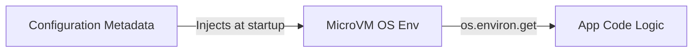

# Section 18 – Environment Variables

## 1. Learning Objectives
* Retrieve configuration parameters dynamically in Lambda using environment variables.

## 2. Introduction (with Real-World Analogy)
Environment variables are like labeling switches on a control board. You can change what the switch connects to (e.g., dev database vs prod database) without rewiring the console itself.

## 3. Why This Topic Exists
Decouples application code from configurations, database connection strings, and feature toggles.

## 4. Theory & Internal Mechanics
Environment variables are stored as key-value pairs in function metadata and injected into the execution container's OS environment variables list.

## 5. Component Flow / Architecture Diagram (Mermaid)


## 6. Commands Reference (Purpose, Syntax, Arguments, Example, Output, Production usage)
| Code Command | Purpose | Example |
|---|---|---|
| `os.environ.get('KEY')` | Read environment variable safely | `db_url = os.environ.get('DB_URL')` |

## 7. Practical Labs (Lab 18.1 - Goal, Steps, Expected Output)
**Lab 18.1**: Create a function that reads a configuration flag from environment variables and changes its execution path.

## 8. Real Projects / Configurations (Step-by-step setup)
**Project 18**: Build a multi-environment routing script that switches database connections based on `APP_ENV`.

## 9. Troubleshooting & Diagnostics (Symptom, Root Cause, Solution)
**Symptom**: `KeyError` when loading variables.  
**Root Cause**: Accessing variables directly via `os.environ['KEY']` when the key is not defined.  
**Solution**: Use `os.environ.get('KEY')` with a fallback default.

## 10. Production Examples
Enterprise applications pass database urls and API endpoints as variables, keeping code portable across stages.

## 11. Best Practices
* Never store raw passwords or API keys in environment variables; use Systems Manager Parameter Store or Secrets Manager.

## 12. Interview Preparation (Q1, Q2, Q3 - QA-style)

### Q1: Are environment variables encrypted at rest in Lambda?
*Answer*: Yes, they are encrypted using AWS KMS keys. You can use default helper keys or configure custom CMKs.

### Q2: How do you read environment variables in Python?
*Answer*: Using the standard library method 'os.environ.get()' after importing the 'os' module.

## 13. Cheat Sheet (Summary Table)
| Library | Access Method |
|---|---|
| Python | `os.environ.get('VAR_NAME', 'default')` |
| Node.js | `process.env.VAR_NAME` |

## 14. Assignments (Beginner and Intermediate)
* Configure 3 environment variables, retrieve them in Python, and log their values.

## 15. Mini Project (Practical coding/scripting task)
* Build an alert script that updates its destination email dynamically using variable configurations.

## 16. References & Further Reading
* Using Lambda environment variables.


---

### Original Preserved Section Code & Configurations

```python
import os

# Retrieve credentials
db_endpoint = os.environ.get('DB_ENDPOINT')
db_password = os.environ.get('DB_PASSWORD')
```

