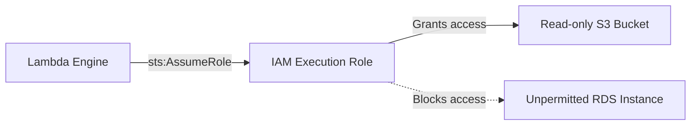

# Section 19 – IAM Permissions

## 1. Learning Objectives
* Implement the Principle of Least Privilege using IAM execution roles and resource policies.

## 2. Introduction (with Real-World Analogy)
An IAM execution role is like a building security badge. The badge declares which specific offices (databases/buckets) you are authorized to enter and what actions you can perform.

## 3. Why This Topic Exists
To guarantee security isolation, preventing compromised code from accessing unauthorized cloud resources.

## 4. Theory & Internal Mechanics
The Lambda service assumes the attached Execution Role at boot. AWS Security Token Service (STS) issues temporary credentials, which boto3 uses to sign API calls.

## 5. Component Flow / Architecture Diagram (Mermaid)


## 6. Commands Reference (Purpose, Syntax, Arguments, Example, Output, Production usage)
| IAM Component | Purpose | Target |
|---|---|---|
| Trust Policy | Allows service to assume role | `lambda.amazonaws.com` |
| Permission Policy | Lists permitted resource actions | `s3:GetObject` on `arn:aws:s3:::mybucket/*` |

## 7. Practical Labs (Lab 19.1 - Goal, Steps, Expected Output)
**Lab 19.1**: Create a custom execution role with DynamoDB write permissions and attach it to a test function.

## 8. Real Projects / Configurations (Step-by-step setup)
**Project 19**: Audit a bloated security policy and refactor it down to the exact resources required.

## 9. Troubleshooting & Diagnostics (Symptom, Root Cause, Solution)
**Symptom**: `AccessDenied` exception.  
**Root Cause**: The function's role lacks policy statements for the action or resource being called.  
**Solution**: Edit the role's IAM policy to grant the missing permission.

## 10. Production Examples
Production configurations prohibit the use of wildcard policies (`*`), requiring strict resource ARN declarations.

## 11. Best Practices
* Apply unique execution roles to each individual function rather than sharing one broad role across the account.

## 12. Interview Preparation (Q1, Q2, Q3 - QA-style)

### Q1: What is the difference between an Execution Role and a Resource-Based Policy?
*Answer*: An execution role defines what the function can access. A resource-based policy defines who (e.g. S3, API Gateway) is allowed to invoke the function.

### Q2: What is the Principle of Least Privilege?
*Answer*: A security best practice of granting only the absolute minimum permissions required to perform a task.

## 13. Cheat Sheet (Summary Table)
| Standard Policy | Usage |
|---|---|
| `AWSLambdaBasicExecutionRole` | Grant CloudWatch write permissions |
| `AWSLambdaVPCAccessExecutionRole` | Allow function to create ENIs inside a VPC |

## 14. Assignments (Beginner and Intermediate)
* Write a JSON IAM policy document granting read-only access to a specific S3 bucket.

## 15. Mini Project (Practical coding/scripting task)
* Build an IAM auditing script listing permission scopes for all regional Lambda functions.

## 16. References & Further Reading
* AWS IAM Policies Reference Guide.


---

### Original Preserved Section Code & Configurations

```json
{
  "Version": "2012-10-17",
  "Statement": [
    {
      "Effect": "Allow",
      "Principal": {
        "Service": "lambda.amazonaws.com"
      },
      "Action": "sts:AssumeRole"
    }
  ]
}
```

