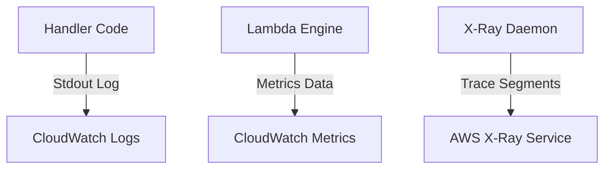

# Section 20 – Monitoring Lambda

## 1. Learning Objectives
* Track serverless performance metrics using CloudWatch Logs, metrics dashboards, and X-Ray tracing.

## 2. Introduction (with Real-World Analogy)
Monitoring is like a dashboard in a car. It reports speed (durations), fuel usage (concurrency levels), and check engine lights (error rates).

## 3. Why This Topic Exists
Since serverless abstracts physical hardware, you must rely on logs and metrics to diagnose issues and trace bottlenecks.

## 4. Theory & Internal Mechanics
The container runtime redirects standard output (`stdout`/`stderr`) streams directly to CloudWatch Logs. Operational statistics are emitted as CloudWatch Metrics.

## 5. Component Flow / Architecture Diagram (Mermaid)

## 6. Commands Reference (Purpose, Syntax, Arguments, Example, Output, Production usage)
| Metric Name | Metric Description | Alert Trigger |
|---|---|---|
| `Invocations` | Total execution requests | High traffic check |
| `Errors` | Unhandled code crash count | Threshold alarm > 0 |
| `Duration` | Runtime processing time | High latency checks |

## 7. Practical Labs (Lab 20.1 - Goal, Steps, Expected Output)
**Lab 20.1**: Configure a CloudWatch metric alarm that triggers when errors exceed zero for 5 minutes.

## 8. Real Projects / Configurations (Step-by-step setup)
**Project 20**: Build a complete CloudWatch dashboard mapping invocations, durations, and concurrent executions.

## 9. Troubleshooting & Diagnostics (Symptom, Root Cause, Solution)
**Symptom**: Missing logs in CloudWatch.  
**Root Cause**: The function's execution role lacks write permissions to `/aws/lambda/` paths.  
**Solution**: Add `AWSLambdaBasicExecutionRole` policy to the function role.

## 10. Production Examples
Site Reliability Engineers build telemetry dashboards to detect service regressions and runtime errors.

## 11. Best Practices
* Structure log outputs as JSON strings to make them searchable in CloudWatch Logs Insights.

## 12. Interview Preparation (Q1, Q2, Q3 - QA-style)

### Q1: What core metrics does CloudWatch track for Lambda?
*Answer*: Invocations, Errors, Duration, Throttles, and ConcurrentExecutions.

### Q2: What is AWS X-Ray?
*Answer*: A distributed tracing tool that helps map and debug requests as they pass through multiple AWS services.

## 13. Cheat Sheet (Summary Table)
| Metric | Target Unit |
|---|---|
| `Duration` | Milliseconds |
| `Throttles` | Count |

## 14. Assignments (Beginner and Intermediate)
* Write a query in CloudWatch Logs Insights that counts errors grouped by stream names.

## 15. Mini Project (Practical coding/scripting task)
* Configure a latency alarm notifying administrators when duration averages exceed 2 seconds.

## 16. References & Further Reading
* Monitoring and Troubleshooting AWS Lambda.
