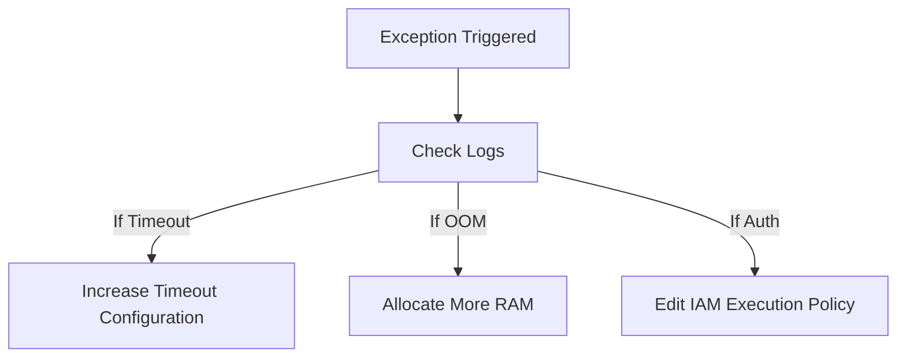

# Section 21 – Troubleshooting Lambda

## 1. Learning Objectives
* Diagnose and resolve common Lambda issues (permissions, timeouts, out-of-memory, handler errors).

## 2. Introduction (with Real-World Analogy)
Troubleshooting is like being an inspector. You follow the evidence (trace logs), check boundaries (timeout settings), and audit resources to solve the mystery.

## 3. Why This Topic Exists
To systematically resolve issues that arise when scaling functions in distributed serverless systems.

## 4. Theory & Internal Mechanics
Troubleshooting utilizes log streams, error codes (e.g. 4xx/5xx), container resource measurements, and diagnostic CLI commands.

## 5. Component Flow / Architecture Diagram (Mermaid)

## 6. Commands Reference (Purpose, Syntax, Arguments, Example, Output, Production usage)
| Error Type | Common Cause | Quick Resolution |
|---|---|---|
| Timeout | Code execution exceeds configured limit | Increase function timeout |
| Out of Memory | RAM limit exceeded | Increase memory allocation |
| ModuleNotFound | Missing package in deployment zip | Package dependencies inside zip/layer |

## 7. Practical Labs (Lab 21.1 - Goal, Steps, Expected Output)
**Lab 21.1**: Intentionally trigger a timeout error, analyze log traces, and adjust timeout configurations.

## 8. Real Projects / Configurations (Step-by-step setup)
**Project 21**: Create a pipeline checking log files for 'ERROR' strings and routing diagnostics.

## 9. Troubleshooting & Diagnostics (Symptom, Root Cause, Solution)
**Symptom**: Function hangs indefinitely and times out.  
**Root Cause**: Network calls (to DBs or APIs) are blocked by security group rules.  
**Solution**: Verify VPC subnets and security group rules.

## 10. Production Examples
DevOps teams use centralized alert systems to resolve infrastructure bottlenecks before they impact users.

## 11. Best Practices
* Set connection timeout values on database clients to prevent functions from hanging.

## 12. Interview Preparation (Q1, Q2, Q3 - QA-style)

### Q1: How do you debug VPC connection timeouts?
*Answer*: Verify that your function resides in private subnets, that security groups allow outbound traffic, and that database subnets allow ingress from the function.

### Q2: How do you detect memory issues?
*Answer*: Check the CloudWatch Log statement: 'Max Memory Used'. If it matches the allocated limit, increase the memory size.

## 13. Cheat Sheet (Summary Table)
| Issue | Indication |
|---|---|
| Timeout | `Task timed out after X seconds` |
| Out of Memory | `Runtime.ExitError` or memory utilization 100% |

## 14. Assignments (Beginner and Intermediate)
* Create a function with 128MB RAM, execute a script that exceeds this memory, and document the error details.

## 15. Mini Project (Practical coding/scripting task)
* Write a validation script checking functions configuration metrics (timeouts, limits).

## 16. References & Further Reading
* Troubleshooting AWS Lambda Guide.
