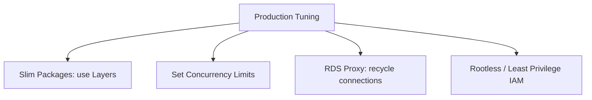

# Section 22 – Production Best Practices

## 1. Learning Objectives
* Optimize functions for speed, security, durability, and cost efficiency in production.

## 2. Introduction (with Real-World Analogy)
Production optimization is like tuning a race car. You shed weight (slim packages), keep components warm (Provisioned Concurrency), and secure the boundaries.

## 3. Why This Topic Exists
Poor configurations lead to high costs, latency regressions, and potential security leaks under enterprise-scale traffic.

## 4. Theory & Internal Mechanics
Optimizations focus on code packages (slimming dependencies), memory allocations (RAM/CPU balance), VPC networking, and security profiles.

## 5. Component Flow / Architecture Diagram (Mermaid)

## 6. Commands Reference (Purpose, Syntax, Arguments, Example, Output, Production usage)
| Practice Type | Action Target | Expected Benefit |
|---|---|---|
| Optimization | Instantiate clients globally | Connection reuse, lower latency |
| Scaling | Set Reserved Concurrency | Prevents resource starvation |
| Security | Block wildcards in IAM policies | Principle of Least Privilege |

## 7. Practical Labs (Lab 22.1 - Goal, Steps, Expected Output)
**Lab 22.1**: Optimize an un-tuned function by refactoring variables to global scope and measuring duration differences.

## 8. Real Projects / Configurations (Step-by-step setup)
**Project 22**: Design a production deployment blueprint with resource limits and RDS proxies.

## 9. Troubleshooting & Diagnostics (Symptom, Root Cause, Solution)
**Symptom**: Cold starts degrade application responsiveness.  
**Root Cause**: Heavy package bundles or complex code initialization.  
**Solution**: Minimize dependencies and apply Provisioned Concurrency.

## 10. Production Examples
Fintech services use strict resource boundaries and audit logs to guarantee processing reliability.

## 11. Best Practices
* Configure reserved concurrency on critical functions to prevent resource starvation.

## 12. Interview Preparation (Q1, Q2, Q3 - QA-style)

### Q1: How do you prevent connection exhaustion on SQL databases when using Lambda?
*Answer*: Use Amazon RDS Proxy, which sits between Lambda and the database, pooling and managing active database connections.

### Q2: Why is Reserved Concurrency important?
*Answer*: It guarantees that a function always has a dedicated pool of concurrent executions and cannot be starved by other functions.

## 13. Cheat Sheet (Summary Table)
| Config Parameter | Production Standard |
|---|---|
| Reserved Concurrency | Set per critical service |
| DLQ | Mandatory for asynchronous routes |

## 14. Assignments (Beginner and Intermediate)
* Document a comparison report evaluating performance improvements after optimizing package imports.

## 15. Mini Project (Practical coding/scripting task)
* Build an execution analyzer auditing runtime memory usage to optimize pricing.

## 16. References & Further Reading
* Best practices for working with AWS Lambda functions.
