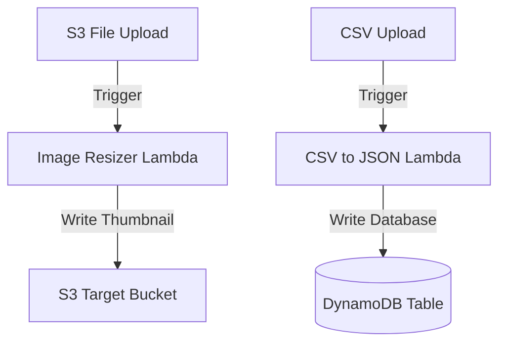

# Section 23 – Real-World Projects

## 1. Learning Objectives
* Construct 7 enterprise-level serverless projects (resizers, converters, logs monitoring, health checkers).

## 2. Introduction (with Real-World Analogy)
Real-World projects are like assembling building blocks into a functional castle. You combine simple compute elements to build secure, robust applications.

## 3. Why This Topic Exists
Provides engineers with hands-on, enterprise-ready templates of common architectural patterns.

## 4. Theory & Internal Mechanics
Projects integrate S3, API Gateway, DynamoDB, SQS, SNS, and CloudWatch logs into cohesive, automated event workflows.

## 5. Component Flow / Architecture Diagram (Mermaid)


## 6. Commands Reference (Purpose, Syntax, Arguments, Example, Output, Production usage)
| Project Name | Event Source | Target Service |
|---|---|---|
| Image Processing Engine | S3 Event | S3 Destination Bucket |
| CSV to JSON Converter | S3 Event | DynamoDB |
| EBS Backup Engine | EventBridge Schedule | EBS Snapshot API |

## 7. Practical Labs (Lab 23.1 - Goal, Steps, Expected Output)
**Lab 23.1**: Build and deploy Project 1 (Image Processing Engine) using S3 triggers and the Pillow package.

## 8. Real Projects / Configurations (Step-by-step setup)
**Project 23**: Deploy a multi-service event aggregator that runs conversions and updates tables.

## 9. Troubleshooting & Diagnostics (Symptom, Root Cause, Solution)
**Symptom**: Processing loop error on S3 uploads.  
**Root Cause**: Function writes output files to the same bucket without prefix filters.  
**Solution**: Filter trigger configurations to ignore target suffixes.

## 10. Production Examples
Startups build their entire early infrastructure using these serverless integration blocks.

## 11. Best Practices
* Store large intermediate files in S3 and pass metadata or presigned URLs between services.

## 12. Interview Preparation (Q1, Q2, Q3 - QA-style)

### Q1: How do you process CSV files inside Lambda without run-time memory crashes?
*Answer*: Stream files in chunks from S3 using boto3 rather than downloading the entire file into memory at once.

### Q2: How do you post notifications to Slack from inside Lambda?
*Answer*: Send HTTP POST requests with JSON payloads to a configured Slack Webhook URL using urllib3.

## 13. Cheat Sheet (Summary Table)
| Project | Integration | Primary Python Library |
|---|---|---|
| Resizer | S3 + Pillow | `PIL` / `io` |
| Slack Alerts | CloudWatch + Slack | `urllib3` / `json` |

## 14. Assignments (Beginner and Intermediate)
* Deploy the CSV to JSON converter, upload a sample customer file, and verify database exports.

## 15. Mini Project (Practical coding/scripting task)
* Build a health monitoring checker dispatching alerts to a mock webhook.

## 16. References & Further Reading
* AWS Serverless Reference Architectures.


---

### Original Preserved Section Code & Configurations

```python
import os
import io
import boto3
from PIL import Image
import urllib.parse
import json

s3 = boto3.client('s3')
TARGET_BUCKET = os.environ.get('TARGET_BUCKET', 'my-resized-thumbnails')

def lambda_handler(event, context):
    source_bucket = event['Records'][0]['s3']['bucket']['name']
    file_key = urllib.parse.unquote_plus(event['Records'][0]['s3']['object']['key'])
    
    # 1. Download image from source S3
    response = s3.get_object(Bucket=source_bucket, Key=file_key)
    raw_data = response['Body'].read()
    
    # 2. Open and resize image using Pillow
    img = Image.open(io.BytesIO(raw_data))
    img.thumbnail((150, 150))
    
    # 3. Save output image to a memory buffer
    output_buffer = io.BytesIO()
    img.save(output_buffer, format=img.format or 'JPEG')
    output_buffer.seek(0)
    
    # 4. Upload resized thumbnail to target S3
    s3.put_object(
        Bucket=TARGET_BUCKET,
        Key=f"thumb-{file_key}",
        Body=output_buffer,
        ContentType=response['ContentType']
    )
    
    return {
        'statusCode': 200,
        'body': json.dumps('Thumbnail generated!')
    }
```

```python
import json
import csv
import io
import boto3
import urllib.parse

s3 = boto3.client('s3')
TARGET_BUCKET = "my-json-database-bucket"

def lambda_handler(event, context):
    bucket = event['Records'][0]['s3']['bucket']['name']
    key = urllib.parse.unquote_plus(event['Records'][0]['s3']['object']['key'])
    
    # Download file contents
    response = s3.get_object(Bucket=bucket, Key=key)
    csv_content = response['Body'].read().decode('utf-8')
    
    # Read CSV and convert to list of dicts
    reader = csv.DictReader(io.StringIO(csv_content))
    data_list = [row for row in reader]
    
    # Save output as JSON
    json_filename = key.replace('.csv', '.json')
    s3.put_object(
        Bucket=TARGET_BUCKET,
        Key=json_filename,
        Body=json.dumps(data_list, indent=2),
        ContentType='application/json'
    )
    
    return "CSV converted to JSON successfully."
```

```python
import boto3
import logging

logger = logging.getLogger()
logger.setLevel(logging.INFO)
ec2 = boto3.client('ec2')

def lambda_handler(event, context):
    logger.info("Executing daily automated EBS snapshot pipeline...")
    
    # Find instances tagged with Backup=True
    instances = ec2.describe_instances(
        Filters=[
            {'Name': 'tag:Backup', 'Values': ['True']},
            {'Name': 'instance-state-name', 'Values': ['running']}
        ]
    )
    
    snapshots = []
    
    for reservation in instances.get('Reservations', []):
        for instance in reservation.get('Instances', []):
            instance_id = instance['InstanceId']
            for mapping in instance.get('BlockDeviceMappings', []):
                volume_id = mapping['Ebs']['VolumeId']
                
                # Create snapshot
                snap = ec2.create_snapshot(
                    VolumeId=volume_id,
                    Description=f"Auto backup for instance {instance_id}"
                )
                snapshots.append(snap['SnapshotId'])
                logger.info(f"Snapshot created: {snap['SnapshotId']} for volume {volume_id}")
                
    return {"createdSnapshots": snapshots}
```

```python
import boto3
import json

sns_client = boto3.client('sns')
SNS_TOPIC_ARN = "arn:aws:sns:us-east-1:123456789012:WelcomeEmails"

def lambda_handler(event, context):
    for record in event['Records']:
        # Trigger on INSERT only
        if record['eventName'] == 'INSERT':
            new_image = record['dynamodb']['NewImage']
            user_email = new_image['email']['S']
            user_name = new_image['name']['S']
            
            # Send notification message via SNS
            msg = f"Welcome, {user_name}! Your registration was successful."
            sns_client.publish(
                TopicArn=SNS_TOPIC_ARN,
                Message=msg,
                Subject="Welcome to Inventure AI!"
            )
            
    return "Welcome emails processed"
```

```python
import urllib3
import json

http = urllib3.PoolManager()
SLACK_WEBHOOK_URL = "https://hooks.slack.com/services/T00/B00/X00"

def lambda_handler(event, context):
    alarm_name = event['alarmData']['alarmName']
    state_value = event['alarmData']['state']['value']
    reason = event['alarmData']['state']['reason']
    
    slack_message = {
        "text": f"🚨 *SYSTEM ALERT*: {alarm_name} transitioned to state *{state_value}*.\nReason: {reason}"
    }
    
    response = http.request(
        'POST',
        SLACK_WEBHOOK_URL,
        body=json.dumps(slack_message),
        headers={'Content-Type': 'application/json'}
    )
    
    return {"slack_response": response.status}
```

```python
import gzip
import json
import base64
import boto3

sns = boto3.client('sns')
SNS_TOPIC = "arn:aws:sns:us-east-1:123456789012:LogAlerts"

def lambda_handler(event, context):
    # Decode and decompress CloudWatch logs
    data = base64.b64decode(event['awslogs']['data'])
    decompressed = gzip.decompress(data)
    log_json = json.loads(decompressed)
    
    for log_event in log_json['logEvents']:
        message = log_event['message']
        if "ERROR" in message:
            sns.publish(
                TopicArn=SNS_TOPIC,
                Message=f"Log Error Detected:\n{message}",
                Subject="Server Error Detected"
            )
            
    return "Logs processed"
```

```python
import json
import boto3
from datetime import datetime

dynamodb = boto3.resource('dynamodb')
table = dynamodb.Table('TransactionsTable')
sns = boto3.client('sns')

def lambda_handler(event, context):
    # Query transactions
    response = table.scan()
    items = response.get('Items', [])
    
    total_sales = sum(float(item['amount']) for item in items)
    report = f"Daily Transaction Summary ({datetime.utcnow().date()}):\n- Total Transactions: {len(items)}\n- Total Sales: ${total_sales:.2f}"
    
    sns.publish(
        TopicArn="arn:aws:sns:us-east-1:123456789012:DailyReports",
        Message=report,
        Subject="Daily Sales Report Summary"
    )
    
    return "Report delivered"
```

