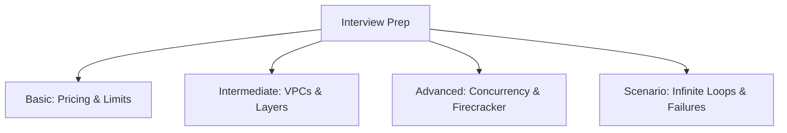

# Section 24 – Interview Questions

## 1. Learning Objectives
* Review and master 40 key AWS Lambda questions across Basic, Intermediate, Advanced, and Scenario levels.

## 2. Introduction (with Real-World Analogy)
Interview prep is like reviewing a playbook. It sharpens your technical vocabulary and helps you explain complex architecture decisions clearly under pressure.

## 3. Why This Topic Exists
To validate an engineer's technical depth, system design capabilities, and hands-on familiarity with Lambda patterns.

## 4. Theory & Internal Mechanics
Covers critical topics including scaling limits, VPC configurations, database connection pools, cold starts, and cost optimization.

## 5. Component Flow / Architecture Diagram (Mermaid)

## 6. Commands Reference (Purpose, Syntax, Arguments, Example, Output, Production usage)
| Category | Focus Area | Sample Concept |
|---|---|---|
| Basic | Lambda fundamentals | Cold start, pricing, timeout limits |
| Intermediate | Integration & Network | VPC endpoints, SQS visibility timeout |
| Advanced | Systems Architecture | Firecracker MicroVMs, Reserved Concurrency |

## 7. Practical Labs (Lab 24.1 - Goal, Steps, Expected Output)
**Lab 24.1**: Practice explaining the architectural differences between VMs and FaaS in a mock peer review.

## 8. Real Projects / Configurations (Step-by-step setup)
**Project 24**: Create a study guide documenting scenarios and recovery architectures.

## 9. Troubleshooting & Diagnostics (Symptom, Root Cause, Solution)
**Symptom**: Difficulty explaining complex architectural failures in interviews.  
**Root Cause**: Lack of hands-on review.  
**Solution**: Practice tracing event states and parsing SQS visibility settings.

## 10. Production Examples
Platform engineers design their architectures around these interview concepts.

## 11. Best Practices
* Always ground system design answers in the AWS Well-Architected Framework guidelines.

## 12. Interview Preparation (Q1, Q2, Q3 - QA-style)

### Q1: How do you answer questions about Lambda cold starts?
*Answer*: Explain the boot process: AWS provisions container runtime, imports code, and runs code. Mention optimization methods likeProvisioned Concurrency and minimal package imports.

### Q2: Explain regional concurrency pools.
*Answer*: All functions in an account share a concurrency pool (default 1,000). A spike in one function can starve others unless Reserved Concurrency is configured.

## 13. Cheat Sheet (Summary Table)
| Topic | Key Concept |
|---|---|
| Cold Start | Provisioned Concurrency |
| VPC Network | NAT Gateway required for internet |

## 14. Assignments (Beginner and Intermediate)
* Write out detailed answers to 5 scenario-based interview questions.

## 15. Mini Project (Practical coding/scripting task)
* Create a mock system design interview dashboard showing Lambda-based web apps.

## 16. References & Further Reading
* AWS Well-Architected Framework.
