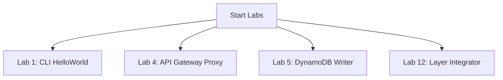

# Section 25 – Hands-on Labs

## 1. Learning Objectives
* Execute 15 structural sandbox labs matching every core integration topic (CLI, API Gateway, DynamoDB, SNS).

## 2. Introduction (with Real-World Analogy)
Labs are like training courses. By repeating commands, configurations, and scripts, you develop the technical skills required for real production work.

## 3. Why This Topic Exists
Translates theoretical knowledge into practical engineering capabilities through structured, step-by-step terminal work.

## 4. Theory & Internal Mechanics
Labs cover packaging zip files, publishing Layers, attaching execution policies, checking logs, and testing scaling behaviors.

## 5. Component Flow / Architecture Diagram (Mermaid)


## 6. Commands Reference (Purpose, Syntax, Arguments, Example, Output, Production usage)
| Lab Number | Target Operation | Key Tool |
|---|---|---|
| Lab 1 | Create CLI function | `aws lambda create-function` |
| Lab 4 | HTTP API endpoints | `curl` / API Gateway |
| Lab 12 | Attaching layers | `aws lambda publish-layer-version` |

## 7. Practical Labs (Lab 25.1 - Goal, Steps, Expected Output)
**Lab 25.1**: Execute Lab 1 and verify that the output JSON file parses the greeting string successfully.

## 8. Real Projects / Configurations (Step-by-step setup)
**Project 25**: Compile all 15 lab outputs into a configuration portfolio document.

## 9. Troubleshooting & Diagnostics (Symptom, Root Cause, Solution)
**Symptom**: Lab execution timeout error.  
**Root Cause**: Default timeout configuration is too short for downstream network requests.  
**Solution**: Increase timeout configurations using CLI commands.

## 10. Production Examples
Organizations use structured lab training to onboard engineers to cloud platforms.

## 11. Best Practices
* Always delete resources and delete target buckets after completing labs to prevent unexpected costs.

## 12. Interview Preparation (Q1, Q2, Q3 - QA-style)

### Q1: How do you package external libraries when deploying via CLI?
*Answer*: Install packages directly into a local workspace directory and zip the contents together with the Lambda python files.

### Q2: How do you test SQS triggers locally?
*Answer*: Use mock SQS payloads inside local execution shells or use local emulation runtimes.

## 13. Cheat Sheet (Summary Table)
| Lab | command / Tool |
|---|---|
| 1 | `zip function.zip lambda_function.py` |
| 12 | `zip -r requests_layer.zip python/` |

## 14. Assignments (Beginner and Intermediate)
* Execute Lab 4, call the URL, and document output payloads and headers.

## 15. Mini Project (Practical coding/scripting task)
* Configure a local batch script executing 3 distinct labs in sequence.

## 16. References & Further Reading
* AWS Lambda Hands-on tutorials.


---

### Original Preserved Section Code & Configurations

     ```python
     def lambda_handler(event, context):
         return {"message": "Hello from CLI!"}
     ```

     ```bash
     aws lambda create-function --function-name CLIHelloWorld \
       --runtime python3.12 --role arn:aws:iam::123456789012:role/MyExecutionRole \
       --handler lambda_function.lambda_handler --zip-file fileb://function.zip
     ```

  ```python
  import logging
  logger = logging.getLogger()
  logger.setLevel(logging.INFO)
  
  def lambda_handler(event, context):
      logger.info(f"Incoming Event payload: {event}")
      return {"status": "Logged"}
  ```

