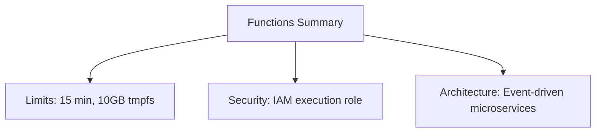

# Section 26 – Chapter Summary

## 1. Learning Objectives
* Consolidate and review key takeaways, configuration limits, and cloud architecture pathways.

## 2. Introduction (with Real-World Analogy)
The Chapter Summary is like looking at a completed puzzle. You step back to see how all the pieces connect into a complete picture.

## 3. Why This Topic Exists
Provides a quick reference to review the core limits and concepts covered in the Functions guide.

## 4. Theory & Internal Mechanics
Summarizes memory boundaries, storage limits, concurrent limits, billing models, and security principles.

## 5. Component Flow / Architecture Diagram (Mermaid)

## 6. Commands Reference (Purpose, Syntax, Arguments, Example, Output, Production usage)
| Limit Parameter | Value Scope | Configuration path |
|---|---|---|
| Memory Size | 128 MB to 10,240 MB | General settings |
| Temporary Storage | 512 MB to 10 GB | General settings |
| Timeout Limit | 1 second to 15 minutes | General settings |

## 7. Practical Labs (Lab 26.1 - Goal, Steps, Expected Output)
**Lab 26.1**: Run an audit script verifying that all active functions adhere to resource limit guidelines.

## 8. Real Projects / Configurations (Step-by-step setup)
**Project 26**: Compile a production checklist verifying functions security, logging, and concurrency limits.

## 9. Troubleshooting & Diagnostics (Symptom, Root Cause, Solution)
**Symptom**: Out of quota warning on execution limits.  
**Root Cause**: Regional concurrency limits or API limits reached.  
**Solution**: Request limit increases via AWS Service Quotas.

## 10. Production Examples
Architects review these limits to ensure their designs fit within AWS Lambda boundaries.

## 11. Best Practices
* Perform regular automated resource sweeps to clean up unused functions and old image layers.

## 12. Interview Preparation (Q1, Q2, Q3 - QA-style)

### Q1: What is the maximum execution timeout for AWS Lambda?
*Answer*: 15 minutes.

### Q2: What is the maximum size of local temporary /tmp storage?
*Answer*: 10 GB.

## 13. Cheat Sheet (Summary Table)
| Metric Limit | Default Value |
|---|---|
| Max Timeout | 15 Minutes |
| Max /tmp | 10 GB |
| Max Memory | 10,240 MB |

## 14. Assignments (Beginner and Intermediate)
* Draft a complete serverless deployment checklist checking timeouts, permissions, and scaling parameters.

## 15. Mini Project (Practical coding/scripting task)
* Build an automated audit script that queries function metrics and reports configuration flags.

## 16. References & Further Reading
* AWS Lambda quotas and limits guide.
