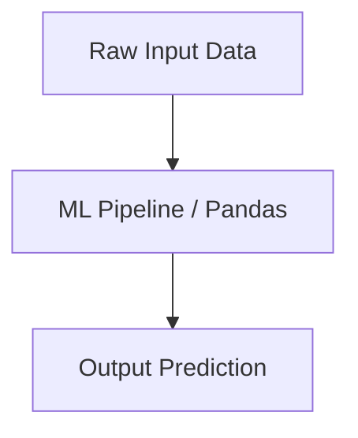

# Pandas Master Engineering Guide

A comprehensive, industry-grade guide to Pandas for AI, ML, and Data Science practitioners.

---

<ProgressTracker currentSection=1 totalSections=6 />

## 1. Introduction
Detailed overview of Pandas in machine learning and AI architectures.

<ProgressTracker currentSection=2 totalSections=6 />

## 2. Why it exists & Problems it solves
Enterprise scale deployments require robust mathematical and computational foundations. Pandas solves these specific constraints.

<ProgressTracker currentSection=3 totalSections=6 />

## 3. Internal Working & Architecture


<ProgressTracker currentSection=4 totalSections=6 />

## 4. Hands-on Examples & Configurations
<Tabs>
  <Tab label="Syntax & Example">

```python
# Sample production setup code
print("Initializing Pandas pipeline...")
```

  </Tab>
  <Tab label="Interactive Playground">
    <InteractiveExample 
      language="python"
      initialCode="# Sample production setup code\nprint(\"Initializing Pandas pipeline...\")" 
      instruction="Execute and edit this PYTHON example."
    />
  </Tab>
</Tabs>

<ProgressTracker currentSection=5 totalSections=6 />

## 5. Performance Optimization & Monitoring
- Implement feature selection and hyperparameters tuning.
- Track accuracy and data drift metrics using Prometheus.

<ProgressTracker currentSection=6 totalSections=6 />

## 6. Common Errors & Troubleshooting
- **Error**: Overfitting.
- **Solution**: Apply dropout, regularization (L1/L2), and cross-validation folds.

---

---

### Knowledge Verification Check

<Quiz 
  question="What does Vectorization mean in NumPy?" 
  options=["Converting arrays into lists of coordinates.", "Executing operations on entire arrays at once using compiled C code, avoiding slow Python loops.", "Running operations in parallel threads using the GIL.", "Creating multi-dimensional graphs."] 
  answerIndex=1 
  explanation="Vectorization delegates array computations to compiled, highly optimized C libraries underneath, which execute operations across block memory without Python loop overhead." 
/>

<Quiz 
  question="How does NumPy's Broadcasting mechanism work?" 
  options=["It streams array contents over network sockets.", "It allows arithmetic operations on arrays of different shapes by conceptually expanding the smaller array to match the shape of the larger array.", "It flattens arrays into a single dimension.", "It allocates memory across different clusters."] 
  answerIndex=1 
  explanation="Broadcasting applies element-wise operations on arrays of different shapes by replicating dimensions of size 1, matching array shapes under strict compatibility rules." 
/>

<Quiz 
  question="What is a Pandas DataFrame?" 
  options=["A 1-dimensional array of numbers.", "A 2-dimensional, size-mutable, tabular data structure with labeled axes (rows and columns).", "A binary tree database structure.", "A layout engine for plotting images."] 
  answerIndex=1 
  explanation="A Pandas DataFrame represents tabular data, mapping columns of potentially different data types to rows, similar to a spreadsheet or SQL table." 
/>

<Quiz 
  question="What is the primary difference between Pandas Series and a 1D NumPy array?" 
  options=["Series can only store float values.", "Series contains an associated index (labels) for accessing data, while NumPy arrays use zero-based integer index offsets only.", "NumPy arrays are mutable, Series are not.", "Series cannot be sliced."] 
  answerIndex=1 
  explanation="Pandas Series is a labeled 1D array. It maintains an index array mapping label keys to data elements, allowing database-like joins and alignment." 
/>

<Quiz 
  question="What describes the Split-Apply-Combine pattern in Pandas GroupBy operations?" 
  options=["Splitting code files, applying formatting, and combining to a single file.", "Splitting data into groups based on keys, applying a function (e.g. aggregation, transform), and combining results into a new DataFrame.", "Sorting rows by index, filtering nulls, and saving.", "Converting DataFrames into NumPy arrays."] 
  answerIndex=1 
  explanation="`groupby()` splits data based on criteria, applies functions (like `sum()` or `mean()`) independently to groups, and combines outcomes back to a summary structure." 
/>

<Quiz 
  question="How does Pandas handle missing values in a DataFrame?" 
  options=["It throws a NullPointerException immediately.", "Using Sentinel values (NaN/None), which can be managed using functions like `dropna()` (filtering nulls) or `fillna()` (imputing values).", "By writing a zero value automatically.", "By converting columns to string types."] 
  answerIndex=1 
  explanation="Pandas labels missing values as NaN (Not a Number) or None. Methods like `dropna()` prune rows/columns containing NaNs, and `fillna()` replaces them with defaults." 
/>

<Quiz 
  question="What is the difference between `.loc` and `.iloc` indexers in Pandas?" 
  options=["There is no difference.", "`.loc` indexes data using labels/names; `.iloc` indexes data using integer positions (0-indexed offsets).", "`.loc` is for rows, `.iloc` is for columns.", "`.loc` is faster than `.iloc`."] 
  answerIndex=1 
  explanation="`.loc` is label-based (e.g. `df.loc['row_label', 'col_label']`). `.iloc` is integer-position based (e.g. `df.iloc[0, 1]`), mirroring standard Python list slicing." 
/>

<Quiz 
  question="In NumPy, what is the role of the `reshape()` method?" 
  options=["It deletes array dimensions.", "It returns a new view of the array with a modified shape (dimensions) without changing the underlying data values.", "It resizes array memory allocation.", "It normalizes element values between 0 and 1."] 
  answerIndex=1 
  explanation="`reshape()` allows altering the shape of an array (e.g. turning 1D array of 6 elements into a 2D array of 2x3) as long as total element count remains identical." 
/>

<Quiz 
  question="What is the difference between merging (`pd.merge`) and joining (`df.join`) in Pandas?" 
  options=["Merging is for SQL databases; joining is for Excel files.", "Merging matches columns on shared keys; joining combines DataFrames based on their row indexes by default.", "They perform opposite operations.", "Merging is done in memory; joining writes to disk."] 
  answerIndex=1 
  explanation="`pd.merge()` is a database-style join matching on arbitrary column keys. `df.join()` is a convenience method that aligns data columns based on row index coordinates." 
/>

<Quiz 
  question="Why are operations on NumPy arrays faster than running standard Python loops over lists?" 
  options=["NumPy bypasses system memory.", "NumPy arrays store elements of homogeneous types in contiguous memory blocks, enabling hardware-level vector processing (SIMD).", "Python lists are compiled to slower database rows.", "NumPy uses parallel background processes."] 
  answerIndex=1 
  explanation="Python lists are arrays of pointers to scattered objects. NumPy arrays store uniform raw data bytes contiguously in memory, allowing CPUs to fetch data efficiently and execute vectorized math instructions." 
/>

<Quiz 
  question="In Pandas DataFrame operations, what does `axis=0` and `axis=1` signify?" 
  options=["`axis=0` refers to columns; `axis=1` refers to rows.", "`axis=0` refers to rows (downwards calculation); `axis=1` refers to columns (sideways calculation).", "They are scaling parameters.", "They represent the dimensions of plot figures."] 
  answerIndex=1 
  explanation="Operations (like `mean()` or `drop()`) along `axis=0` run vertically down row indices. Operations along `axis=1` run horizontally across column fields." 
/>

<Quiz 
  question="What is the cap on dimensions for a NumPy ndarray?" 
  options=["Maximum 2 dimensions (tables).", "Maximum 3 dimensions (tensors).", "Practically arbitrary; ndarrays support N-dimensional arrays.", "It is limited by CPU core count."] 
  answerIndex=2 
  explanation="NumPy arrays are N-dimensional. An ndarray can represent 1D vectors, 2D matrices, 3D color images, or any higher-dimensional tensors." 
/>
