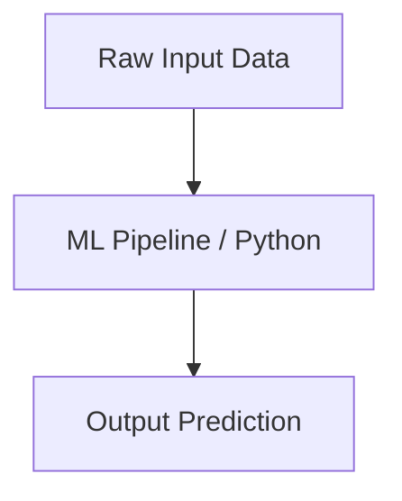

# Python Master Engineering Guide

A comprehensive, industry-grade guide to Python for AI, ML, and Data Science practitioners.

---

<ProgressTracker currentSection=1 totalSections=6 />

## 1. Introduction
Detailed overview of Python in machine learning and AI architectures.

<ProgressTracker currentSection=2 totalSections=6 />

## 2. Why it exists & Problems it solves
Enterprise scale deployments require robust mathematical and computational foundations. Python solves these specific constraints.

<ProgressTracker currentSection=3 totalSections=6 />

## 3. Internal Working & Architecture


<ProgressTracker currentSection=4 totalSections=6 />

## 4. Hands-on Examples & Configurations
<Tabs>
  <Tab label="Syntax & Example">

```python
# Sample production setup code
print("Initializing Python pipeline...")
```

  </Tab>
  <Tab label="Interactive Playground">
    <InteractiveExample 
      language="python"
      initialCode="# Sample production setup code\nprint(\\"Initializing Python pipeline...\\")" 
      instruction="Execute and edit this PYTHON example."
    />
  </Tab>
</Tabs>

<ProgressTracker currentSection=5 totalSections=6 />

## 5. Performance Optimization & Monitoring
- Implement feature selection and hyperparameters tuning.
- Track accuracy and data drift metrics using Prometheus.

<ProgressTracker currentSection=6 totalSections=6 />

## 6. Common Errors & Troubleshooting
- **Error**: Overfitting.
- **Solution**: Apply dropout, regularization (L1/L2), and cross-validation folds.

---


---

### Knowledge Verification Check

<Quiz 
  question="What is the purpose of using a pointer receiver (*StructName) for a method in Go?" 
  options=["It automatically compiles the method to C code.", "It allows the method to mutate the receiver's fields directly in memory and avoids copying the struct.", "It makes the struct immutable.", "It creates a new garbage collection thread."] 
  answerIndex=1 
  explanation="A pointer receiver passes the memory address of the struct instance, enabling direct field modification and optimizing performance by avoiding struct copying." 
/>
