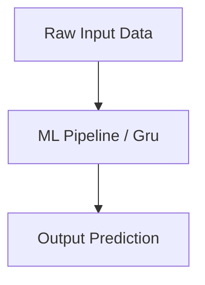

# Gru Master Engineering Guide

A comprehensive, industry-grade guide to Gru for AI, ML, and Data Science practitioners.

---

<ProgressTracker currentSection=1 totalSections=6 />

## 1. Introduction
Detailed overview of Gru in machine learning and AI architectures.

<ProgressTracker currentSection=2 totalSections=6 />

## 2. Why it exists & Problems it solves
Enterprise scale deployments require robust mathematical and computational foundations. Gru solves these specific constraints.

<ProgressTracker currentSection=3 totalSections=6 />

## 3. Internal Working & Architecture


<ProgressTracker currentSection=4 totalSections=6 />

## 4. Hands-on Examples & Configurations
<Tabs>
  <Tab label="Syntax & Example">

```python
# Sample production setup code
print("Initializing Gru pipeline...")
```

  </Tab>
  <Tab label="Interactive Playground">
    <InteractiveExample 
      language="python"
      initialCode="# Sample production setup code\nprint(\"Initializing Gru pipeline...\")" 
      instruction="Execute and edit this PYTHON example."
    />
  </Tab>
</Tabs>

<ProgressTracker currentSection=5 totalSections=6 />

## 5. Performance Optimization & Monitoring
- Implement feature selection and hyperparameters tuning.
- Track accuracy and data drift metrics using Prometheus.

<ProgressTracker currentSection=6 totalSections=6 />

## 6. Common Errors & Troubleshooting
- **Error**: Overfitting.
- **Solution**: Apply dropout, regularization (L1/L2), and cross-validation folds.

---

---

### Knowledge Verification Check

<Quiz 
  question="What is the difference between Supervised and Unsupervised Learning?" 
  options=["Supervised learning requires human monitoring during model training.", "Supervised learning trains models on labeled input-output pairs; Unsupervised learning finds patterns within unlabeled data.", "Supervised learning runs only on local machines.", "Unsupervised learning uses no algorithms."] 
  answerIndex=1 
  explanation="Supervised learning maps inputs to target labels (e.g. regression/classification). Unsupervised learning clusters or processes input data without ground-truth labels." 
/>

<Quiz 
  question="What occurs when a machine learning model suffers from Overfitting?" 
  options=["The model runs too slowly on GPUs.", "The model performs well on training data but fails to generalize to unseen test data.", "The model gets deleted from disk memory.", "The model underperforms on both training and test data."] 
  answerIndex=1 
  explanation="Overfitting happens when a model learns noise and specifics of training data instead of general patterns. Regularization, dropout, or early stopping are used to mitigate this." 
/>

<Quiz 
  question="How are parameter weight gradients calculated in neural networks?" 
  options=["By guessing random weight changes.", "Using Backpropagation, which applies the calculus Chain Rule to compute loss gradients with respect to weights from output layer backward to input.", "By compiling code to native binaries.", "Through file system metadata scanning."] 
  answerIndex=1 
  explanation="Backpropagation computes loss gradients. The error is propagated backward through network layers using the chain rule, allowing optimizers (like SGD) to update model weights." 
/>

<Quiz 
  question="Why are non-linear Activation Functions (like ReLU, Tanh) necessary in hidden layers?" 
  options=["To speed up matrix multiplication.", "To enable the network to learn complex, non-linear relationships in data; without them, the network acts as a single linear combination.", "To keep values strictly positive.", "To prevent files from being corrupted."] 
  answerIndex=1 
  explanation="A network of linear layers mathematically collapses into a single linear function. Non-linear activations introduce non-linearity, allowing deep networks to approximate arbitrary functions." 
/>

<Quiz 
  question="Which loss function is commonly used for multiclass classification tasks?" 
  options=["Mean Squared Error (MSE)", "Binary Cross-Entropy", "Categorical Cross-Entropy", "Huber Loss"] 
  answerIndex=2 
  explanation="Categorical Cross-Entropy compares the model's predicted probability distribution (via Softmax) against the ground-truth one-hot encoded labels, penalizing incorrect predictions." 
/>

<Quiz 
  question="What role does the Learning Rate play in gradient descent updates?" 
  options=["It adjusts the speed of model file writing.", "It scales step size: the fraction of gradient value subtracted from weights to minimize loss.", "It dictates GPU memory allocations.", "It counts total epochs of training."] 
  answerIndex=1 
  explanation="Learning rate is a hyperparameter. A rate too high causes optimization to diverge; a rate too low makes training extremely slow." 
/>

<Quiz 
  question="What is the Bias-Variance Tradeoff?" 
  options=["Trading calculation speed for precision.", "The balance between errors from simple assumptions (high bias, underfitting) and errors from high sensitivity to training noise (high variance, overfitting).", "The tradeoff between CPU and GPU RAM.", "The difference between SQL and NoSQL databases."] 
  answerIndex=1 
  explanation="Minimizing bias increases variance, and vice versa. An optimal model minimizes total error by balancing both terms to generalize well." 
/>

<Quiz 
  question="Why is it critical to split dataset into training, validation, and test sets?" 
  options=["To speed up file reading.", "Training updates weights; Validation tunes hyperparameters; Test evaluates final generalization performance on completely unseen data.", "To format data into JSON columns.", "It is only done to prevent memory leaks."] 
  answerIndex=1 
  explanation="This separation prevents data leakage. Validation guides selection of best epochs/models, and the test set acts as an unbiased final check." 
/>

<Quiz 
  question="In binary classification, what does Precision represent?" 
  options=["The total fraction of correct predictions.", "The ratio of True Positives to all predicted positives (True Positives + False Positives).", "The model compilation speed.", "The ratio of True Positives to all actual positives (True Positives + False Negatives)."] 
  answerIndex=1 
  explanation="Precision answers: 'Out of all items predicted as positive, how many were actually positive?' (True Positives / (True Positives + False Positives))." 
/>

<Quiz 
  question="What does the Softmax function output?" 
  options=["A binary 0 or 1 value.", "A probability distribution: normalizes output values into range [0, 1] that sum to 1.", "An array of integer index values.", "A matrix of weight gradients."] 
  answerIndex=1 
  explanation="Softmax is applied to logits in final classification layers. It exponentiates and divides inputs by their sum, mapping them to probabilities." 
/>

<Quiz 
  question="What is the purpose of Dropout in training deep neural networks?" 
  options=["To drop invalid database rows.", "A regularization technique that randomly ignores (sets to zero) a fraction of neurons during training to prevent co-adaptation and overfitting.", "To close inactive server threads.", "To reset learning rates."] 
  answerIndex=1 
  explanation="By turning off random neurons during forward passes, the network cannot rely on specific node paths, forcing it to learn redundant, robust features." 
/>

<Quiz 
  question="Why is Feature Scaling (Normalization/Standardization) important before model training?" 
  options=["To save disk storage space.", "It ensures features share comparable value ranges, preventing variables with large scales from dominating gradients and accelerating optimization convergence.", "To convert numbers to strings.", "To index columns."] 
  answerIndex=1 
  explanation="Gradient descent updates weights proportionally to input features. Scaling coordinates numeric variables, yielding smoother loss landscapes and faster optimization." 
/>
