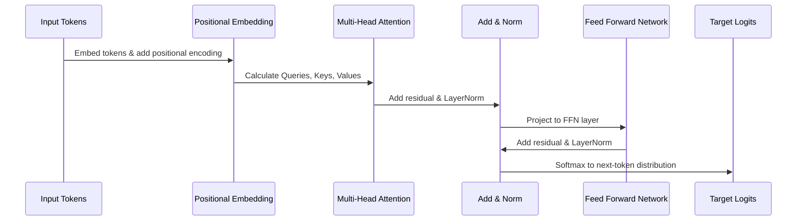

# Transformers Master Guide

A comprehensive, industry-grade guide to Transformer architectures, multi-head self-attention mechanisms, and sequence translation workflows.

---

## 1. Introduction & History
Introduced by Vaswani et al. in 2017 ("Attention Is All You Need"), the Transformer replaces recurrent layers (LSTMs, GRUs) entirely with self-attention mechanism, enabling massive parallelization during training.

## 2. Mathematics Behind Multi-Head Attention
The fundamental building block of the Transformer is the Scaled Dot-Product Attention:

$$\text{Attention}(Q, K, V) = \text{softmax}\left(\frac{QK^T}{\sqrt{d_k}}\right)V$$

Where:
- $Q$ is the Query matrix.
- $K$ is the Key matrix.
- $V$ is the Value matrix.
- $d_k$ is the scaling factor (dimension of query/key vectors).

Multi-head attention projects Queries, Keys, and Values $h$ times with different learned linear projections:

$$\text{MultiHead}(Q, K, V) = \text{Concat}(\text{head}_1, \dots, \text{head}_h)W^O$$
$$\text{head}_i = \text{Attention}(QW_i^Q, KW_i^K, VW_i^V)$$

## 3. Workflow & Sequence Diagram


## 4. PyTorch Implementation of Self-Attention
```python
import torch
import torch.nn as nn
import math

class ScaledDotProductAttention(nn.Module):
    def __init__(self):
        super().__init__()
        
    def forward(self, q, k, v, mask=None):
        d_k = q.size(-1)
        scores = torch.matmul(q, k.transpose(-2, -1)) / math.sqrt(d_k)
        
        if mask is not None:
            scores = scores.masked_fill(mask == 0, -1e9)
            
        attn_weights = torch.softmax(scores, dim=-1)
        output = torch.matmul(attn_weights, v)
        return output, attn_weights
```

## 5. Performance Optimization & Troubleshooting
- **Memory scaling**: Self-attention scales quadratically ($O(N^2)$) with sequence length. Use FlashAttention or sliding window attention to optimize memory bottleneck.

---
