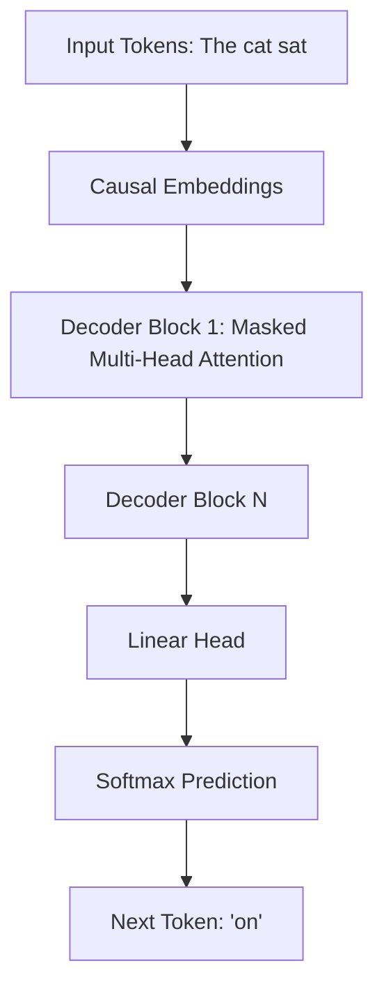

# GPT (Generative Pre-trained Transformer) Guide

A comprehensive guide to the Decoder-Only Autoregressive Transformer family (GPT-1, GPT-2, GPT-3, GPT-4).

---

## 1. Introduction
GPT is a generative autoregressive language model developed by OpenAI, based on the Transformer Decoder architecture.

## 2. Architecture & Autoregressive Decoding
Unlike BERT (which is Encoder-Only and bidirectional), GPT is Decoder-Only and utilizes masked causal self-attention. This prevents the query from attending to future tokens.



## 3. Python Autoregressive Generation
```python
import torch
import torch.nn.functional as F

def generate_text(model, start_tokens, max_len=50):
    model.eval()
    generated = start_tokens
    
    for _ in range(max_len):
        with torch.no_grad():
            logits = model(generated) # get output logits
            next_token_logits = logits[:, -1, :]
            
            # Filter logits using top-k/top-p sampling
            probs = F.softmax(next_token_logits, dim=-1)
            next_token = torch.multinomial(probs, num_samples=1)
            
            generated = torch.cat((generated, next_token), dim=1)
    return generated
```

---
