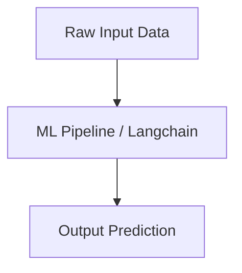

# Langchain Master Engineering Guide

A comprehensive, industry-grade guide to Langchain for AI, ML, and Data Science practitioners.

---

<ProgressTracker currentSection=1 totalSections=6 />

## 1. Introduction
Detailed overview of Langchain in machine learning and AI architectures.

<ProgressTracker currentSection=2 totalSections=6 />

## 2. Why it exists & Problems it solves
Enterprise scale deployments require robust mathematical and computational foundations. Langchain solves these specific constraints.

<ProgressTracker currentSection=3 totalSections=6 />

## 3. Internal Working & Architecture


<ProgressTracker currentSection=4 totalSections=6 />

## 4. Hands-on Examples & Configurations
<Tabs>
  <Tab label="Syntax & Example">

```python
# Sample production setup code
print("Initializing Langchain pipeline...")
```

  </Tab>
  <Tab label="Interactive Playground">
    <InteractiveExample 
      language="python"
      initialCode="# Sample production setup code\nprint(\"Initializing Langchain pipeline...\")" 
      instruction="Execute and edit this PYTHON example."
    />
  </Tab>
</Tabs>

<ProgressTracker currentSection=5 totalSections=6 />

## 5. Performance Optimization & Monitoring
- Implement feature selection and hyperparameters tuning.
- Track accuracy and data drift metrics using Prometheus.

<ProgressTracker currentSection=6 totalSections=6 />

## 6. Common Errors & Troubleshooting
- **Error**: Overfitting.
- **Solution**: Apply dropout, regularization (L1/L2), and cross-validation folds.

---

---

### Knowledge Verification Check

<Quiz 
  question="What does Retrieval-Augmented Generation (RAG) accomplish in LLM deployment?" 
  options=["It fine-tunes model weights on private PDFs.", "It queries external databases for relevant context based on user prompt, injecting that context into the prompt to provide accurate, up-to-date answers.", "It translates English prompts to SQL queries automatically.", "It speeds up token processing rates."] 
  answerIndex=1 
  explanation="RAG bridges foundation models with external search. It fetches domain documents semantically and feeds them as prompt context, reducing hallucinations." 
/>

<Quiz 
  question="What is the difference between Fine-tuning and Prompt Engineering?" 
  options=["Fine-tuning alters the model's static weight parameters; Prompt Engineering designs context prompts to guide pre-trained models without modifying weights.", "Fine-tuning is done in Javascript; Prompt Engineering in Python.", "Prompt Engineering is done only by compilers.", "There is no difference."] 
  answerIndex=0 
  explanation="Fine-tuning updates weights via gradient descent on specific datasets. Prompt engineering adjusts the query layout to leverage the model's in-context learning." 
/>

<Quiz 
  question="How are text prompts processed by LLM architectures?" 
  options=["As whole paragraphs in memory.", "Text is split into sub-word units called tokens, which are mapped to numerical IDs using a vocabulary tokenizer.", "By compiling words to native C strings.", "By index lookup in SQL databases."] 
  answerIndex=1 
  explanation="Models read sequences of tokens. Tokenization algorithms (like Byte Pair Encoding) break strings down into sub-word tokens representing common character sets." 
/>

<Quiz 
  question="What is a text embedding?" 
  options=["A compressed zip file of text documentation.", "A dense, high-dimensional vector representation of text that captures semantic meaning, enabling mathematical similarity comparison.", "A database primary key value.", "An HTML container tag."] 
  answerIndex=1 
  explanation="Embeddings map words or sentences into a continuous vector space where semantically similar items reside close to each other (e.g. calculated via Cosine Similarity)." 
/>

<Quiz 
  question="What database type is optimized to index and query vector embeddings for semantic search?" 
  options=["Relational Database (SQL)", "Vector Database (e.g. Pinecone, Milvus, Chroma)", "Graph Database", "Key-Value Store"] 
  answerIndex=1 
  explanation="Vector databases specialize in storing embeddings and executing fast nearest-neighbor queries (like KNN or ANN search algorithms) over high-dimensional vector spaces." 
/>

<Quiz 
  question="Which core mechanism in Transformer architectures calculates the relevance of tokens relative to each other in a sequence?" 
  options=["Backpropagation", "Self-Attention", "Activation gating", "Vector indexing"] 
  answerIndex=1 
  explanation="Self-attention computes dynamic weight vectors for each token based on query, key, and value matrices, letting tokens capture contextual relationships across sequences." 
/>

<Quiz 
  question="What is an LLM 'hallucination'?" 
  options=["A crash in the GPU server.", "When a model generates factually incorrect, nonsensical, or ungrounded statements with high statistical confidence.", "A syntax error in model compilation.", "A network timeout in API requests."] 
  answerIndex=1 
  explanation="Hallucinations occur because models predict the most statistically probable next token based on training data, without actual validation of factual truth." 
/>

<Quiz 
  question="What is the role of a System Prompt in LLM systems?" 
  options=["To control operating system threads.", "To define the overall persona, constraints, instructions, and behavior limits of the model prior to processing user queries.", "To index documentation documents.", "To handle database exceptions."] 
  answerIndex=1 
  explanation="System prompts establish the runtime frame. They tell the model how to act (e.g., 'You are a helpful assistant', 'Only output JSON') and set formatting guidelines." 
/>

<Quiz 
  question="How does the Temperature setting affect LLM responses?" 
  options=["It adjusts the GPU server cooling system.", "It controls randomness: low temperature yields deterministic responses; high temperature introduces variety and creativity by flattening probability logits.", "It alters context token limits.", "It tracks execution time."] 
  answerIndex=1 
  explanation="Temperature scales logit values before Softmax. Values near 0 produce greedy sampling (same output). Values near 1.0 introduce randomness." 
/>

<Quiz 
  question="What is the Context Window of an LLM?" 
  options=["The UI window displaying chats.", "The maximum sequence length (in tokens) the model can process in a single forward pass, covering both prompt input and generated output.", "The total training dataset file size.", "The API request time limit."] 
  answerIndex=1 
  explanation="The context window limits total token capacity (e.g. 8k, 32k, or 1M tokens). Exceeding it requires truncating history or using retrieval." 
/>

<Quiz 
  question="What defines Few-shot prompting?" 
  options=["Training models on few GPUs.", "Providing a few complete examples of inputs and desired outputs directly inside the prompt to demonstrate task format before query.", "Fine-tuning models on a tiny dataset.", "Running inference multiple times."] 
  answerIndex=1 
  explanation="Few-shot prompting leverages the in-context learning of LLMs. Showing examples of matching transformations guides the model to reproduce the target format." 
/>

<Quiz 
  question="What is the objective of Chunking in a RAG ingestion pipeline?" 
  options=["To delete empty lines in source documents.", "To split large documents into smaller, semantically coherent segments before vector indexing, ensuring focused embedding calculations and context injections.", "To convert markdown into HTML tables.", "To encrypt data fields."] 
  answerIndex=1 
  explanation="Chunking aligns document scale. Injecting a whole book exceeds context windows; chunking splits it into focused parts (e.g., 500-token segments) for exact retrieval." 
/>
