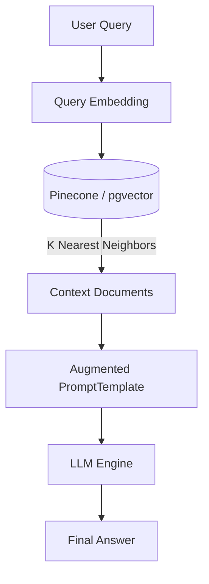

# Retrieval-Augmented Generation (RAG) Master Guide

A comprehensive guide to building, chunking, indexing, and evaluating production-grade RAG systems.

---

## 1. Introduction & Workflow
RAG enhances Large Language Models by retrieving context documents from a vector database before compiling the user query prompt.



## 2. Chunking & Indexing Strategies
- **Fixed-Size Chunking**: Chunk size of 512 tokens with 10% overlap.
- **Semantic Chunking**: Split sentences based on cosine similarity thresholds between consecutive sentences.

## 3. Hands-on RAG Pipeline with LangChain
```python
from langchain_community.vectorstores import Chroma
from langchain_openai import OpenAIEmbeddings, ChatOpenAI
from langchain_core.prompts import ChatPromptTemplate
from langchain_core.runnables import RunnablePassthrough

# Load Vector Store
vectorstore = Chroma(persist_directory="./db", embedding_function=OpenAIEmbeddings())
retriever = vectorstore.as_retriever(search_kwargs={"k": 3})

# Prompt
template = "Answer based on context:\nContext: {context}\nQuestion: {question}"
prompt = ChatPromptTemplate.from_template(template)

# Chain
rag_chain = (
    {"context": retriever, "question": RunnablePassthrough()}
    | prompt
    | ChatOpenAI(model="gpt-4o")
)

response = rag_chain.invoke("What is our product roadmap?")
print(response)
```

---
