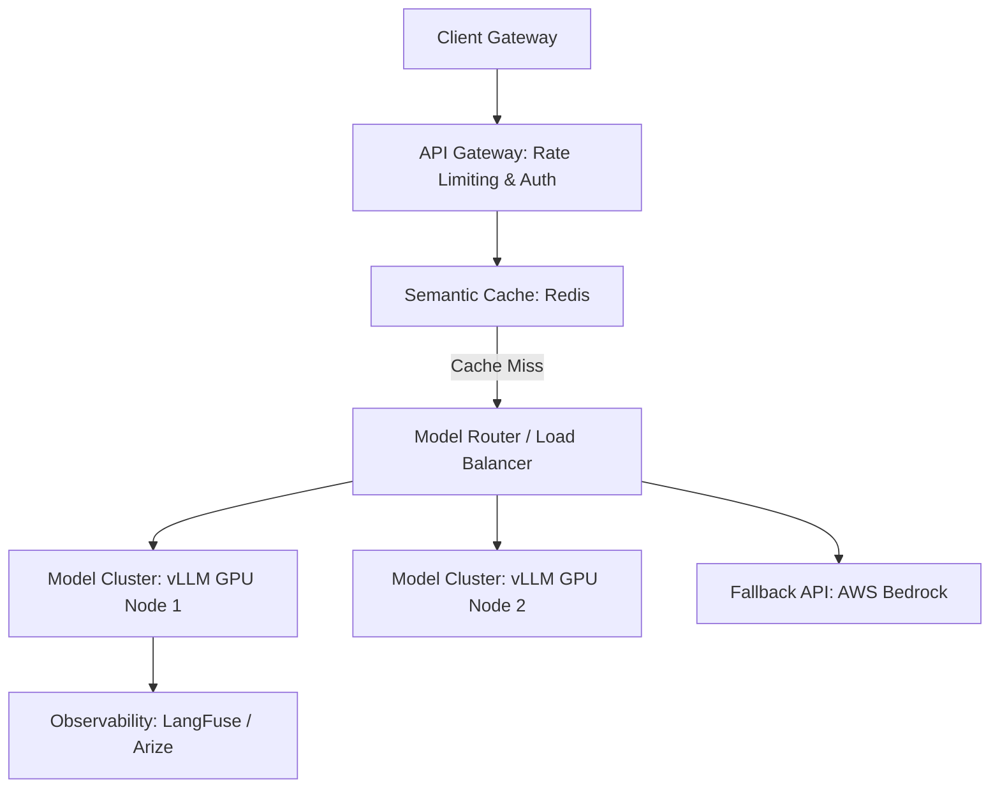

# LLM Production System Design

Architecting enterprise-grade LLM applications, routing pipelines, caching models, and multi-node serving.

---

## 1. Production Architecture

## 2. Critical Scaling Features
- **Semantic Caching**: Store queries in Redis. If a new query has a cosine similarity > 0.95 with a cached query, return the cached response.
- **Continuous Batching**: Run dynamic scheduling inside vLLM/TGI serving engines to maximize GPU utilization.

---
