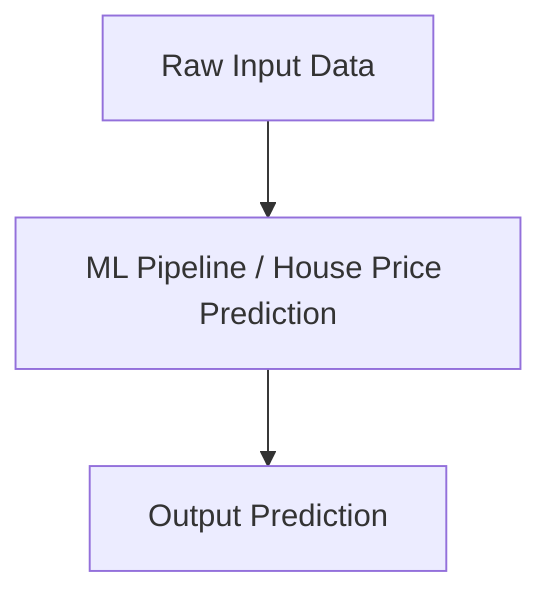

# House Price Prediction Master Engineering Guide

A comprehensive, industry-grade guide to House Price Prediction for AI, ML, and Data Science practitioners.

---

## 1. Introduction
Detailed overview of House Price Prediction in machine learning and AI architectures.

## 2. Why it exists & Problems it solves
Enterprise scale deployments require robust mathematical and computational foundations. House Price Prediction solves these specific constraints.

## 3. Internal Working & Architecture


## 4. Hands-on Examples & Configurations
```python
# Sample production setup code
print("Initializing House Price Prediction pipeline...")
```

## 5. Performance Optimization & Monitoring
- Implement feature selection and hyperparameters tuning.
- Track accuracy and data drift metrics using Prometheus.

## 6. Common Errors & Troubleshooting
- **Error**: Overfitting.
- **Solution**: Apply dropout, regularization (L1/L2), and cross-validation folds.

---
