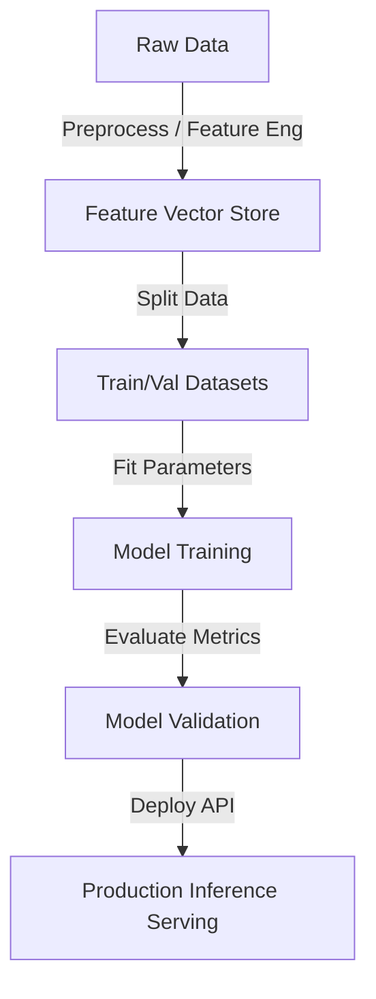

# AI / ML Developer Guide

Welcome to the AI / ML Developer guide. This document serves as a comprehensive reference for training ML models, deploying neural networks, and building generative AI applications using Large Language Models (LLMs).

---

## 1. Machine Learning Workflow

A standard Machine Learning system requires robust pipelines for data preparation, model training, evaluation, and serving.



### Core ML Metrics

| Task | Common Algorithms | Primary Metrics | Key Considerations |
| :--- | :--- | :--- | :--- |
| **Classification** | Logistic Regression, Random Forest, XGBoost | Accuracy, Precision, Recall, F1-Score, ROC-AUC | Imbalanced classes (use F1/Precision-Recall curve instead of Accuracy) |
| **Regression** | Linear Regression, Ridge, Lasso, Gradient Boosting | MSE, RMSE, MAE, R-Squared | Outlier sensitivity (use MAE if outliers are present) |
| **Generative AI** | GPT-4, Gemini 2.5, Claude 3.5, Llama 3 | BLEU, ROUGE, Cosine Similarity, Ragas | Hallucinations, latency, context window limits |

---

## 2. Deep Learning & Computer Vision

Deep learning leverages multi-layered neural networks to extract high-level representations from unstructured inputs like text, audio, and images.

```python
# Example: Simple Neural Network with PyTorch
import torch
import torch.nn as nn
import torch.optim as optim

class SimpleClassifier(nn.Module):
    def __init__(self, input_dim, hidden_dim, output_dim):
        super(SimpleClassifier, self).__init__()
        self.fc1 = nn.Linear(input_dim, hidden_dim)
        self.relu = nn.ReLU()
        self.fc2 = nn.Linear(hidden_dim, output_dim)
        self.softmax = nn.LogSoftmax(dim=1)
        
    def forward(self, x):
        out = self.fc1(x)
        out = self.relu(out)
        out = self.fc2(out)
        out = self.softmax(out)
        return out

# Instantiate model
model = SimpleClassifier(input_dim=10, hidden_dim=32, output_dim=2)
print(model)
```

---

## 3. Retrieval-Augmented Generation (RAG)

Generative AI often requires grounding in proprietary datasets to prevent hallucinations. RAG solves this by injecting relevant text chunks into the context window of an LLM.

### RAG Sequence:
1. **Ingest**: Parse documents and split them into semantic text chunks.
2. **Embed**: Convert text chunks to vector embeddings using an embedding model (e.g., `text-embedding-004`).
3. **Index**: Load vectors into a Vector Database (e.g., Pinecone, Chroma, pgvector).
4. **Retrieve**: Embed user query, perform a cosine-similarity search, and retrieve top-k chunks.
5. **Generate**: Query LLM with system prompt + retrieved context + user question.

```python
# Example: Using Gemini Client for Q&A
from google import genai
from google.genai import types

def answer_with_gemini(user_query, retrieved_context, api_key):
    client = genai.Client(api_key=api_key)
    
    system_instruction = (
        "You are an AI/ML documentation assistant. "
        "Answer the user query using ONLY the provided context."
    )
    
    response = client.models.generate_content(
        model="gemini-2.5-flash",
        contents=f"CONTEXT:\n{retrieved_context}\n\nQUESTION:\n{user_query}",
        config=types.GenerateContentConfig(
            system_instruction=system_instruction,
            temperature=0.1
        )
    )
    return response.text
```
