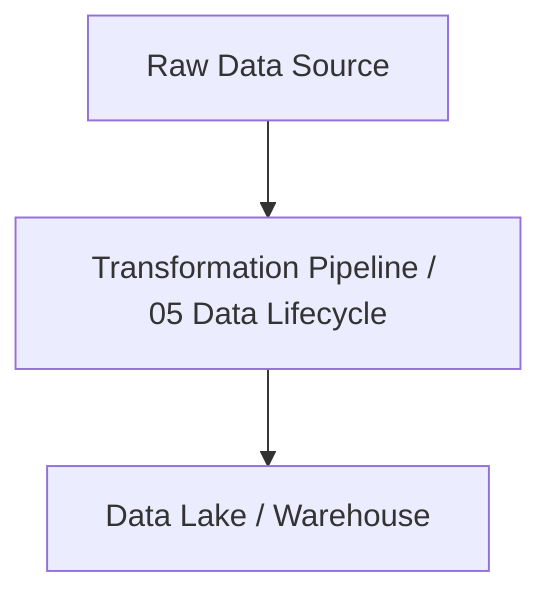

# 05 Data Lifecycle Master Engineering Guide

A comprehensive, industry-grade guide to 05 Data Lifecycle for data engineers, architects, and developers.

---

## 1. Introduction
Detailed overview of 05 Data Lifecycle in data engineering pipelines.

## 2. Why it exists & Problems it solves
Enterprise scale data pipelines require robust, scalable abstractions to handle data volume, velocity, and variety. 05 Data Lifecycle solves these specific constraints.

## 3. Internal Working & Architecture


## 4. Hands-on Examples & Configurations
```python
# Sample production setup code
print("Initializing 05 Data Lifecycle operations...")
```

## 5. Performance Optimization & Security
- Implement partition pruning and data compression.
- Enable Role-Based Access Control (RBAC) and data encryption in transit.

## 6. Common Errors & Troubleshooting
- **Error**: Connection timeout.
- **Solution**: Configure keep-alive limits and verify network routes.

---
