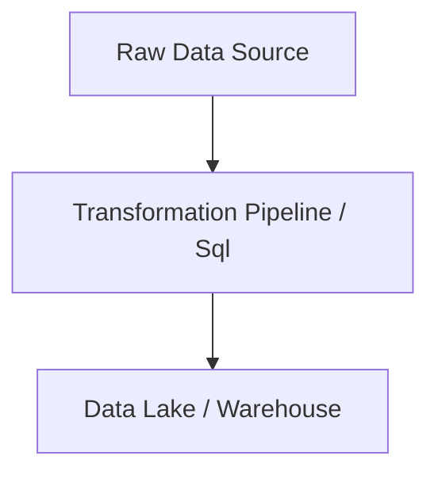

# Sql Master Engineering Guide

A comprehensive, industry-grade guide to Sql for data engineers, architects, and developers.

---

<ProgressTracker currentSection=1 totalSections=6 />

## 1. Introduction
Detailed overview of Sql in data engineering pipelines.

<ProgressTracker currentSection=2 totalSections=6 />

## 2. Why it exists & Problems it solves
Enterprise scale data pipelines require robust, scalable abstractions to handle data volume, velocity, and variety. Sql solves these specific constraints.

<ProgressTracker currentSection=3 totalSections=6 />

## 3. Internal Working & Architecture


<ProgressTracker currentSection=4 totalSections=6 />

## 4. Hands-on Examples & Configurations
<Tabs>
  <Tab label="Syntax & Example">

```python
# Sample production setup code
print("Initializing Sql operations...")
```

  </Tab>
  <Tab label="Interactive Playground">
    <InteractiveExample 
      language="python"
      initialCode="# Sample production setup code\nprint(\"Initializing Sql operations...\")" 
      instruction="Execute and edit this PYTHON example."
    />
  </Tab>
</Tabs>

<ProgressTracker currentSection=5 totalSections=6 />

## 5. Performance Optimization & Security
- Implement partition pruning and data compression.
- Enable Role-Based Access Control (RBAC) and data encryption in transit.

<ProgressTracker currentSection=6 totalSections=6 />

## 6. Common Errors & Troubleshooting
- **Error**: Connection timeout.
- **Solution**: Configure keep-alive limits and verify network routes.

---

---

### Knowledge Verification Check

<Quiz 
  question="When must the `HAVING` clause be used in SQL instead of the `WHERE` clause?" 
  options=["When filtering records containing string patterns.", "When filtering groups of query results based on aggregate functions (e.g. SUM, AVG).", "When sorting results in descending order.", "When performing SQL join operations."] 
  answerIndex=1 
  explanation="The `WHERE` clause filters individual rows before grouping. The `HAVING` clause filters grouped results after aggregation has been applied." 
/>

<Quiz 
  question="Which type of SQL Join returns all rows from the left table, and matching rows from the right table, filling with NULL if no match is found?" 
  options=["INNER JOIN", "LEFT JOIN", "RIGHT JOIN", "FULL OUTER JOIN"] 
  answerIndex=1 
  explanation="A `LEFT JOIN` (or LEFT OUTER JOIN) returns all records from the left table and any corresponding matching records from the right table." 
/>

<Quiz 
  question="How does a B-Tree index speed up database SELECT queries, and what is its overhead?" 
  options=["It compresses table files to half size, slowing down writes.", "It provides logarithmic time search (O(log N)) for matching rows, but adds write overhead to update the index on INSERT, UPDATE, and DELETE operations.", "It turns relational tables into NoSQL collections.", "It runs queries in parallel on the GPU."] 
  answerIndex=1 
  explanation="B-Tree indexes speed up lookups by organizing data in a balanced search tree. However, every modification to indexed columns requires updating the tree structure, adding write overhead." 
/>

<Quiz 
  question="What does the ACID acronym stand for in database transaction management?" 
  options=["Aggregation, Consolidation, Indexing, Distribution.", "Atomicity, Consistency, Isolation, Durability.", "Availability, Concurrency, Isolation, Deletion.", "Access, Control, Integrity, Definition."] 
  answerIndex=1 
  explanation="ACID properties (Atomicity, Consistency, Isolation, Durability) ensure database transactions are processed reliably, maintaining data integrity." 
/>

<Quiz 
  question="Which ANSI SQL transaction isolation level prevents dirty reads and non-repeatable reads, but can allow phantom reads?" 
  options=["Read Uncommitted", "Read Committed", "Repeatable Read", "Serializable"] 
  answerIndex=2 
  explanation="Repeatable Read prevents dirty reads and non-repeatable reads by holding locks on read rows, but does not lock index ranges, potentially allowing phantom rows to be inserted." 
/>

<Quiz 
  question="What is the primary goal of Third Normal Form (3NF) in database design?" 
  options=["To optimize search queries using caching.", "To eliminate transitive dependencies, ensuring all non-key columns depend only on the primary key, thereby reducing data redundancy.", "To split tables into document-based JSON rows.", "To enforce foreign key constraints across different databases."] 
  answerIndex=1 
  explanation="A database is in 3NF if it is in 2NF and has no transitive functional dependencies, meaning every non-prime attribute depends directly on the primary key." 
/>

<Quiz 
  question="What is a key difference between a Primary Key and a Unique constraint?" 
  options=["A table can have multiple Primary Keys, but only one Unique constraint.", "Primary Keys can contain NULL values, Unique constraints cannot.", "A table can have only one Primary Key, but multiple Unique constraints, and Unique constraints can allow NULL values.", "They are identical and have no functional differences."] 
  answerIndex=2 
  explanation="A table is limited to one primary key, which uniquely identifies rows and forbids NULL values. Unique constraints allow duplicate prevention across other columns, allowing NULLs." 
/>

<Quiz 
  question="What does a Foreign Key constraint enforce in a relational schema?" 
  options=["It encrypts columns to secure foreign user access.", "Referential integrity, guaranteeing that values in a column match existing values in the primary key of a referenced parent table.", "It automatically synchronizes tables with external APIs.", "It indexes columns for faster search."] 
  answerIndex=1 
  explanation="Foreign keys maintain referential integrity, preventing invalid data entries in child tables by ensuring they point to a valid parent record." 
/>

<Quiz 
  question="Which SQL aggregate function computes the rank of rows within query partitions without skipping rank numbers?" 
  options=["RANK()", "DENSE_RANK()", "ROW_NUMBER()", "PERCENT_RANK()"] 
  answerIndex=1 
  explanation="Unlike `RANK()`, which leaves gaps when ties occur (e.g. 1, 2, 2, 4), `DENSE_RANK()` assigns consecutive integers without gaps (e.g. 1, 2, 2, 3)." 
/>

<Quiz 
  question="What is the difference between a View and a Materialized View?" 
  options=["Views are stored on disk, Materialized Views exist only in memory.", "A View is a virtual table that executes its query dynamically, while a Materialized View precomputes and stores its result query data on disk.", "Materialized Views are used only in NoSQL databases.", "There is no difference; they are identical."] 
  answerIndex=1 
  explanation="Views run their queries on-demand, consuming computation resources each time. Materialized views cache query results physically on disk and must be refreshed when base data changes." 
/>

<Quiz 
  question="Why are Columnar databases preferred over Row-oriented databases for OLAP (Analytical) workloads?" 
  options=["They run transactions faster.", "They allow reading only the specific columns needed for aggregations, drastically reducing disk I/O and improving compression rates.", "They use JSON format internally.", "They require less memory to load."] 
  answerIndex=1 
  explanation="Row-oriented databases are optimized for OLTP (reading whole rows). Columnar databases group column values together, enabling high compression and fast aggregation over specific fields." 
/>

<Quiz 
  question="What is a Common Table Expression (CTE) in SQL?" 
  options=["A permanent database table used for caching.", "A temporary named result set defined within the scope of a single SELECT, INSERT, UPDATE, or DELETE query using the `WITH` keyword.", "A table index optimization strategy.", "A database schema validation rule."] 
  answerIndex=1 
  explanation="CTEs are defined using the `WITH` keyword. They act as temporary queries that exist during the execution of a main statement, improving query readability and enabling recursion." 
/>
