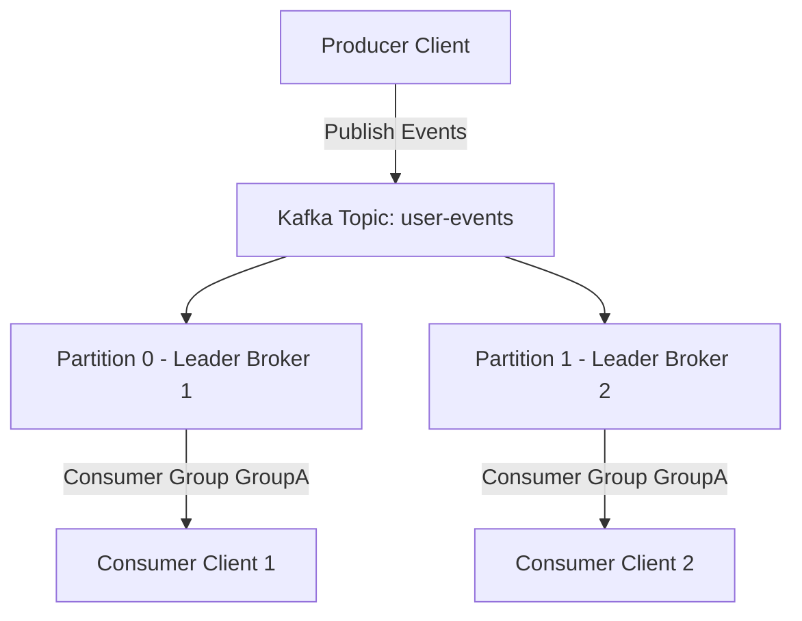

# Apache Kafka Master Engineering Guide

A comprehensive, production-grade guide to Apache Kafka for real-time data streaming.

---

## 1. Introduction
Apache Kafka is a distributed event store and stream processing platform designed to handle real-time data feeds at massive scale.

## 2. Internal Working & Architecture
Kafka runs as a cluster of brokers. Topics are divided into partitions and distributed across brokers for parallel processing and replication.



## 3. Hands-on Kafka Producer & Consumer Configuration
```python
from kafka import KafkaProducer, KafkaConsumer
import json

# Setup Producer
producer = KafkaProducer(
    bootstrap_servers=['localhost:9092'],
    value_serializer=lambda v: json.dumps(v).encode('utf-8')
)

# Publish message
producer.send('user-events', {'user_id': 101, 'action': 'click'})
producer.flush()

# Setup Consumer
consumer = KafkaConsumer(
    'user-events',
    bootstrap_servers=['localhost:9092'],
    auto_offset_reset='earliest',
    group_id='analytics-group',
    value_deserializer=lambda x: json.loads(x.decode('utf-8'))
)

for message in consumer:
    print(f"Consumed event: {message.value}")
```

## 4. Production Best Practices & Common Errors
- **Replication Factor**: Always set to at least `3` in production.
- **Error: CommitFailedException**: Consumer took too long to process messages. Tune `max.poll.interval.ms` or decrease `max.poll.records`.

---
