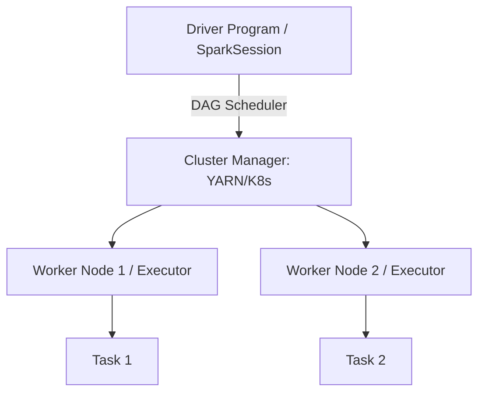

# Spark Streaming Master Guide

A comprehensive, industry-grade guide to Spark Streaming for data engineers, architects, and developers.

---

## 1. Introduction
Apache Spark is a multi-language engine for executing data engineering, data science, and machine learning on single-node machines or clusters.

## 2. Why it exists & Problems it solves
Traditional MapReduce writes intermediate results to physical disk, causing massive disk I/O bottlenecks. Spark solves this by introducing in-memory processing via Resilient Distributed Datasets (RDDs).

## 3. Internal Working & Architecture
Spark uses a Master-Worker clustering model. The Driver program coordinates execution, creates the SparkSession, builds the Logical/Physical Execution Plans, and sends tasks to Executor worker nodes.



## 4. Hands-on PySpark DataFrame Operations
```python
from pyspark.sql import SparkSession
from pyspark.sql.functions import col, when

# Initialize SparkSession
spark = SparkSession.builder \
    .appName("ProductionETL") \
    .config("spark.sql.shuffle.partitions", "200") \
    .getOrCreate()

# Create dataframe
df = spark.read.json("s3a://data-lake/raw/events.json")

# Transform data
processed_df = df.filter(col("status") == "ACTIVE") \
    .withColumn("priority", when(col("score") > 80, "HIGH").otherwise("LOW"))

# Write output to Delta Lake partitioned by date
processed_df.write \
    .format("delta") \
    .partitionBy("event_date") \
    .mode("overwrite") \
    .save("s3a://data-lake/processed/events")
```

## 5. Performance Optimization & Troubleshooting
- **Data Skew**: Use salting techniques to distribute hot keys.
- **OOM Errors**: Increase executor memory (`spark.executor.memory`) and tune serialization config (`spark.serializer=org.apache.spark.serializer.KryoSerializer`).

---
