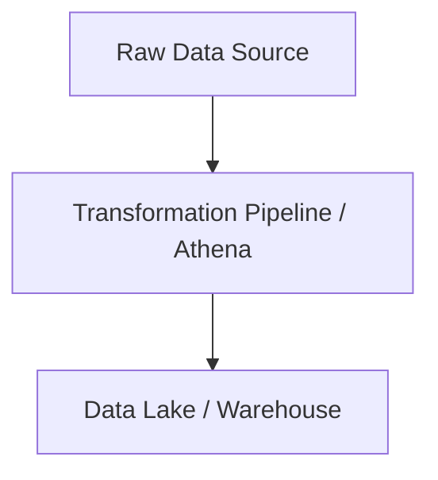

# Athena Master Engineering Guide

A comprehensive, industry-grade guide to Athena for data engineers, architects, and developers.

---

<ProgressTracker currentSection=1 totalSections=6 />

## 1. Introduction
Detailed overview of Athena in data engineering pipelines.

<ProgressTracker currentSection=2 totalSections=6 />

## 2. Why it exists & Problems it solves
Enterprise scale data pipelines require robust, scalable abstractions to handle data volume, velocity, and variety. Athena solves these specific constraints.

<ProgressTracker currentSection=3 totalSections=6 />

## 3. Internal Working & Architecture


<ProgressTracker currentSection=4 totalSections=6 />

## 4. Hands-on Examples & Configurations
<Tabs>
  <Tab label="Syntax & Example">

```python
# Sample production setup code
print("Initializing Athena operations...")
```

  </Tab>
  <Tab label="Interactive Playground">
    <InteractiveExample 
      language="python"
      initialCode="# Sample production setup code\nprint(\"Initializing Athena operations...\")" 
      instruction="Execute and edit this PYTHON example."
    />
  </Tab>
</Tabs>

<ProgressTracker currentSection=5 totalSections=6 />

## 5. Performance Optimization & Security
- Implement partition pruning and data compression.
- Enable Role-Based Access Control (RBAC) and data encryption in transit.

<ProgressTracker currentSection=6 totalSections=6 />

## 6. Common Errors & Troubleshooting
- **Error**: Connection timeout.
- **Solution**: Configure keep-alive limits and verify network routes.

---

---

### Knowledge Verification Check

<Quiz 
  question="What is a key protocol difference between REST and gRPC APIs?" 
  options=["REST uses TCP; gRPC uses UDP.", "REST relies on HTTP/1.1 and exchanges JSON/XML text; gRPC uses HTTP/2 and serializes binary data via Protocol Buffers.", "REST is stateful; gRPC is stateless.", "REST is faster for server-to-server streaming."] 
  answerIndex=1 
  explanation="gRPC leverages HTTP/2 features (like multiplexing, header compression, bidirectional streaming) and binary protobuf encoding to offer high-efficiency server communication." 
/>

<Quiz 
  question="What is the core idea of a Microservices architecture?" 
  options=["Compiling all code into a single massive server executable.", "Decomposing an application into a collection of small, loosely coupled, independently deployable services organized around business capabilities.", "Running all code on a single developer machine.", "Writing applications using tiny javascript packages."] 
  answerIndex=1 
  explanation="Microservices isolate database and code scope. Each service manages its own stack and data, communicating via APIs (REST, gRPC, or messaging), enhancing scale." 
/>

<Quiz 
  question="What is AWS EC2?" 
  options=["A serverless database service.", "A web service providing secure, resizable compute capacity in the cloud (Virtual Machines).", "An object storage bucket container.", "An API routing gateway."] 
  answerIndex=1 
  explanation="Elastic Compute Cloud (EC2) provides virtual machine instances where developers configure operating systems, middleware, and applications manually." 
/>

<Quiz 
  question="What defines AWS Lambda compute execution?" 
  options=["A physical server cabinet allocated to a tenant.", "Serverless, event-driven compute service that runs application code automatically in response to triggers, scaling container resources dynamically.", "A virtual machine running 24/7.", "A managed Redis caching node."] 
  answerIndex=1 
  explanation="Lambda is serverless. Users upload code and set trigger events. Lambda instantiates containers to execute the code, scaling to zero when requests finish, charging by run duration." 
/>

<Quiz 
  question="What is Amazon S3?" 
  options=["A relational database service.", "An object storage service offering industry-leading scalability, data availability, security, and performance for files.", "A serverless message broker.", "An AWS networking load balancer."] 
  answerIndex=1 
  explanation="Simple Storage Service (S3) stores flat files (images, backups, datasets) as key-value objects in buckets, providing high durability and scalability." 
/>

<Quiz 
  question="What is the primary role of a Load Balancer in system design?" 
  options=["To compress database tables.", "To distribute incoming network traffic across a group of backend servers to prevent overload and ensure high availability.", "To encrypt API request bodies.", "To coordinate server database backups."] 
  answerIndex=1 
  explanation="Load Balancers (like Nginx, AWS ALB) sit between clients and servers. They monitor server health and forward requests, optimizing response speeds and uptime." 
/>

<Quiz 
  question="What is an API Gateway used for in microservice architectures?" 
  options=["To store document collections.", "As a single entry point that routes requests, handles authentication, collects metrics, and applies rate limiting for all downstream microservices.", "To compile code files.", "To back up server instances."] 
  answerIndex=1 
  explanation="API Gateways centralize cross-cutting concerns. They shield internal service locations from clients, applying access checks, load routing, and SSL termination." 
/>

<Quiz 
  question="What is the role of Service Discovery in microservices?" 
  options=["To scan code directories for new files.", "A mechanism (like Consul, Eureka) that allows service instances to dynamically register their IP addresses and ports so other services can find them.", "To find new AWS accounts.", "To parse SQL query paths."] 
  answerIndex=1 
  explanation="Microservice instances scale dynamically, changing host IPs. Service Discovery acts as a registry where instances advertise addresses, allowing load routing." 
/>

<Quiz 
  question="What is a major trade-off of Microservices over Monolith architectures?" 
  options=["Microservices are always slower.", "Microservices introduce operational complexity (deployment, monitoring, networking, distributed transactions) that monolithic apps avoid.", "Monoliths require more servers to run in development.", "Microservices cannot access database tables."] 
  answerIndex=1 
  explanation="Monoliths are simple to build and test. Microservices offer decoupling and scalable team organization but add distributed system overhead (network latency, consistency)." 
/>

<Quiz 
  question="What is the difference between Vertical Scaling and Horizontal Scaling?" 
  options=["Vertical scaling is for SQL; Horizontal is for NoSQL.", "Vertical scaling adds more resources (CPU, RAM) to a single server; Horizontal scaling adds more server nodes to the resource pool.", "Vertical scaling requires compiling binaries; Horizontal scaling does not.", "They are synonyms."] 
  answerIndex=1 
  explanation="Vertical scaling (scaling up) hits hardware limits. Horizontal scaling (scaling out) adds nodes to handle traffic, matching distributed design requirements." 
/>

<Quiz 
  question="What is a Message Broker (e.g. RabbitMQ, AWS SQS) used for?" 
  options=["To direct API traffic to target IP endpoints.", "To enable asynchronous, decoupled communication between services by queuing messages until receiver services consume them.", "To compile code blocks.", "To run relational queries."] 
  answerIndex=1 
  explanation="Message brokers enable asynchronous architectures. A service publishes a message and resumes execution; receiver services process tasks asynchronously, reducing system coupling." 
/>

<Quiz 
  question="What is an Event-driven architecture?" 
  options=["An architecture running on specific user interface events (clicks).", "A system design pattern where services react to state changes (events) produced and consumed asynchronously via event logs or message channels.", "An architecture running only at specified clock times.", "A database schema design technique."] 
  answerIndex=1 
  explanation="In event-driven architectures, services communicate by publishing event streams (e.g., 'OrderCreated'). Downstream microservices subscribe and react, decoupling operations." 
/>
