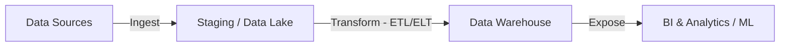

# Data Engineer Guide

Welcome to the Data Engineer guide. This document serves as a comprehensive reference for designing scalable data platforms, building reliable pipelines, and managing big data infrastructure.

---

<ProgressTracker currentSection=1 totalSections=3 />

## 1. Core Data Engineering Pipeline

Data engineering bridges the gap between raw data sources and actionable analytics. The flow is generally structured as ingest, process, load, and consume.



### ETL vs ELT Frameworks

| Paradigm | Architecture | When to Use | Key Technologies |
| :--- | :--- | :--- | :--- |
| **ETL (Extract, Transform, Load)** | Data is transformed before loading into target warehouse. | For sensitive data masking or older, compute-constrained target systems. | Apache Spark, Talend, AWS Glue |
| **ELT (Extract, Load, Transform)** | Raw data is loaded directly; transformation happens inside the target using its compute. | Modern warehouses with decoupled storage & compute. | Snowflake, BigQuery, dbt (Data Build Tool) |

---

<ProgressTracker currentSection=2 totalSections=3 />

## 2. Data Warehousing & Modeling

Proper data modeling is essential to speed up analytical queries and maintain consistency.

### Dimensional Modeling
1. **Star Schema**: Composed of a central **Fact Table** surrounded by multiple **Dimension Tables**. Extremely simple and highly optimized for read performance.
2. **Snowflake Schema**: Normalizes dimension tables into further sub-dimensions, reducing redundancy at the cost of more complex join queries.

```sql
-- Example SQL: Constructing a Star Schema Fact Table for Sales
CREATE TABLE fact_sales (
    sale_id SERIAL PRIMARY KEY,
    date_key INT REFERENCES dim_date(date_key),
    product_key INT REFERENCES dim_product(product_key),
    customer_key INT REFERENCES dim_customer(customer_key),
    quantity INT NOT NULL,
    total_amount NUMERIC(12, 2) NOT NULL
);
```

---

<ProgressTracker currentSection=3 totalSections=3 />

## 3. Streaming vs Batch Architectures

Real-time architectures are necessary for immediate insights (e.g., fraud detection), while batch is ideal for large historical aggregations.

### Comparison Matrix:
* **Batch Processing**: Processes data in large, bounded chunks. Best for nightly dashboards. (e.g., Apache Spark, Snowflake Tasks, Airflow DAGs).
* **Streaming Processing**: Processes unbounded streams of event records immediately. (e.g., Apache Kafka, Apache Flink, AWS Kinesis).

<Tabs>
  <Tab label="Syntax & Example">

```python
# Example: Simple Spark Batch Job
from pyspark.sql import SparkSession
from pyspark.sql.functions import col

def process_daily_sales():
    spark = SparkSession.builder.appName("SalesAggregation").getOrCreate()
    
    # Read raw sales CSV from S3
    df = spark.read.csv("s3://company-lake/raw/sales/*.csv", header=True, inferSchema=True)
    
    # Clean and aggregate sales
    agg_df = df.filter(col("status") == "COMPLETED") \
               .groupBy("product_id") \
               .sum("amount") \
               .withColumnRenamed("sum(amount)", "total_sales")
               
    # Write processed data back to warehouse destination
    agg_df.write.mode("overwrite").parquet("s3://company-lake/processed/sales_summary/")
    spark.stop()
```

  </Tab>
  <Tab label="Interactive Playground">
    <InteractiveExample 
      language="python"
      initialCode="# Example: Simple Spark Batch Job\nfrom pyspark.sql import SparkSession\nfrom pyspark.sql.functions import col\n\ndef process_daily_sales():\n    spark = SparkSession.builder.appName(\"SalesAggregation\").getOrCreate()\n    \n    # Read raw sales CSV from S3\n    df = spark.read.csv(\"s3://company-lake/raw/sales/*.csv\", header=True, inferSchema=True)\n    \n    # Clean and aggregate sales\n    agg_df = df.filter(col(\"status\") == \"COMPLETED\") \\\n               .groupBy(\"product_id\") \\\n               .sum(\"amount\") \\\n               .withColumnRenamed(\"sum(amount)\", \"total_sales\")\n               \n    # Write processed data back to warehouse destination\n    agg_df.write.mode(\"overwrite\").parquet(\"s3://company-lake/processed/sales_summary/\")\n    spark.stop()" 
      instruction="Execute and edit this PYTHON example."
    />
  </Tab>
</Tabs>

---

### Knowledge Verification Check

<Quiz 
  question="What are the two core phases of a MapReduce job?" 
  options=["Read and Write phases.", "Map (transforming input records) and Reduce (aggregating key-value pairs after shuffling).", "Compile and Execute phases.", "Load and Partition phases."] 
  answerIndex=1 
  explanation="MapReduce divides work. The Map step processes input lines to produce intermediate key-value sets. The Reduce step summarizes those values per key." 
/>

<Quiz 
  question="Why is Apache Spark faster than legacy Hadoop MapReduce for iterative algorithms?" 
  options=["It runs queries in the web browser.", "It performs processing in-memory (RAM) and caches intermediate states, avoiding MapReduce's frequent disk reads and writes.", "It uses NoSQL databases internally.", "It bypasses network communication entirely."] 
  answerIndex=1 
  explanation="Hadoop writes intermediate step outputs to HDFS disk. Spark keeps data in memory as Resilient Distributed Datasets (RDDs) and updates lazily, boosting speed." 
/>

<Quiz 
  question="What does a Resilient Distributed Dataset (RDD) represent in Spark?" 
  options=["A SQL table stored on a single host.", "A read-only, partitioned collection of records that can be operated on in parallel across a cluster with automatic lineage-based fault tolerance.", "A backup directory of CSV files.", "An index structure for fast search."] 
  answerIndex=1 
  explanation="RDDs are Spark's core abstraction. Distributed across worker nodes, RDDs track transformation history (lineage), allowing partitions to be rebuilt if nodes fail." 
/>

<Quiz 
  question="How are messages distributed within an Apache Kafka Topic?" 
  options=["All messages are written to one single log file.", "Topics are split into Partitions distributed across brokers; messages are appended sequentially to partitions using keys for routing.", "Messages are stored in MongoDB collections.", "Messages are deleted automatically on read."] 
  answerIndex=1 
  explanation="Partitions enable Kafka to scale. A partition is an ordered append-only commit log. Distributing partitions across cluster brokers supports high write and read scaling." 
/>

<Quiz 
  question="What does a Kafka Consumer Group enable?" 
  options=["Running multiple database queries concurrently.", "Coordinated parallel reading of topic partitions, where each partition is assigned to exactly one consumer member in the group.", "Creating backup copies of Kafka topics.", "Compiling stream processing binaries."] 
  answerIndex=1 
  explanation="Consumer groups partition message reading. By coordinating partition assignments, Kafka scales processing: adding group members divides the read workload." 
/>

<Quiz 
  question="What is a Directed Acyclic Graph (DAG) in data workflow orchestration (e.g. Apache Airflow)?" 
  options=["A database schema layout diagram.", "A collection of all tasks to run, organized in a way that reflects their relationships and execution dependencies without loop cycles.", "A network path routing table.", "A type of column-oriented index."] 
  answerIndex=1 
  explanation="Airflow uses DAGs to define workflows. Tasks are represented as nodes. Directed edges define dependencies. The acyclic rule prevents circular dependency loops." 
/>

<Quiz 
  question="How does dbt (data build tool) differ from traditional ETL tools?" 
  options=["It focuses strictly on the 'T' (Transformation) phase in ELT pipelines, compiling SQL models and running them inside the target data warehouse.", "It handles data extraction from APIs.", "It stores data in-memory on local server nodes.", "It compiles SQL into Go binaries."] 
  answerIndex=0 
  explanation="dbt doesn't move data. It acts after data is loaded (ELT), letting analysts write SQL models that dbt compiles and executes as tables/views inside warehouses." 
/>

<Quiz 
  question="What is Schema Evolution in data storage frameworks (like Parquet or Delta Lake)?" 
  options=["Updating database driver software automatically.", "The ability to modify database schema definitions (e.g. adding columns) over time without rewriting historical data files.", "Deleting old database files when schemas change.", "Automatically compiling queries to match new versions."] 
  answerIndex=1 
  explanation="Schema evolution allows column additions or type changes. Query engines read historical data with back-compatibility, avoiding expensive dataset rewrites." 
/>

<Quiz 
  question="What is the difference between Partitioning and Bucketing in large-scale table optimization?" 
  options=["Partitioning is for databases; Bucketing is for cache.", "Partitioning divides tables into directories based on column values (e.g. date); Bucketing splits data into fixed files using a hash function on a key.", "They are synonyms.", "Bucketing encrypts column fields."] 
  answerIndex=1 
  explanation="Partitioning creates folder hierarchies (e.g. `year=2026/month=07`). Bucketing (Clustering) hashes a key column to divide data into equal files within partition paths, optimizing joins." 
/>

<Quiz 
  question="What does Lazy Evaluation mean in Apache Spark execution?" 
  options=["The cluster waits for system idle time before executing jobs.", "Spark delays execution of transformations until an Action (e.g. `count()`, `collect()`) is called, enabling optimization of the entire execution plan.", "Spark runs computations slowly to save energy.", "Queries are executed only on subset samples."] 
  answerIndex=1 
  explanation="Transformations (like `filter()`, `select()`) only build a logical execution plan (DAG). When an action requests output, Spark optimizes and compiles the DAG for execution." 
/>

<Quiz 
  question="What is Change Data Capture (CDC) in data pipelines?" 
  options=["A system for version-controlling SQL files.", "A design pattern that identifies and tracks changes (inserts, updates, deletes) in a source database, streaming those events to target systems in real-time.", "A data quality validation framework.", "A database snapshotting utility."] 
  answerIndex=1 
  explanation="CDC monitors database transaction logs. Whenever modifications occur, events are streamed (e.g. via Debezium and Kafka) to update analytical warehouses immediately." 
/>

<Quiz 
  question="What is the primary difference between Lambda and Kappa data pipeline architectures?" 
  options=["Lambda uses Python; Kappa uses Go.", "Lambda processes data through batch and speed layers in parallel; Kappa processes all data using a single stream processing engine, treating batch as historical stream.", "Kappa uses SQL databases; Lambda uses NoSQL databases.", "Lambda is serverless; Kappa runs on VMs."] 
  answerIndex=1 
  explanation="Lambda balances batch stability and stream latency by using duplicate code paths. Kappa simplifies this by processing all data through a single stream pipeline (e.g., Flink) with raw logs." 
/>
