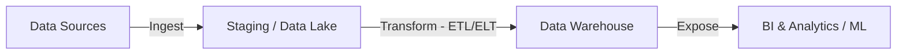

# Data Engineer Guide

Welcome to the Data Engineer guide. This document serves as a comprehensive reference for designing scalable data platforms, building reliable pipelines, and managing big data infrastructure.

---

## 1. Core Data Engineering Pipeline

Data engineering bridges the gap between raw data sources and actionable analytics. The flow is generally structured as ingest, process, load, and consume.



### ETL vs ELT Frameworks

| Paradigm | Architecture | When to Use | Key Technologies |
| :--- | :--- | :--- | :--- |
| **ETL (Extract, Transform, Load)** | Data is transformed before loading into target warehouse. | For sensitive data masking or older, compute-constrained target systems. | Apache Spark, Talend, AWS Glue |
| **ELT (Extract, Load, Transform)** | Raw data is loaded directly; transformation happens inside the target using its compute. | Modern warehouses with decoupled storage & compute. | Snowflake, BigQuery, dbt (Data Build Tool) |

---

## 2. Data Warehousing & Modeling

Proper data modeling is essential to speed up analytical queries and maintain consistency.

### Dimensional Modeling
1. **Star Schema**: Composed of a central **Fact Table** surrounded by multiple **Dimension Tables**. Extremely simple and highly optimized for read performance.
2. **Snowflake Schema**: Normalizes dimension tables into further sub-dimensions, reducing redundancy at the cost of more complex join queries.

```sql
-- Example SQL: Constructing a Star Schema Fact Table for Sales
CREATE TABLE fact_sales (
    sale_id SERIAL PRIMARY KEY,
    date_key INT REFERENCES dim_date(date_key),
    product_key INT REFERENCES dim_product(product_key),
    customer_key INT REFERENCES dim_customer(customer_key),
    quantity INT NOT NULL,
    total_amount NUMERIC(12, 2) NOT NULL
);
```

---

## 3. Streaming vs Batch Architectures

Real-time architectures are necessary for immediate insights (e.g., fraud detection), while batch is ideal for large historical aggregations.

### Comparison Matrix:
* **Batch Processing**: Processes data in large, bounded chunks. Best for nightly dashboards. (e.g., Apache Spark, Snowflake Tasks, Airflow DAGs).
* **Streaming Processing**: Processes unbounded streams of event records immediately. (e.g., Apache Kafka, Apache Flink, AWS Kinesis).

```python
# Example: Simple Spark Batch Job
from pyspark.sql import SparkSession
from pyspark.sql.functions import col

def process_daily_sales():
    spark = SparkSession.builder.appName("SalesAggregation").getOrCreate()
    
    # Read raw sales CSV from S3
    df = spark.read.csv("s3://company-lake/raw/sales/*.csv", header=True, inferSchema=True)
    
    # Clean and aggregate sales
    agg_df = df.filter(col("status") == "COMPLETED") \
               .groupBy("product_id") \
               .sum("amount") \
               .withColumnRenamed("sum(amount)", "total_sales")
               
    # Write processed data back to warehouse destination
    agg_df.write.mode("overwrite").parquet("s3://company-lake/processed/sales_summary/")
    spark.stop()
```
