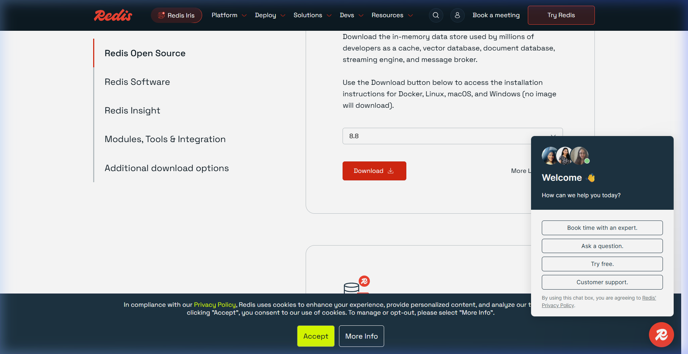
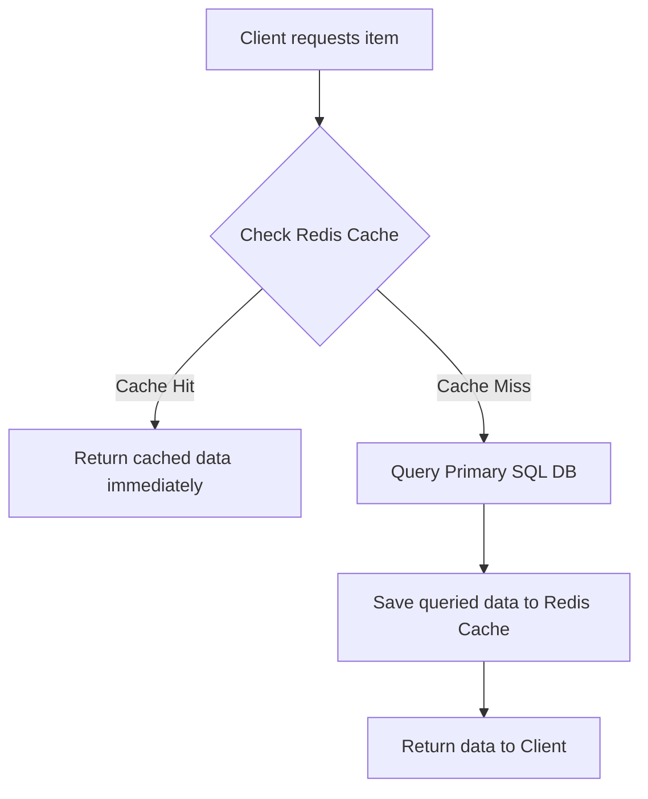

# Caching & Key-Value Stores (Redis)

Caching is the process of storing copies of frequently accessed data in transient, ultra-fast memory (RAM) to avoid running expensive database queries or CPU operations repeatedly.

## Installation & Downloads

To install Redis on your machine:
* **Linux (Ubuntu/Debian)**: Run the following commands to install and start the Redis server:
  ```bash
  sudo apt-get install redis-server
  sudo service redis-server start
  ```
* **macOS**: Install via Homebrew:
  ```bash
  brew install redis
  brew services start redis
  ```
* **Windows**: Download the Windows port (MSI installer) or run Redis inside **WSL2** (Windows Subsystem for Linux):
  1. Install WSL2 and Ubuntu.
  2. Run `sudo apt install redis-server`.
* **Verification**: Verify the connection using Redis CLI:
  ```bash
  redis-cli ping
  # Expected output: PONG
  ```

### Official Download Portal


---

## 1. Cache-Aside Pattern Flow



---

## 2. Code Demonstration: Cache-Aside Implementation in Python

```python
import json
import redis
import psycopg2

# Initialize Redis client (In-memory storage)
cache = redis.Redis(host='localhost', port=6379, db=0)

# Initialize Postgres client (Persistent storage)
db_conn = psycopg2.connect("dbname=store user=postgres password=secret")

def get_item_by_id(item_id):
    cache_key = f"item:{item_id}"
    
    # 1. Attempt to fetch from Redis
    cached_data = cache.get(cache_key)
    if cached_data:
        print("Cache Hit!")
        return json.loads(cached_data)
    
    # 2. Cache Miss: Fetch from PostgreSQL
    print("Cache Miss! Querying SQL DB...")
    cursor = db_conn.cursor()
    cursor.execute("SELECT id, name, description FROM items WHERE id = %s", (item_id,))
    row = cursor.fetchone()
    
    if not row:
        return None
        
    item_data = {"id": row[0], "name": row[1], "description": row[2]}
    
    # 3. Save serialized JSON payload into Redis with an Expiration Time (TTL)
    cache.setex(cache_key, 3600, json.dumps(item_data))  # Expire in 1 hour
    
    return item_data
```

---

## 3. Cache Eviction Policies

When memory limits are reached, Redis evicts old keys based on configured rules:
* **LRU (Least Recently Used)**: Evicts keys that have not been requested for the longest time. Ideal for hot-key scenarios.
* **LFU (Least Frequently Used)**: Evicts keys with the lowest access counters.
* **TTL (Time to Live)**: Automatically expires keys after a set number of seconds, forcing the application to fetch fresh data.
* **Volatile-LRU / Allkeys-LRU**: Applies LRU only to keys with an explicit TTL set, or across all keys in the database.
