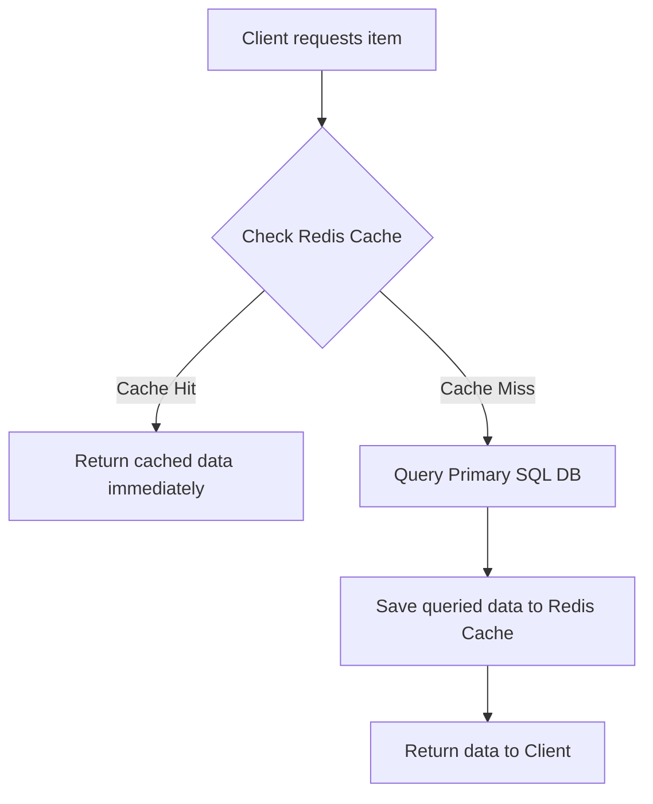

# Caching & Key-Value Stores (Redis)

Caching is the process of storing copies of frequently accessed data in transient, ultra-fast memory (RAM) to avoid running expensive database queries or CPU operations repeatedly.

<ProgressTracker currentSection=1 totalSections=4 />

## Installation & Downloads

To install Redis on your machine:
* **Linux (Ubuntu/Debian)**: Run the following commands to install and start the Redis server:
  ```bash
  sudo apt-get install redis-server
  sudo service redis-server start
  ```
* **macOS**: Install via Homebrew:
  ```bash
  brew install redis
  brew services start redis
  ```
* **Windows**: Download the Windows port (MSI installer) or run Redis inside **WSL2** (Windows Subsystem for Linux):
  1. Install WSL2 and Ubuntu.
  2. Run `sudo apt install redis-server`.
* **Verification**: Verify the connection using Redis CLI:
  ```bash
  redis-cli ping
  # Expected output: PONG
  ```

### Official Download Portal


---

<ProgressTracker currentSection=2 totalSections=4 />

## 1. Cache-Aside Pattern Flow



---

<ProgressTracker currentSection=3 totalSections=4 />

## 2. Code Demonstration: Cache-Aside Implementation in Python

<Tabs>
  <Tab label="Syntax & Example">

```python
import json
import redis
import psycopg2

# Initialize Redis client (In-memory storage)
cache = redis.Redis(host='localhost', port=6379, db=0)

# Initialize Postgres client (Persistent storage)
db_conn = psycopg2.connect("dbname=store user=postgres password=secret")

def get_item_by_id(item_id):
    cache_key = f"item:{item_id}"
    
    # 1. Attempt to fetch from Redis
    cached_data = cache.get(cache_key)
    if cached_data:
        print("Cache Hit!")
        return json.loads(cached_data)
    
    # 2. Cache Miss: Fetch from PostgreSQL
    print("Cache Miss! Querying SQL DB...")
    cursor = db_conn.cursor()
    cursor.execute("SELECT id, name, description FROM items WHERE id = %s", (item_id,))
    row = cursor.fetchone()
    
    if not row:
        return None
        
    item_data = {"id": row[0], "name": row[1], "description": row[2]}
    
    # 3. Save serialized JSON payload into Redis with an Expiration Time (TTL)
    cache.setex(cache_key, 3600, json.dumps(item_data))  # Expire in 1 hour
    
    return item_data
```

  </Tab>
  <Tab label="Interactive Playground">
    <InteractiveExample 
      language="python"
      initialCode="import json\nimport redis\nimport psycopg2\n\n# Initialize Redis client (In-memory storage)\ncache = redis.Redis(host='localhost', port=6379, db=0)\n\n# Initialize Postgres client (Persistent storage)\ndb_conn = psycopg2.connect(\"dbname=store user=postgres password=secret\")\n\ndef get_item_by_id(item_id):\n    cache_key = f\"item:{item_id}\"\n    \n    # 1. Attempt to fetch from Redis\n    cached_data = cache.get(cache_key)\n    if cached_data:\n        print(\"Cache Hit!\")\n        return json.loads(cached_data)\n    \n    # 2. Cache Miss: Fetch from PostgreSQL\n    print(\"Cache Miss! Querying SQL DB...\")\n    cursor = db_conn.cursor()\n    cursor.execute(\"SELECT id, name, description FROM items WHERE id = %s\", (item_id,))\n    row = cursor.fetchone()\n    \n    if not row:\n        return None\n        \n    item_data = {\"id\": row[0], \"name\": row[1], \"description\": row[2]}\n    \n    # 3. Save serialized JSON payload into Redis with an Expiration Time (TTL)\n    cache.setex(cache_key, 3600, json.dumps(item_data))  # Expire in 1 hour\n    \n    return item_data" 
      instruction="Execute and edit this PYTHON example."
    />
  </Tab>
</Tabs>

---

<ProgressTracker currentSection=4 totalSections=4 />

## 3. Cache Eviction Policies

When memory limits are reached, Redis evicts old keys based on configured rules:
* **LRU (Least Recently Used)**: Evicts keys that have not been requested for the longest time. Ideal for hot-key scenarios.
* **LFU (Least Frequently Used)**: Evicts keys with the lowest access counters.
* **TTL (Time to Live)**: Automatically expires keys after a set number of seconds, forcing the application to fetch fresh data.
* **Volatile-LRU / Allkeys-LRU**: Applies LRU only to keys with an explicit TTL set, or across all keys in the database.

---

### Knowledge Verification Check

<Quiz 
  question="What is the primary characteristic of key-value stores like Redis?" 
  options=["They store data in relational schemas with strict tables.", "They store records in-memory, mapping keys to values for sub-millisecond retrieval speeds.", "They compile code snippets to native binaries.", "They require GraphQL to access properties."] 
  answerIndex=1 
  explanation="Redis stores key-value pairs in memory, which allows it to act as an extremely fast cache, session store, or queue." 
/>

<Quiz 
  question="How are records represented and structured in a document database like MongoDB?" 
  options=["As rows in contiguous tables.", "As JSON-like documents (internally serialized as BSON) with dynamic schemas.", "As nodes and edge relationships.", "As key-value byte strings only."] 
  answerIndex=1 
  explanation="MongoDB is a document-oriented database. It stores records as BSON (Binary JSON) documents, letting applications persist nested object structures directly." 
/>

<Quiz 
  question="According to the CAP Theorem, which two properties must a distributed database choose between in the event of a Network Partition (P)?" 
  options=["Security vs Performance.", "Consistency (C) vs Availability (A).", "Scalability vs Relational Integrity.", "Replication vs Indexing."] 
  answerIndex=1 
  explanation="The CAP theorem states that a distributed system cannot simultaneously guarantee Consistency, Availability, and Partition Tolerance. Under network partitions, it must trade consistency for availability, or vice versa." 
/>

<Quiz 
  question="Which cache eviction policy removes the least recently accessed items first when memory limit is reached?" 
  options=["LFU (Least Frequently Used)", "LRU (Least Recently Used)", "FIFO (First In First Out)", "TTL (Time To Live)"] 
  answerIndex=1 
  explanation="Least Recently Used (LRU) evicts the key that has not been accessed for the longest duration, optimizing cache retention for temporal locality." 
/>

<Quiz 
  question="Why is denormalization commonly practiced in NoSQL database design?" 
  options=["To enforce strict SQL constraints.", "To optimize read performance by storing related data together, avoiding expensive runtime join operations across tables.", "To decrease disk space consumption.", "To make databases ACID-compliant."] 
  answerIndex=1 
  explanation="NoSQL databases generally lack relational join features. Denormalization repeats data in single documents to allow fast, single-query reads." 
/>

<Quiz 
  question="What are the two primary persistence options provided by Redis to survive restarts?" 
  options=["SQL replication and JSON dumps.", "RDB (snapshotting at intervals) and AOF (logging write commands to an append-only file).", "Direct memory allocation and swap files.", "B-Tree index logging and caching."] 
  answerIndex=1 
  explanation="Redis provides durability through RDB snapshots (point-in-time state dumps) and AOF logs (recording every write transaction as it happens)." 
/>

<Quiz 
  question="What is the role of MongoDB replica sets?" 
  options=["To split collections into separate shard keys.", "To provide high availability and automatic failover by replicating data across primary and secondary nodes.", "To speed up local memory reads by caching records.", "To compile database functions."] 
  answerIndex=1 
  explanation="Replica sets consist of a primary node (handling writes) and secondary nodes replicating data. If primary fails, secondary nodes hold an election to promote a new primary." 
/>

<Quiz 
  question="How does Consistent Hashing benefit distributed caching clusters?" 
  options=["It encrypts hash values for data security.", "It minimizes the reshuffling of cached keys when cache nodes are added or removed from the cluster.", "It compiles string keys to integer keys.", "It distributes data evenly to one single primary node."] 
  answerIndex=1 
  explanation="Consistent hashing maps cache nodes and keys to a logical ring. Adding or removing a node only impacts a fraction of keys (K/N), preventing massive cache misses." 
/>

<Quiz 
  question="What is the difference between Cache Avalanche and Cache Breakdown?" 
  options=["Avalanche is caused by database server crashes; Breakdown is client side.", "Cache Avalanche occurs when many keys expire simultaneously, flooding the database; Cache Breakdown is when a single popular hot key expires, causing concurrent DB queries.", "They are identical terms.", "Breakdown is caused by network timeouts."] 
  answerIndex=1 
  explanation="Avalanche happens when massive key expirations send concurrent spikes to databases. Breakdown (or cache stampede) is target-focused: a single hot key expires, causing concurrent database reads." 
/>

<Quiz 
  question="What defines the data model of a Graph Database (like Neo4j)?" 
  options=["Key-value string blobs.", "Nodes (entities), Edges (relationships), and Properties (key-value attributes on nodes/edges).", "Tabular records organized in rows.", "JSON documents stored inside buckets."] 
  answerIndex=1 
  explanation="Graph databases use the Property Graph model. Entities are represented as nodes, and their connections as edges, allowing fast traversal of complex relations." 
/>

<Quiz 
  question="Which NoSQL wide-column database uses keyspaces and column families to scale horizontally across multi-master nodes?" 
  options=["MongoDB", "Redis", "Apache Cassandra", "SQLite"] 
  answerIndex=2 
  explanation="Cassandra is a distributed wide-column store designed for high-availability write workloads, utilizing partitioning keys and ring topologies." 
/>

<Quiz 
  question="What is the difference between Write-through and Write-back caching strategies?" 
  options=["Write-through is slower because it writes to cache and database synchronously; Write-back writes to cache and updates the database asynchronously.", "Write-through is for NoSQL; Write-back is for SQL databases.", "Write-back deletes keys automatically.", "Write-through bypasses the cache entirely."] 
  answerIndex=0 
  explanation="Write-through updates both cache and DB immediately, avoiding stale data but adding write latency. Write-back updates cache and returns, queueing DB updates for background processing." 
/>
