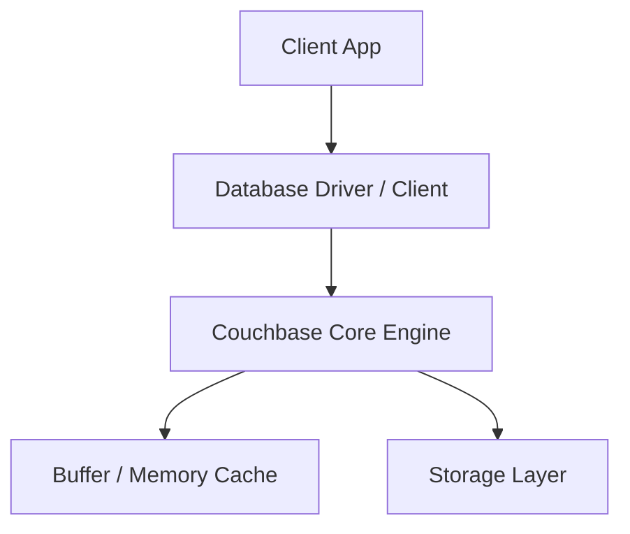
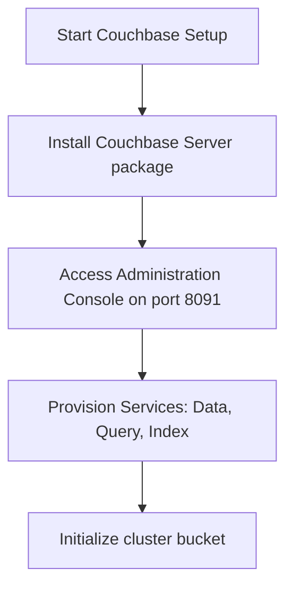

# Couchbase Master Engineering Guide

A comprehensive, production-level, industry-grade guide to Couchbase for software engineers, backend developers, data engineers, DevOps, and DBAs. Distributed document NoSQL database combining memory-first caching architecture with SQL-like N1QL querying.

---

<ProgressTracker currentSection=1 totalSections=35 />

## 1. Introduction

### 1.1 Overview & Theory
Detailed explanation of Introduction in Couchbase. Since Couchbase is a document database, it provides optimized strategies to solve enterprise engineering constraints.

### 1.2 Practical Operations & Best Practices
Production setup guidelines for Introduction in Couchbase.

```bash
# Retrieve general cluster configuration and health status
couchbase-cli server-info -c localhost:8091 -u Admin -p password
```

---

<ProgressTracker currentSection=2 totalSections=35 />

## 2. Database Fundamentals

### 2.1 Overview & Theory
Detailed explanation of Database Fundamentals in Couchbase. Since Couchbase is a document database, it supports structural operations corresponding to transaction consistency models. It matches specific ACID/BASE characteristics.

### 2.2 Practical Operations & Best Practices
Production setup guidelines for Database Fundamentals in Couchbase.

```bash
# List active Couchbase data buckets and RAM allocations
couchbase-cli bucket-list -c localhost:8091 -u Admin -p password
```

---

<ProgressTracker currentSection=3 totalSections=35 />

## 3. Internal Architecture

### 3.1 Overview & Theory
Detailed explanation of Internal Architecture in Couchbase. Since Couchbase is a document database, its internal architecture decouples various core processes. In Couchbase, this handles write paths and read paths efficiently.



### 3.2 Practical Operations & Best Practices
Production setup guidelines for Internal Architecture in Couchbase.

```bash
# Create full backup of Couchbase bucket data to local path
cbbackup http://localhost:8091 /backups -u Admin -p password
```

---

<ProgressTracker currentSection=4 totalSections=35 />

## 4. Installation

### 4.0 Official Resources & Installation Flow
- **Download Link**: [Official Couchbase Downloads](https://www.couchbase.com/downloads)




### 4.1 Overview & Theory
Detailed explanation of Installation in Couchbase. Since Couchbase is a document database, it provides optimized strategies to solve enterprise engineering constraints.

### 4.2 Practical Operations & Best Practices
Production setup guidelines for Installation in Couchbase.

```bash
# Retrieve general cluster configuration and health status
couchbase-cli server-info -c localhost:8091 -u Admin -p password
```

---

<ProgressTracker currentSection=5 totalSections=35 />

## 5. Database Creation

### 5.1 Overview & Theory
Detailed explanation of Database Creation in Couchbase. Since Couchbase is a document database, it provides optimized strategies to solve enterprise engineering constraints.

### 5.2 Practical Operations & Best Practices
Production setup guidelines for Database Creation in Couchbase.

```bash
# List active Couchbase data buckets and RAM allocations
couchbase-cli bucket-list -c localhost:8091 -u Admin -p password
```

---

<ProgressTracker currentSection=6 totalSections=35 />

## 6. Data Types

### 6.1 Overview & Theory
Detailed explanation of Data Types in Couchbase. Since Couchbase is a document database, it provides optimized strategies to solve enterprise engineering constraints.

### 6.2 Practical Operations & Best Practices
Production setup guidelines for Data Types in Couchbase.

```bash
# Create full backup of Couchbase bucket data to local path
cbbackup http://localhost:8091 /backups -u Admin -p password
```

---

<ProgressTracker currentSection=7 totalSections=35 />

## 7. Tables

### 7.1 Overview & Theory
Detailed explanation of Tables in Couchbase. Since Couchbase is a document database, it provides optimized strategies to solve enterprise engineering constraints.

### 7.2 Practical Operations & Best Practices
Production setup guidelines for Tables in Couchbase.

```bash
# Retrieve general cluster configuration and health status
couchbase-cli server-info -c localhost:8091 -u Admin -p password
```

---

<ProgressTracker currentSection=8 totalSections=35 />

## 8. CRUD Operations

### 8.1 Overview & Theory
Detailed explanation of CRUD Operations in Couchbase. Since Couchbase is a document database, it offers specialized query paradigms. Let's look at code and syntax examples:

```json
// Find query in Couchbase
db.users.find({ "status": "active" })
```

### 8.2 Practical Operations & Best Practices
Production setup guidelines for CRUD Operations in Couchbase.

```bash
# List active Couchbase data buckets and RAM allocations
couchbase-cli bucket-list -c localhost:8091 -u Admin -p password
```

---

<ProgressTracker currentSection=9 totalSections=35 />

## 9. SQL Queries

### 9.1 Overview & Theory
Detailed explanation of SQL Queries in Couchbase. Since Couchbase is a document database, it offers specialized query paradigms. Let's look at code and syntax examples:

```json
// Find query in Couchbase
db.users.find({ "status": "active" })
```

### 9.2 Practical Operations & Best Practices
Production setup guidelines for SQL Queries in Couchbase.

```bash
# Create full backup of Couchbase bucket data to local path
cbbackup http://localhost:8091 /backups -u Admin -p password
```

---

<ProgressTracker currentSection=10 totalSections=35 />

## 10. Joins

### 10.1 Overview & Theory
Detailed explanation of Joins in Couchbase. Since Couchbase is a document database, it provides optimized strategies to solve enterprise engineering constraints.

### 10.2 Practical Operations & Best Practices
Production setup guidelines for Joins in Couchbase.

```bash
# Retrieve general cluster configuration and health status
couchbase-cli server-info -c localhost:8091 -u Admin -p password
```

---

<ProgressTracker currentSection=11 totalSections=35 />

## 11. Functions

### 11.1 Overview & Theory
Detailed explanation of Functions in Couchbase. Since Couchbase is a document database, it provides optimized strategies to solve enterprise engineering constraints.

### 11.2 Practical Operations & Best Practices
Production setup guidelines for Functions in Couchbase.

```bash
# List active Couchbase data buckets and RAM allocations
couchbase-cli bucket-list -c localhost:8091 -u Admin -p password
```

---

<ProgressTracker currentSection=12 totalSections=35 />

## 12. Indexes

### 12.1 Overview & Theory
Detailed explanation of Indexes in Couchbase. Since Couchbase is a document database, it provides optimized strategies to solve enterprise engineering constraints.

### 12.2 Practical Operations & Best Practices
Production setup guidelines for Indexes in Couchbase.

```bash
# Create full backup of Couchbase bucket data to local path
cbbackup http://localhost:8091 /backups -u Admin -p password
```

---

<ProgressTracker currentSection=13 totalSections=35 />

## 13. Views

### 13.1 Overview & Theory
Detailed explanation of Views in Couchbase. Since Couchbase is a document database, it provides optimized strategies to solve enterprise engineering constraints.

### 13.2 Practical Operations & Best Practices
Production setup guidelines for Views in Couchbase.

```bash
# Retrieve general cluster configuration and health status
couchbase-cli server-info -c localhost:8091 -u Admin -p password
```

---

<ProgressTracker currentSection=14 totalSections=35 />

## 14. Stored Procedures

### 14.1 Overview & Theory
Detailed explanation of Stored Procedures in Couchbase. Since Couchbase is a document database, it provides optimized strategies to solve enterprise engineering constraints.

### 14.2 Practical Operations & Best Practices
Production setup guidelines for Stored Procedures in Couchbase.

```bash
# List active Couchbase data buckets and RAM allocations
couchbase-cli bucket-list -c localhost:8091 -u Admin -p password
```

---

<ProgressTracker currentSection=15 totalSections=35 />

## 15. Transactions

### 15.1 Overview & Theory
Detailed explanation of Transactions in Couchbase. Since Couchbase is a document database, it provides optimized strategies to solve enterprise engineering constraints.

### 15.2 Practical Operations & Best Practices
Production setup guidelines for Transactions in Couchbase.

```bash
# Create full backup of Couchbase bucket data to local path
cbbackup http://localhost:8091 /backups -u Admin -p password
```

---

<ProgressTracker currentSection=16 totalSections=35 />

## 16. Locks

### 16.1 Overview & Theory
Detailed explanation of Locks in Couchbase. Since Couchbase is a document database, it provides optimized strategies to solve enterprise engineering constraints.

### 16.2 Practical Operations & Best Practices
Production setup guidelines for Locks in Couchbase.

```bash
# Retrieve general cluster configuration and health status
couchbase-cli server-info -c localhost:8091 -u Admin -p password
```

---

<ProgressTracker currentSection=17 totalSections=35 />

## 17. Performance Optimization

### 17.1 Overview & Theory
Detailed explanation of Performance Optimization in Couchbase. Since Couchbase is a document database, it provides optimized strategies to solve enterprise engineering constraints.

### 17.2 Practical Operations & Best Practices
Production setup guidelines for Performance Optimization in Couchbase.

```bash
# List active Couchbase data buckets and RAM allocations
couchbase-cli bucket-list -c localhost:8091 -u Admin -p password
```

---

<ProgressTracker currentSection=18 totalSections=35 />

## 18. Replication

### 18.1 Overview & Theory
Detailed explanation of Replication in Couchbase. Since Couchbase is a document database, it provides optimized strategies to solve enterprise engineering constraints.

### 18.2 Practical Operations & Best Practices
Production setup guidelines for Replication in Couchbase.

```bash
# Create full backup of Couchbase bucket data to local path
cbbackup http://localhost:8091 /backups -u Admin -p password
```

---

<ProgressTracker currentSection=19 totalSections=35 />

## 19. High Availability

### 19.1 Overview & Theory
Detailed explanation of High Availability in Couchbase. Since Couchbase is a document database, it provides optimized strategies to solve enterprise engineering constraints.

### 19.2 Practical Operations & Best Practices
Production setup guidelines for High Availability in Couchbase.

```bash
# Retrieve general cluster configuration and health status
couchbase-cli server-info -c localhost:8091 -u Admin -p password
```

---

<ProgressTracker currentSection=20 totalSections=35 />

## 20. Security

### 20.1 Overview & Theory
Detailed explanation of Security in Couchbase. Since Couchbase is a document database, it provides optimized strategies to solve enterprise engineering constraints.

### 20.2 Practical Operations & Best Practices
Production setup guidelines for Security in Couchbase.

```bash
# List active Couchbase data buckets and RAM allocations
couchbase-cli bucket-list -c localhost:8091 -u Admin -p password
```

---

<ProgressTracker currentSection=21 totalSections=35 />

## 21. Backup & Restore

### 21.1 Overview & Theory
Detailed explanation of Backup & Restore in Couchbase. Since Couchbase is a document database, it provides optimized strategies to solve enterprise engineering constraints.

### 21.2 Practical Operations & Best Practices
Production setup guidelines for Backup & Restore in Couchbase.

```bash
# Create full backup of Couchbase bucket data to local path
cbbackup http://localhost:8091 /backups -u Admin -p password
```

---

<ProgressTracker currentSection=22 totalSections=35 />

## 22. Monitoring

### 22.1 Overview & Theory
Detailed explanation of Monitoring in Couchbase. Since Couchbase is a document database, it provides optimized strategies to solve enterprise engineering constraints.

### 22.2 Practical Operations & Best Practices
Production setup guidelines for Monitoring in Couchbase.

```bash
# Retrieve general cluster configuration and health status
couchbase-cli server-info -c localhost:8091 -u Admin -p password
```

---

<ProgressTracker currentSection=23 totalSections=35 />

## 23. Cloud Services

### 23.1 Overview & Theory
Detailed explanation of Cloud Services in Couchbase. Since Couchbase is a document database, it provides optimized strategies to solve enterprise engineering constraints.

### 23.2 Practical Operations & Best Practices
Production setup guidelines for Cloud Services in Couchbase.

```bash
# List active Couchbase data buckets and RAM allocations
couchbase-cli bucket-list -c localhost:8091 -u Admin -p password
```

---

<ProgressTracker currentSection=24 totalSections=35 />

## 24. Integration

### 24.1 Overview & Theory
Detailed explanation of Integration in Couchbase. Since Couchbase is a document database, drivers exist for popular frameworks. Here is a connection sample:

<Tabs>
  <Tab label="Syntax & Example">

```python
# Python Connection Example
# Initialize and connect client
print('Connected to Couchbase')
```

  </Tab>
  <Tab label="Interactive Playground">
    <InteractiveExample 
      language="python"
      initialCode="# Python Connection Example\n# Initialize and connect client\nprint('Connected to Couchbase')" 
      instruction="Execute and edit this PYTHON example."
    />
  </Tab>
</Tabs>

### 24.2 Practical Operations & Best Practices
Production setup guidelines for Integration in Couchbase.

```bash
# Create full backup of Couchbase bucket data to local path
cbbackup http://localhost:8091 /backups -u Admin -p password
```

---

<ProgressTracker currentSection=25 totalSections=35 />

## 25. ORM Support

### 25.1 Overview & Theory
Detailed explanation of ORM Support in Couchbase. Since Couchbase is a document database, drivers exist for popular frameworks. Here is a connection sample:

<Tabs>
  <Tab label="Syntax & Example">

```python
# Python Connection Example
# Initialize and connect client
print('Connected to Couchbase')
```

  </Tab>
  <Tab label="Interactive Playground">
    <InteractiveExample 
      language="python"
      initialCode="# Python Connection Example\n# Initialize and connect client\nprint('Connected to Couchbase')" 
      instruction="Execute and edit this PYTHON example."
    />
  </Tab>
</Tabs>

### 25.2 Practical Operations & Best Practices
Production setup guidelines for ORM Support in Couchbase.

```bash
# Retrieve general cluster configuration and health status
couchbase-cli server-info -c localhost:8091 -u Admin -p password
```

---

<ProgressTracker currentSection=26 totalSections=35 />

## 26. AI Integration

### 26.1 Overview & Theory
Detailed explanation of AI Integration in Couchbase. Since Couchbase is a document database, drivers exist for popular frameworks. Here is a connection sample:

<Tabs>
  <Tab label="Syntax & Example">

```python
# Python Connection Example
# Initialize and connect client
print('Connected to Couchbase')
```

  </Tab>
  <Tab label="Interactive Playground">
    <InteractiveExample 
      language="python"
      initialCode="# Python Connection Example\n# Initialize and connect client\nprint('Connected to Couchbase')" 
      instruction="Execute and edit this PYTHON example."
    />
  </Tab>
</Tabs>

### 26.2 Practical Operations & Best Practices
Production setup guidelines for AI Integration in Couchbase.

```bash
# List active Couchbase data buckets and RAM allocations
couchbase-cli bucket-list -c localhost:8091 -u Admin -p password
```

---

<ProgressTracker currentSection=27 totalSections=35 />

## 27. Production Architecture

### 27.1 Overview & Theory
Detailed explanation of Production Architecture in Couchbase. Since Couchbase is a document database, its internal architecture decouples various core processes. In Couchbase, this handles write paths and read paths efficiently.


### 27.2 Practical Operations & Best Practices
Production setup guidelines for Production Architecture in Couchbase.

```bash
# Create full backup of Couchbase bucket data to local path
cbbackup http://localhost:8091 /backups -u Admin -p password
```

---

<ProgressTracker currentSection=28 totalSections=35 />

## 28. Real Industry Use Cases

### 28.1 Overview & Theory
Detailed explanation of Real Industry Use Cases in Couchbase. Since Couchbase is a document database, it provides optimized strategies to solve enterprise engineering constraints.

### 28.2 Practical Operations & Best Practices
Production setup guidelines for Real Industry Use Cases in Couchbase.

```bash
# Retrieve general cluster configuration and health status
couchbase-cli server-info -c localhost:8091 -u Admin -p password
```

---

<ProgressTracker currentSection=29 totalSections=35 />

## 29. Common Errors

### 29.1 Overview & Theory
Detailed explanation of Common Errors in Couchbase. Since Couchbase is a document database, it provides optimized strategies to solve enterprise engineering constraints.

### 29.2 Practical Operations & Best Practices
Production setup guidelines for Common Errors in Couchbase.

```bash
# List active Couchbase data buckets and RAM allocations
couchbase-cli bucket-list -c localhost:8091 -u Admin -p password
```

---

<ProgressTracker currentSection=30 totalSections=35 />

## 30. Interview Questions

### 30.1 Overview & Theory
Detailed explanation of Interview Questions in Couchbase. Since Couchbase is a document database, it provides optimized strategies to solve enterprise engineering constraints.

### 30.2 Practical Operations & Best Practices
Production setup guidelines for Interview Questions in Couchbase.

```bash
# Create full backup of Couchbase bucket data to local path
cbbackup http://localhost:8091 /backups -u Admin -p password
```

---

<ProgressTracker currentSection=31 totalSections=35 />

## 31. Cheat Sheet

### 31.1 Overview & Theory
Detailed explanation of Cheat Sheet in Couchbase. Since Couchbase is a document database, it provides optimized strategies to solve enterprise engineering constraints.

### 31.2 Practical Operations & Best Practices
Production setup guidelines for Cheat Sheet in Couchbase.

```bash
# Retrieve general cluster configuration and health status
couchbase-cli server-info -c localhost:8091 -u Admin -p password
```

---

<ProgressTracker currentSection=32 totalSections=35 />

## 32. Hands-on Projects

### 32.1 Overview & Theory
Detailed explanation of Hands-on Projects in Couchbase. Since Couchbase is a document database, it provides optimized strategies to solve enterprise engineering constraints.

### 32.2 Practical Operations & Best Practices
Production setup guidelines for Hands-on Projects in Couchbase.

```bash
# List active Couchbase data buckets and RAM allocations
couchbase-cli bucket-list -c localhost:8091 -u Admin -p password
```

---

<ProgressTracker currentSection=33 totalSections=35 />

## 33. Practice Exercises

### 33.1 Overview & Theory
Detailed explanation of Practice Exercises in Couchbase. Since Couchbase is a document database, it provides optimized strategies to solve enterprise engineering constraints.

### 33.2 Practical Operations & Best Practices
Production setup guidelines for Practice Exercises in Couchbase.

```bash
# Create full backup of Couchbase bucket data to local path
cbbackup http://localhost:8091 /backups -u Admin -p password
```

---

<ProgressTracker currentSection=34 totalSections=35 />

## 34. Comparison

### 34.1 Overview & Theory
Detailed explanation of Comparison in Couchbase. Since Couchbase is a document database, it provides optimized strategies to solve enterprise engineering constraints.

### 34.2 Practical Operations & Best Practices
Production setup guidelines for Comparison in Couchbase.

```bash
# Retrieve general cluster configuration and health status
couchbase-cli server-info -c localhost:8091 -u Admin -p password
```

---

<ProgressTracker currentSection=35 totalSections=35 />

## 35. Final Summary

### 35.1 Overview & Theory
Detailed explanation of Final Summary in Couchbase. Since Couchbase is a document database, it provides optimized strategies to solve enterprise engineering constraints.

### 35.2 Practical Operations & Best Practices
Production setup guidelines for Final Summary in Couchbase.

```bash
# List active Couchbase data buckets and RAM allocations
couchbase-cli bucket-list -c localhost:8091 -u Admin -p password
```

---

---

### Knowledge Verification Check

<Quiz 
  question="What is the primary characteristic of key-value stores like Redis?" 
  options=["They store data in relational schemas with strict tables.", "They store records in-memory, mapping keys to values for sub-millisecond retrieval speeds.", "They compile code snippets to native binaries.", "They require GraphQL to access properties."] 
  answerIndex=1 
  explanation="Redis stores key-value pairs in memory, which allows it to act as an extremely fast cache, session store, or queue." 
/>

<Quiz 
  question="How are records represented and structured in a document database like MongoDB?" 
  options=["As rows in contiguous tables.", "As JSON-like documents (internally serialized as BSON) with dynamic schemas.", "As nodes and edge relationships.", "As key-value byte strings only."] 
  answerIndex=1 
  explanation="MongoDB is a document-oriented database. It stores records as BSON (Binary JSON) documents, letting applications persist nested object structures directly." 
/>

<Quiz 
  question="According to the CAP Theorem, which two properties must a distributed database choose between in the event of a Network Partition (P)?" 
  options=["Security vs Performance.", "Consistency (C) vs Availability (A).", "Scalability vs Relational Integrity.", "Replication vs Indexing."] 
  answerIndex=1 
  explanation="The CAP theorem states that a distributed system cannot simultaneously guarantee Consistency, Availability, and Partition Tolerance. Under network partitions, it must trade consistency for availability, or vice versa." 
/>

<Quiz 
  question="Which cache eviction policy removes the least recently accessed items first when memory limit is reached?" 
  options=["LFU (Least Frequently Used)", "LRU (Least Recently Used)", "FIFO (First In First Out)", "TTL (Time To Live)"] 
  answerIndex=1 
  explanation="Least Recently Used (LRU) evicts the key that has not been accessed for the longest duration, optimizing cache retention for temporal locality." 
/>

<Quiz 
  question="Why is denormalization commonly practiced in NoSQL database design?" 
  options=["To enforce strict SQL constraints.", "To optimize read performance by storing related data together, avoiding expensive runtime join operations across tables.", "To decrease disk space consumption.", "To make databases ACID-compliant."] 
  answerIndex=1 
  explanation="NoSQL databases generally lack relational join features. Denormalization repeats data in single documents to allow fast, single-query reads." 
/>

<Quiz 
  question="What are the two primary persistence options provided by Redis to survive restarts?" 
  options=["SQL replication and JSON dumps.", "RDB (snapshotting at intervals) and AOF (logging write commands to an append-only file).", "Direct memory allocation and swap files.", "B-Tree index logging and caching."] 
  answerIndex=1 
  explanation="Redis provides durability through RDB snapshots (point-in-time state dumps) and AOF logs (recording every write transaction as it happens)." 
/>

<Quiz 
  question="What is the role of MongoDB replica sets?" 
  options=["To split collections into separate shard keys.", "To provide high availability and automatic failover by replicating data across primary and secondary nodes.", "To speed up local memory reads by caching records.", "To compile database functions."] 
  answerIndex=1 
  explanation="Replica sets consist of a primary node (handling writes) and secondary nodes replicating data. If primary fails, secondary nodes hold an election to promote a new primary." 
/>

<Quiz 
  question="How does Consistent Hashing benefit distributed caching clusters?" 
  options=["It encrypts hash values for data security.", "It minimizes the reshuffling of cached keys when cache nodes are added or removed from the cluster.", "It compiles string keys to integer keys.", "It distributes data evenly to one single primary node."] 
  answerIndex=1 
  explanation="Consistent hashing maps cache nodes and keys to a logical ring. Adding or removing a node only impacts a fraction of keys (K/N), preventing massive cache misses." 
/>

<Quiz 
  question="What is the difference between Cache Avalanche and Cache Breakdown?" 
  options=["Avalanche is caused by database server crashes; Breakdown is client side.", "Cache Avalanche occurs when many keys expire simultaneously, flooding the database; Cache Breakdown is when a single popular hot key expires, causing concurrent DB queries.", "They are identical terms.", "Breakdown is caused by network timeouts."] 
  answerIndex=1 
  explanation="Avalanche happens when massive key expirations send concurrent spikes to databases. Breakdown (or cache stampede) is target-focused: a single hot key expires, causing concurrent database reads." 
/>

<Quiz 
  question="What defines the data model of a Graph Database (like Neo4j)?" 
  options=["Key-value string blobs.", "Nodes (entities), Edges (relationships), and Properties (key-value attributes on nodes/edges).", "Tabular records organized in rows.", "JSON documents stored inside buckets."] 
  answerIndex=1 
  explanation="Graph databases use the Property Graph model. Entities are represented as nodes, and their connections as edges, allowing fast traversal of complex relations." 
/>

<Quiz 
  question="Which NoSQL wide-column database uses keyspaces and column families to scale horizontally across multi-master nodes?" 
  options=["MongoDB", "Redis", "Apache Cassandra", "SQLite"] 
  answerIndex=2 
  explanation="Cassandra is a distributed wide-column store designed for high-availability write workloads, utilizing partitioning keys and ring topologies." 
/>

<Quiz 
  question="What is the difference between Write-through and Write-back caching strategies?" 
  options=["Write-through is slower because it writes to cache and database synchronously; Write-back writes to cache and updates the database asynchronously.", "Write-through is for NoSQL; Write-back is for SQL databases.", "Write-back deletes keys automatically.", "Write-through bypasses the cache entirely."] 
  answerIndex=0 
  explanation="Write-through updates both cache and DB immediately, avoiding stale data but adding write latency. Write-back updates cache and returns, queueing DB updates for background processing." 
/>
