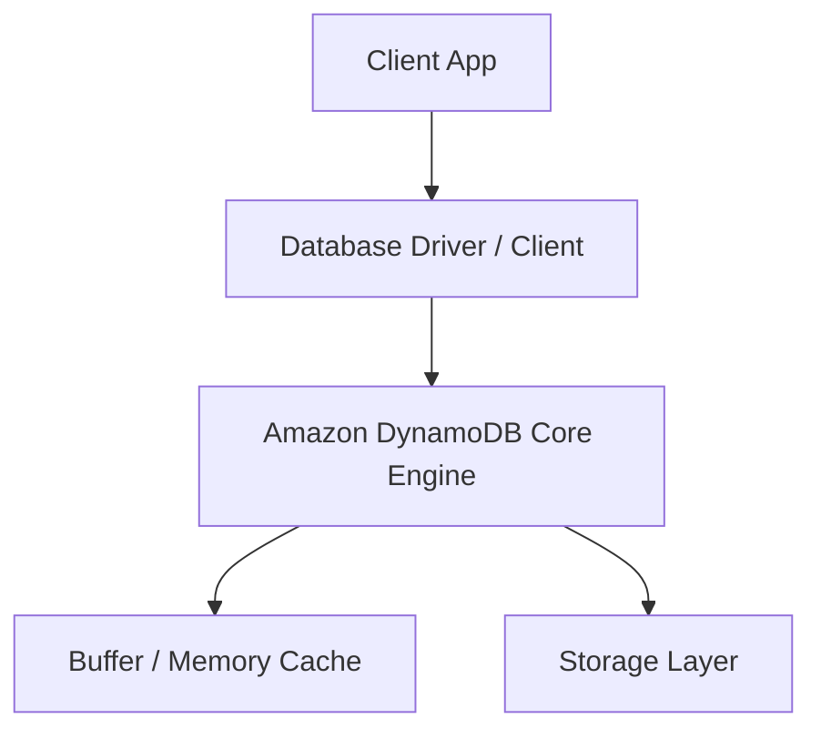
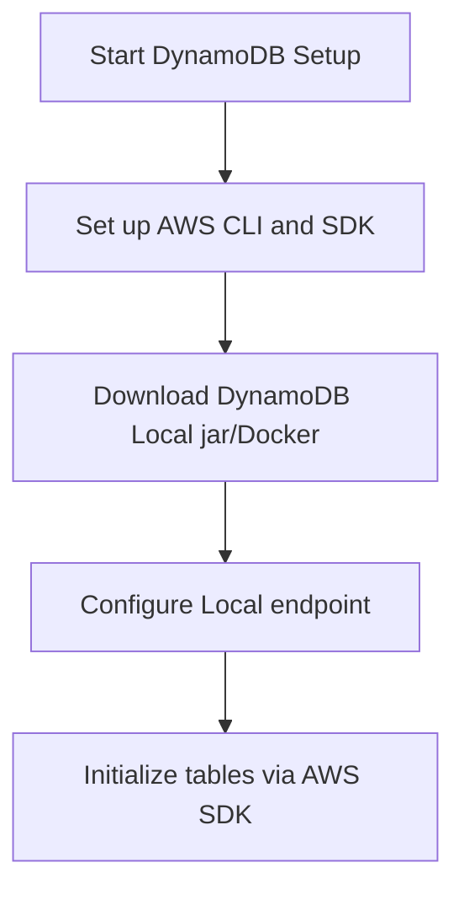

# Amazon DynamoDB Master Engineering Guide

A comprehensive, production-level, industry-grade guide to Amazon DynamoDB for software engineers, backend developers, data engineers, DevOps, and DBAs. Fully managed NoSQL wide-column database by AWS, offering single-digit millisecond latency at any scale using Partition and Sort Keys.

---

## 1. Introduction

### 1.1 Overview & Theory
Detailed explanation of Introduction in Amazon DynamoDB. Since Amazon DynamoDB is a nosql database, it provides optimized strategies to solve enterprise engineering constraints.

### 1.2 Practical Operations & Best Practices
Production setup guidelines for Introduction in Amazon DynamoDB.

> [!NOTE]
> Ensure you configure memory limits and monitor disk capacity when scaling Amazon DynamoDB in production.

---

## 2. Database Fundamentals

### 2.1 Overview & Theory
Detailed explanation of Database Fundamentals in Amazon DynamoDB. Since Amazon DynamoDB is a nosql database, it supports structural operations corresponding to transaction consistency models. It matches specific ACID/BASE characteristics.

### 2.2 Practical Operations & Best Practices
Production setup guidelines for Database Fundamentals in Amazon DynamoDB.

> [!NOTE]
> Ensure you configure memory limits and monitor disk capacity when scaling Amazon DynamoDB in production.

---

## 3. Internal Architecture

### 3.1 Overview & Theory
Detailed explanation of Internal Architecture in Amazon DynamoDB. Since Amazon DynamoDB is a nosql database, its internal architecture decouples various core processes. In Amazon DynamoDB, this handles write paths and read paths efficiently.



### 3.2 Practical Operations & Best Practices
Production setup guidelines for Internal Architecture in Amazon DynamoDB.

> [!NOTE]
> Ensure you configure memory limits and monitor disk capacity when scaling Amazon DynamoDB in production.

---

## 4. Installation

### 4.0 Official Resources & Installation Flow
- **Download Link**: [Official DynamoDB Local Setup Page](https://docs.aws.amazon.com/amazondynamodb/latest/developerguide/DynamoDBLocal.html)




### 4.1 Overview & Theory
Detailed explanation of Installation in Amazon DynamoDB. Since Amazon DynamoDB is a nosql database, it provides optimized strategies to solve enterprise engineering constraints.

### 4.2 Practical Operations & Best Practices
Production setup guidelines for Installation in Amazon DynamoDB.

> [!NOTE]
> Ensure you configure memory limits and monitor disk capacity when scaling Amazon DynamoDB in production.

---

## 5. Database Creation

### 5.1 Overview & Theory
Detailed explanation of Database Creation in Amazon DynamoDB. Since Amazon DynamoDB is a nosql database, it provides optimized strategies to solve enterprise engineering constraints.

### 5.2 Practical Operations & Best Practices
Production setup guidelines for Database Creation in Amazon DynamoDB.

> [!NOTE]
> Ensure you configure memory limits and monitor disk capacity when scaling Amazon DynamoDB in production.

---

## 6. Data Types

### 6.1 Overview & Theory
Detailed explanation of Data Types in Amazon DynamoDB. Since Amazon DynamoDB is a nosql database, it provides optimized strategies to solve enterprise engineering constraints.

### 6.2 Practical Operations & Best Practices
Production setup guidelines for Data Types in Amazon DynamoDB.

> [!NOTE]
> Ensure you configure memory limits and monitor disk capacity when scaling Amazon DynamoDB in production.

---

## 7. Tables

### 7.1 Overview & Theory
Detailed explanation of Tables in Amazon DynamoDB. Since Amazon DynamoDB is a nosql database, it provides optimized strategies to solve enterprise engineering constraints.

### 7.2 Practical Operations & Best Practices
Production setup guidelines for Tables in Amazon DynamoDB.

> [!NOTE]
> Ensure you configure memory limits and monitor disk capacity when scaling Amazon DynamoDB in production.

---

## 8. CRUD Operations

### 8.1 Overview & Theory
Detailed explanation of CRUD Operations in Amazon DynamoDB. Since Amazon DynamoDB is a nosql database, it offers specialized query paradigms. Let's look at code and syntax examples:

```bash
# Query example in Amazon DynamoDB
GET /users/_search?q=status:active
```

### 8.2 Practical Operations & Best Practices
Production setup guidelines for CRUD Operations in Amazon DynamoDB.

> [!NOTE]
> Ensure you configure memory limits and monitor disk capacity when scaling Amazon DynamoDB in production.

---

## 9. SQL Queries

### 9.1 Overview & Theory
Detailed explanation of SQL Queries in Amazon DynamoDB. Since Amazon DynamoDB is a nosql database, it offers specialized query paradigms. Let's look at code and syntax examples:

```bash
# Query example in Amazon DynamoDB
GET /users/_search?q=status:active
```

### 9.2 Practical Operations & Best Practices
Production setup guidelines for SQL Queries in Amazon DynamoDB.

> [!NOTE]
> Ensure you configure memory limits and monitor disk capacity when scaling Amazon DynamoDB in production.

---

## 10. Joins

### 10.1 Overview & Theory
Detailed explanation of Joins in Amazon DynamoDB. Since Amazon DynamoDB is a nosql database, it provides optimized strategies to solve enterprise engineering constraints.

### 10.2 Practical Operations & Best Practices
Production setup guidelines for Joins in Amazon DynamoDB.

> [!NOTE]
> Ensure you configure memory limits and monitor disk capacity when scaling Amazon DynamoDB in production.

---

## 11. Functions

### 11.1 Overview & Theory
Detailed explanation of Functions in Amazon DynamoDB. Since Amazon DynamoDB is a nosql database, it provides optimized strategies to solve enterprise engineering constraints.

### 11.2 Practical Operations & Best Practices
Production setup guidelines for Functions in Amazon DynamoDB.

> [!NOTE]
> Ensure you configure memory limits and monitor disk capacity when scaling Amazon DynamoDB in production.

---

## 12. Indexes

### 12.1 Overview & Theory
Detailed explanation of Indexes in Amazon DynamoDB. Since Amazon DynamoDB is a nosql database, it provides optimized strategies to solve enterprise engineering constraints.

### 12.2 Practical Operations & Best Practices
Production setup guidelines for Indexes in Amazon DynamoDB.

> [!NOTE]
> Ensure you configure memory limits and monitor disk capacity when scaling Amazon DynamoDB in production.

---

## 13. Views

### 13.1 Overview & Theory
Detailed explanation of Views in Amazon DynamoDB. Since Amazon DynamoDB is a nosql database, it provides optimized strategies to solve enterprise engineering constraints.

### 13.2 Practical Operations & Best Practices
Production setup guidelines for Views in Amazon DynamoDB.

> [!NOTE]
> Ensure you configure memory limits and monitor disk capacity when scaling Amazon DynamoDB in production.

---

## 14. Stored Procedures

### 14.1 Overview & Theory
Detailed explanation of Stored Procedures in Amazon DynamoDB. Since Amazon DynamoDB is a nosql database, it provides optimized strategies to solve enterprise engineering constraints.

### 14.2 Practical Operations & Best Practices
Production setup guidelines for Stored Procedures in Amazon DynamoDB.

> [!NOTE]
> Ensure you configure memory limits and monitor disk capacity when scaling Amazon DynamoDB in production.

---

## 15. Transactions

### 15.1 Overview & Theory
Detailed explanation of Transactions in Amazon DynamoDB. Since Amazon DynamoDB is a nosql database, it provides optimized strategies to solve enterprise engineering constraints.

### 15.2 Practical Operations & Best Practices
Production setup guidelines for Transactions in Amazon DynamoDB.

> [!NOTE]
> Ensure you configure memory limits and monitor disk capacity when scaling Amazon DynamoDB in production.

---

## 16. Locks

### 16.1 Overview & Theory
Detailed explanation of Locks in Amazon DynamoDB. Since Amazon DynamoDB is a nosql database, it provides optimized strategies to solve enterprise engineering constraints.

### 16.2 Practical Operations & Best Practices
Production setup guidelines for Locks in Amazon DynamoDB.

> [!NOTE]
> Ensure you configure memory limits and monitor disk capacity when scaling Amazon DynamoDB in production.

---

## 17. Performance Optimization

### 17.1 Overview & Theory
Detailed explanation of Performance Optimization in Amazon DynamoDB. Since Amazon DynamoDB is a nosql database, it provides optimized strategies to solve enterprise engineering constraints.

### 17.2 Practical Operations & Best Practices
Production setup guidelines for Performance Optimization in Amazon DynamoDB.

> [!NOTE]
> Ensure you configure memory limits and monitor disk capacity when scaling Amazon DynamoDB in production.

---

## 18. Replication

### 18.1 Overview & Theory
Detailed explanation of Replication in Amazon DynamoDB. Since Amazon DynamoDB is a nosql database, it provides optimized strategies to solve enterprise engineering constraints.

### 18.2 Practical Operations & Best Practices
Production setup guidelines for Replication in Amazon DynamoDB.

> [!NOTE]
> Ensure you configure memory limits and monitor disk capacity when scaling Amazon DynamoDB in production.

---

## 19. High Availability

### 19.1 Overview & Theory
Detailed explanation of High Availability in Amazon DynamoDB. Since Amazon DynamoDB is a nosql database, it provides optimized strategies to solve enterprise engineering constraints.

### 19.2 Practical Operations & Best Practices
Production setup guidelines for High Availability in Amazon DynamoDB.

> [!NOTE]
> Ensure you configure memory limits and monitor disk capacity when scaling Amazon DynamoDB in production.

---

## 20. Security

### 20.1 Overview & Theory
Detailed explanation of Security in Amazon DynamoDB. Since Amazon DynamoDB is a nosql database, it provides optimized strategies to solve enterprise engineering constraints.

### 20.2 Practical Operations & Best Practices
Production setup guidelines for Security in Amazon DynamoDB.

> [!NOTE]
> Ensure you configure memory limits and monitor disk capacity when scaling Amazon DynamoDB in production.

---

## 21. Backup & Restore

### 21.1 Overview & Theory
Detailed explanation of Backup & Restore in Amazon DynamoDB. Since Amazon DynamoDB is a nosql database, it provides optimized strategies to solve enterprise engineering constraints.

### 21.2 Practical Operations & Best Practices
Production setup guidelines for Backup & Restore in Amazon DynamoDB.

> [!NOTE]
> Ensure you configure memory limits and monitor disk capacity when scaling Amazon DynamoDB in production.

---

## 22. Monitoring

### 22.1 Overview & Theory
Detailed explanation of Monitoring in Amazon DynamoDB. Since Amazon DynamoDB is a nosql database, it provides optimized strategies to solve enterprise engineering constraints.

### 22.2 Practical Operations & Best Practices
Production setup guidelines for Monitoring in Amazon DynamoDB.

> [!NOTE]
> Ensure you configure memory limits and monitor disk capacity when scaling Amazon DynamoDB in production.

---

## 23. Cloud Services

### 23.1 Overview & Theory
Detailed explanation of Cloud Services in Amazon DynamoDB. Since Amazon DynamoDB is a nosql database, it provides optimized strategies to solve enterprise engineering constraints.

### 23.2 Practical Operations & Best Practices
Production setup guidelines for Cloud Services in Amazon DynamoDB.

> [!NOTE]
> Ensure you configure memory limits and monitor disk capacity when scaling Amazon DynamoDB in production.

---

## 24. Integration

### 24.1 Overview & Theory
Detailed explanation of Integration in Amazon DynamoDB. Since Amazon DynamoDB is a nosql database, drivers exist for popular frameworks. Here is a connection sample:

```python
# Python Connection Example
# Initialize and connect client
print('Connected to Amazon DynamoDB')
```

### 24.2 Practical Operations & Best Practices
Production setup guidelines for Integration in Amazon DynamoDB.

> [!NOTE]
> Ensure you configure memory limits and monitor disk capacity when scaling Amazon DynamoDB in production.

---

## 25. ORM Support

### 25.1 Overview & Theory
Detailed explanation of ORM Support in Amazon DynamoDB. Since Amazon DynamoDB is a nosql database, drivers exist for popular frameworks. Here is a connection sample:

```python
# Python Connection Example
# Initialize and connect client
print('Connected to Amazon DynamoDB')
```

### 25.2 Practical Operations & Best Practices
Production setup guidelines for ORM Support in Amazon DynamoDB.

> [!NOTE]
> Ensure you configure memory limits and monitor disk capacity when scaling Amazon DynamoDB in production.

---

## 26. AI Integration

### 26.1 Overview & Theory
Detailed explanation of AI Integration in Amazon DynamoDB. Since Amazon DynamoDB is a nosql database, drivers exist for popular frameworks. Here is a connection sample:

```python
# Python Connection Example
# Initialize and connect client
print('Connected to Amazon DynamoDB')
```

### 26.2 Practical Operations & Best Practices
Production setup guidelines for AI Integration in Amazon DynamoDB.

> [!NOTE]
> Ensure you configure memory limits and monitor disk capacity when scaling Amazon DynamoDB in production.

---

## 27. Production Architecture

### 27.1 Overview & Theory
Detailed explanation of Production Architecture in Amazon DynamoDB. Since Amazon DynamoDB is a nosql database, its internal architecture decouples various core processes. In Amazon DynamoDB, this handles write paths and read paths efficiently.


### 27.2 Practical Operations & Best Practices
Production setup guidelines for Production Architecture in Amazon DynamoDB.

> [!NOTE]
> Ensure you configure memory limits and monitor disk capacity when scaling Amazon DynamoDB in production.

---

## 28. Real Industry Use Cases

### 28.1 Overview & Theory
Detailed explanation of Real Industry Use Cases in Amazon DynamoDB. Since Amazon DynamoDB is a nosql database, it provides optimized strategies to solve enterprise engineering constraints.

### 28.2 Practical Operations & Best Practices
Production setup guidelines for Real Industry Use Cases in Amazon DynamoDB.

> [!NOTE]
> Ensure you configure memory limits and monitor disk capacity when scaling Amazon DynamoDB in production.

---

## 29. Common Errors

### 29.1 Overview & Theory
Detailed explanation of Common Errors in Amazon DynamoDB. Since Amazon DynamoDB is a nosql database, it provides optimized strategies to solve enterprise engineering constraints.

### 29.2 Practical Operations & Best Practices
Production setup guidelines for Common Errors in Amazon DynamoDB.

> [!NOTE]
> Ensure you configure memory limits and monitor disk capacity when scaling Amazon DynamoDB in production.

---

## 30. Interview Questions

### 30.1 Overview & Theory
Detailed explanation of Interview Questions in Amazon DynamoDB. Since Amazon DynamoDB is a nosql database, it provides optimized strategies to solve enterprise engineering constraints.

### 30.2 Practical Operations & Best Practices
Production setup guidelines for Interview Questions in Amazon DynamoDB.

> [!NOTE]
> Ensure you configure memory limits and monitor disk capacity when scaling Amazon DynamoDB in production.

---

## 31. Cheat Sheet

### 31.1 Overview & Theory
Detailed explanation of Cheat Sheet in Amazon DynamoDB. Since Amazon DynamoDB is a nosql database, it provides optimized strategies to solve enterprise engineering constraints.

### 31.2 Practical Operations & Best Practices
Production setup guidelines for Cheat Sheet in Amazon DynamoDB.

> [!NOTE]
> Ensure you configure memory limits and monitor disk capacity when scaling Amazon DynamoDB in production.

---

## 32. Hands-on Projects

### 32.1 Overview & Theory
Detailed explanation of Hands-on Projects in Amazon DynamoDB. Since Amazon DynamoDB is a nosql database, it provides optimized strategies to solve enterprise engineering constraints.

### 32.2 Practical Operations & Best Practices
Production setup guidelines for Hands-on Projects in Amazon DynamoDB.

> [!NOTE]
> Ensure you configure memory limits and monitor disk capacity when scaling Amazon DynamoDB in production.

---

## 33. Practice Exercises

### 33.1 Overview & Theory
Detailed explanation of Practice Exercises in Amazon DynamoDB. Since Amazon DynamoDB is a nosql database, it provides optimized strategies to solve enterprise engineering constraints.

### 33.2 Practical Operations & Best Practices
Production setup guidelines for Practice Exercises in Amazon DynamoDB.

> [!NOTE]
> Ensure you configure memory limits and monitor disk capacity when scaling Amazon DynamoDB in production.

---

## 34. Comparison

### 34.1 Overview & Theory
Detailed explanation of Comparison in Amazon DynamoDB. Since Amazon DynamoDB is a nosql database, it provides optimized strategies to solve enterprise engineering constraints.

### 34.2 Practical Operations & Best Practices
Production setup guidelines for Comparison in Amazon DynamoDB.

> [!NOTE]
> Ensure you configure memory limits and monitor disk capacity when scaling Amazon DynamoDB in production.

---

## 35. Final Summary

### 35.1 Overview & Theory
Detailed explanation of Final Summary in Amazon DynamoDB. Since Amazon DynamoDB is a nosql database, it provides optimized strategies to solve enterprise engineering constraints.

### 35.2 Practical Operations & Best Practices
Production setup guidelines for Final Summary in Amazon DynamoDB.

> [!NOTE]
> Ensure you configure memory limits and monitor disk capacity when scaling Amazon DynamoDB in production.

---

