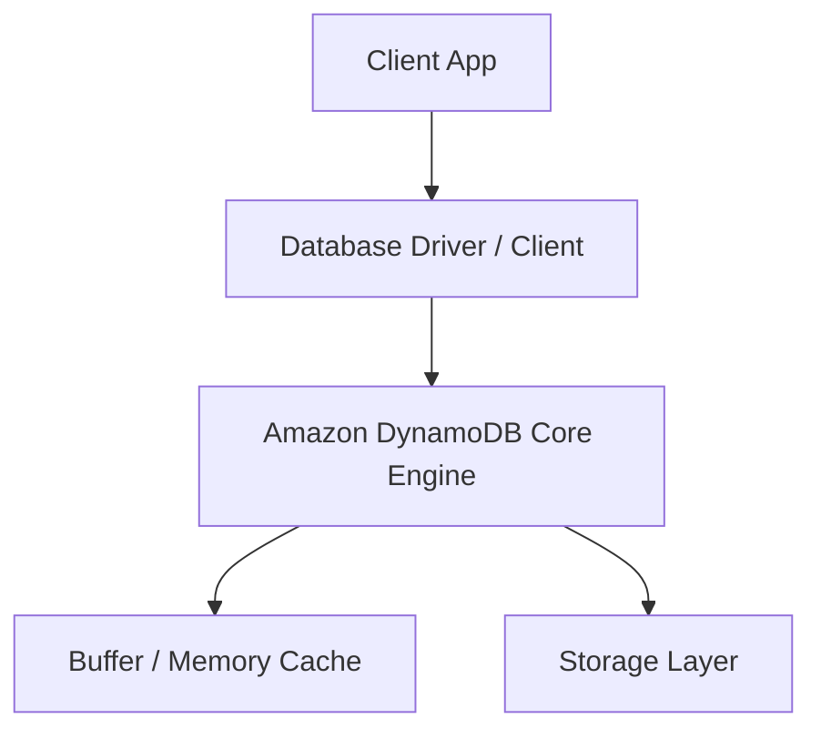
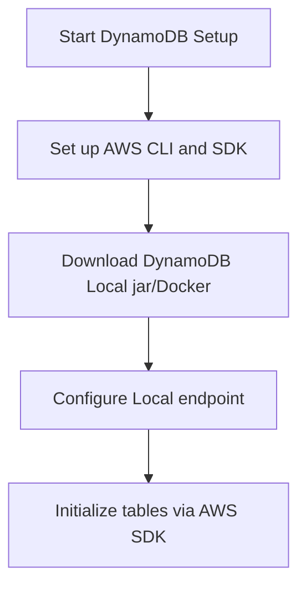

# Amazon DynamoDB Master Engineering Guide

A comprehensive, production-level, industry-grade guide to Amazon DynamoDB for software engineers, backend developers, data engineers, DevOps, and DBAs. Fully managed NoSQL wide-column database by AWS, offering single-digit millisecond latency at any scale using Partition and Sort Keys.

---

<ProgressTracker currentSection=1 totalSections=35 />

## 1. Introduction

### 1.1 Overview & Theory
Detailed explanation of Introduction in Amazon DynamoDB. Since Amazon DynamoDB is a nosql database, it provides optimized strategies to solve enterprise engineering constraints.

### 1.2 Practical Operations & Best Practices
Production setup guidelines for Introduction in Amazon DynamoDB.

```bash
# Describe table throughput capacity settings and schema details
aws dynamodb describe-table --table-name UsersTable
```

---

<ProgressTracker currentSection=2 totalSections=35 />

## 2. Database Fundamentals

### 2.1 Overview & Theory
Detailed explanation of Database Fundamentals in Amazon DynamoDB. Since Amazon DynamoDB is a nosql database, it supports structural operations corresponding to transaction consistency models. It matches specific ACID/BASE characteristics.

### 2.2 Practical Operations & Best Practices
Production setup guidelines for Database Fundamentals in Amazon DynamoDB.

```bash
# List DynamoDB tables configured on local dev environment
aws dynamodb list-tables --endpoint-url http://localhost:8000
```

---

<ProgressTracker currentSection=3 totalSections=35 />

## 3. Internal Architecture

### 3.1 Overview & Theory
Detailed explanation of Internal Architecture in Amazon DynamoDB. Since Amazon DynamoDB is a nosql database, its internal architecture decouples various core processes. In Amazon DynamoDB, this handles write paths and read paths efficiently.



### 3.2 Practical Operations & Best Practices
Production setup guidelines for Internal Architecture in Amazon DynamoDB.

```bash
# Retrieve specific item by partition key via AWS CLI
aws dynamodb get-item --table-name UsersTable --key '{"UserID": {"S": "123"}}'
```

---

<ProgressTracker currentSection=4 totalSections=35 />

## 4. Installation

### 4.0 Official Resources & Installation Flow
- **Download Link**: [Official DynamoDB Local Setup Page](https://docs.aws.amazon.com/amazondynamodb/latest/developerguide/DynamoDBLocal.html)




### 4.1 Overview & Theory
Detailed explanation of Installation in Amazon DynamoDB. Since Amazon DynamoDB is a nosql database, it provides optimized strategies to solve enterprise engineering constraints.

### 4.2 Practical Operations & Best Practices
Production setup guidelines for Installation in Amazon DynamoDB.

```bash
# Configure Time-To-Live (TTL) expiration attribute on tables
aws dynamodb update-time-to-live --table-name UsersTable --time-to-live-specification "Enabled=true,AttributeName=ttl"
```

---

<ProgressTracker currentSection=5 totalSections=35 />

## 5. Database Creation

### 5.1 Overview & Theory
Detailed explanation of Database Creation in Amazon DynamoDB. Since Amazon DynamoDB is a nosql database, it provides optimized strategies to solve enterprise engineering constraints.

### 5.2 Practical Operations & Best Practices
Production setup guidelines for Database Creation in Amazon DynamoDB.

```bash
# Describe table throughput capacity settings and schema details
aws dynamodb describe-table --table-name UsersTable
```

---

<ProgressTracker currentSection=6 totalSections=35 />

## 6. Data Types

### 6.1 Overview & Theory
Detailed explanation of Data Types in Amazon DynamoDB. Since Amazon DynamoDB is a nosql database, it provides optimized strategies to solve enterprise engineering constraints.

### 6.2 Practical Operations & Best Practices
Production setup guidelines for Data Types in Amazon DynamoDB.

```bash
# List DynamoDB tables configured on local dev environment
aws dynamodb list-tables --endpoint-url http://localhost:8000
```

---

<ProgressTracker currentSection=7 totalSections=35 />

## 7. Tables

### 7.1 Overview & Theory
Detailed explanation of Tables in Amazon DynamoDB. Since Amazon DynamoDB is a nosql database, it provides optimized strategies to solve enterprise engineering constraints.

### 7.2 Practical Operations & Best Practices
Production setup guidelines for Tables in Amazon DynamoDB.

```bash
# Retrieve specific item by partition key via AWS CLI
aws dynamodb get-item --table-name UsersTable --key '{"UserID": {"S": "123"}}'
```

---

<ProgressTracker currentSection=8 totalSections=35 />

## 8. CRUD Operations

### 8.1 Overview & Theory
Detailed explanation of CRUD Operations in Amazon DynamoDB. Since Amazon DynamoDB is a nosql database, it offers specialized query paradigms. Let's look at code and syntax examples:

```bash
# Query example in Amazon DynamoDB
GET /users/_search?q=status:active
```

### 8.2 Practical Operations & Best Practices
Production setup guidelines for CRUD Operations in Amazon DynamoDB.

```bash
# Configure Time-To-Live (TTL) expiration attribute on tables
aws dynamodb update-time-to-live --table-name UsersTable --time-to-live-specification "Enabled=true,AttributeName=ttl"
```

---

<ProgressTracker currentSection=9 totalSections=35 />

## 9. SQL Queries

### 9.1 Overview & Theory
Detailed explanation of SQL Queries in Amazon DynamoDB. Since Amazon DynamoDB is a nosql database, it offers specialized query paradigms. Let's look at code and syntax examples:

```bash
# Query example in Amazon DynamoDB
GET /users/_search?q=status:active
```

### 9.2 Practical Operations & Best Practices
Production setup guidelines for SQL Queries in Amazon DynamoDB.

```bash
# Describe table throughput capacity settings and schema details
aws dynamodb describe-table --table-name UsersTable
```

---

<ProgressTracker currentSection=10 totalSections=35 />

## 10. Joins

### 10.1 Overview & Theory
Detailed explanation of Joins in Amazon DynamoDB. Since Amazon DynamoDB is a nosql database, it provides optimized strategies to solve enterprise engineering constraints.

### 10.2 Practical Operations & Best Practices
Production setup guidelines for Joins in Amazon DynamoDB.

```bash
# List DynamoDB tables configured on local dev environment
aws dynamodb list-tables --endpoint-url http://localhost:8000
```

---

<ProgressTracker currentSection=11 totalSections=35 />

## 11. Functions

### 11.1 Overview & Theory
Detailed explanation of Functions in Amazon DynamoDB. Since Amazon DynamoDB is a nosql database, it provides optimized strategies to solve enterprise engineering constraints.

### 11.2 Practical Operations & Best Practices
Production setup guidelines for Functions in Amazon DynamoDB.

```bash
# Retrieve specific item by partition key via AWS CLI
aws dynamodb get-item --table-name UsersTable --key '{"UserID": {"S": "123"}}'
```

---

<ProgressTracker currentSection=12 totalSections=35 />

## 12. Indexes

### 12.1 Overview & Theory
Detailed explanation of Indexes in Amazon DynamoDB. Since Amazon DynamoDB is a nosql database, it provides optimized strategies to solve enterprise engineering constraints.

### 12.2 Practical Operations & Best Practices
Production setup guidelines for Indexes in Amazon DynamoDB.

```bash
# Configure Time-To-Live (TTL) expiration attribute on tables
aws dynamodb update-time-to-live --table-name UsersTable --time-to-live-specification "Enabled=true,AttributeName=ttl"
```

---

<ProgressTracker currentSection=13 totalSections=35 />

## 13. Views

### 13.1 Overview & Theory
Detailed explanation of Views in Amazon DynamoDB. Since Amazon DynamoDB is a nosql database, it provides optimized strategies to solve enterprise engineering constraints.

### 13.2 Practical Operations & Best Practices
Production setup guidelines for Views in Amazon DynamoDB.

```bash
# Describe table throughput capacity settings and schema details
aws dynamodb describe-table --table-name UsersTable
```

---

<ProgressTracker currentSection=14 totalSections=35 />

## 14. Stored Procedures

### 14.1 Overview & Theory
Detailed explanation of Stored Procedures in Amazon DynamoDB. Since Amazon DynamoDB is a nosql database, it provides optimized strategies to solve enterprise engineering constraints.

### 14.2 Practical Operations & Best Practices
Production setup guidelines for Stored Procedures in Amazon DynamoDB.

```bash
# List DynamoDB tables configured on local dev environment
aws dynamodb list-tables --endpoint-url http://localhost:8000
```

---

<ProgressTracker currentSection=15 totalSections=35 />

## 15. Transactions

### 15.1 Overview & Theory
Detailed explanation of Transactions in Amazon DynamoDB. Since Amazon DynamoDB is a nosql database, it provides optimized strategies to solve enterprise engineering constraints.

### 15.2 Practical Operations & Best Practices
Production setup guidelines for Transactions in Amazon DynamoDB.

```bash
# Retrieve specific item by partition key via AWS CLI
aws dynamodb get-item --table-name UsersTable --key '{"UserID": {"S": "123"}}'
```

---

<ProgressTracker currentSection=16 totalSections=35 />

## 16. Locks

### 16.1 Overview & Theory
Detailed explanation of Locks in Amazon DynamoDB. Since Amazon DynamoDB is a nosql database, it provides optimized strategies to solve enterprise engineering constraints.

### 16.2 Practical Operations & Best Practices
Production setup guidelines for Locks in Amazon DynamoDB.

```bash
# Configure Time-To-Live (TTL) expiration attribute on tables
aws dynamodb update-time-to-live --table-name UsersTable --time-to-live-specification "Enabled=true,AttributeName=ttl"
```

---

<ProgressTracker currentSection=17 totalSections=35 />

## 17. Performance Optimization

### 17.1 Overview & Theory
Detailed explanation of Performance Optimization in Amazon DynamoDB. Since Amazon DynamoDB is a nosql database, it provides optimized strategies to solve enterprise engineering constraints.

### 17.2 Practical Operations & Best Practices
Production setup guidelines for Performance Optimization in Amazon DynamoDB.

```bash
# Describe table throughput capacity settings and schema details
aws dynamodb describe-table --table-name UsersTable
```

---

<ProgressTracker currentSection=18 totalSections=35 />

## 18. Replication

### 18.1 Overview & Theory
Detailed explanation of Replication in Amazon DynamoDB. Since Amazon DynamoDB is a nosql database, it provides optimized strategies to solve enterprise engineering constraints.

### 18.2 Practical Operations & Best Practices
Production setup guidelines for Replication in Amazon DynamoDB.

```bash
# List DynamoDB tables configured on local dev environment
aws dynamodb list-tables --endpoint-url http://localhost:8000
```

---

<ProgressTracker currentSection=19 totalSections=35 />

## 19. High Availability

### 19.1 Overview & Theory
Detailed explanation of High Availability in Amazon DynamoDB. Since Amazon DynamoDB is a nosql database, it provides optimized strategies to solve enterprise engineering constraints.

### 19.2 Practical Operations & Best Practices
Production setup guidelines for High Availability in Amazon DynamoDB.

```bash
# Retrieve specific item by partition key via AWS CLI
aws dynamodb get-item --table-name UsersTable --key '{"UserID": {"S": "123"}}'
```

---

<ProgressTracker currentSection=20 totalSections=35 />

## 20. Security

### 20.1 Overview & Theory
Detailed explanation of Security in Amazon DynamoDB. Since Amazon DynamoDB is a nosql database, it provides optimized strategies to solve enterprise engineering constraints.

### 20.2 Practical Operations & Best Practices
Production setup guidelines for Security in Amazon DynamoDB.

```bash
# Configure Time-To-Live (TTL) expiration attribute on tables
aws dynamodb update-time-to-live --table-name UsersTable --time-to-live-specification "Enabled=true,AttributeName=ttl"
```

---

<ProgressTracker currentSection=21 totalSections=35 />

## 21. Backup & Restore

### 21.1 Overview & Theory
Detailed explanation of Backup & Restore in Amazon DynamoDB. Since Amazon DynamoDB is a nosql database, it provides optimized strategies to solve enterprise engineering constraints.

### 21.2 Practical Operations & Best Practices
Production setup guidelines for Backup & Restore in Amazon DynamoDB.

```bash
# Describe table throughput capacity settings and schema details
aws dynamodb describe-table --table-name UsersTable
```

---

<ProgressTracker currentSection=22 totalSections=35 />

## 22. Monitoring

### 22.1 Overview & Theory
Detailed explanation of Monitoring in Amazon DynamoDB. Since Amazon DynamoDB is a nosql database, it provides optimized strategies to solve enterprise engineering constraints.

### 22.2 Practical Operations & Best Practices
Production setup guidelines for Monitoring in Amazon DynamoDB.

```bash
# List DynamoDB tables configured on local dev environment
aws dynamodb list-tables --endpoint-url http://localhost:8000
```

---

<ProgressTracker currentSection=23 totalSections=35 />

## 23. Cloud Services

### 23.1 Overview & Theory
Detailed explanation of Cloud Services in Amazon DynamoDB. Since Amazon DynamoDB is a nosql database, it provides optimized strategies to solve enterprise engineering constraints.

### 23.2 Practical Operations & Best Practices
Production setup guidelines for Cloud Services in Amazon DynamoDB.

```bash
# Retrieve specific item by partition key via AWS CLI
aws dynamodb get-item --table-name UsersTable --key '{"UserID": {"S": "123"}}'
```

---

<ProgressTracker currentSection=24 totalSections=35 />

## 24. Integration

### 24.1 Overview & Theory
Detailed explanation of Integration in Amazon DynamoDB. Since Amazon DynamoDB is a nosql database, drivers exist for popular frameworks. Here is a connection sample:

<Tabs>
  <Tab label="Syntax & Example">

```python
# Python Connection Example
# Initialize and connect client
print('Connected to Amazon DynamoDB')
```

  </Tab>
  <Tab label="Interactive Playground">
    <InteractiveExample 
      language="python"
      initialCode="# Python Connection Example\n# Initialize and connect client\nprint('Connected to Amazon DynamoDB')" 
      instruction="Execute and edit this PYTHON example."
    />
  </Tab>
</Tabs>

### 24.2 Practical Operations & Best Practices
Production setup guidelines for Integration in Amazon DynamoDB.

```bash
# Configure Time-To-Live (TTL) expiration attribute on tables
aws dynamodb update-time-to-live --table-name UsersTable --time-to-live-specification "Enabled=true,AttributeName=ttl"
```

---

<ProgressTracker currentSection=25 totalSections=35 />

## 25. ORM Support

### 25.1 Overview & Theory
Detailed explanation of ORM Support in Amazon DynamoDB. Since Amazon DynamoDB is a nosql database, drivers exist for popular frameworks. Here is a connection sample:

<Tabs>
  <Tab label="Syntax & Example">

```python
# Python Connection Example
# Initialize and connect client
print('Connected to Amazon DynamoDB')
```

  </Tab>
  <Tab label="Interactive Playground">
    <InteractiveExample 
      language="python"
      initialCode="# Python Connection Example\n# Initialize and connect client\nprint('Connected to Amazon DynamoDB')" 
      instruction="Execute and edit this PYTHON example."
    />
  </Tab>
</Tabs>

### 25.2 Practical Operations & Best Practices
Production setup guidelines for ORM Support in Amazon DynamoDB.

```bash
# Describe table throughput capacity settings and schema details
aws dynamodb describe-table --table-name UsersTable
```

---

<ProgressTracker currentSection=26 totalSections=35 />

## 26. AI Integration

### 26.1 Overview & Theory
Detailed explanation of AI Integration in Amazon DynamoDB. Since Amazon DynamoDB is a nosql database, drivers exist for popular frameworks. Here is a connection sample:

<Tabs>
  <Tab label="Syntax & Example">

```python
# Python Connection Example
# Initialize and connect client
print('Connected to Amazon DynamoDB')
```

  </Tab>
  <Tab label="Interactive Playground">
    <InteractiveExample 
      language="python"
      initialCode="# Python Connection Example\n# Initialize and connect client\nprint('Connected to Amazon DynamoDB')" 
      instruction="Execute and edit this PYTHON example."
    />
  </Tab>
</Tabs>

### 26.2 Practical Operations & Best Practices
Production setup guidelines for AI Integration in Amazon DynamoDB.

```bash
# List DynamoDB tables configured on local dev environment
aws dynamodb list-tables --endpoint-url http://localhost:8000
```

---

<ProgressTracker currentSection=27 totalSections=35 />

## 27. Production Architecture

### 27.1 Overview & Theory
Detailed explanation of Production Architecture in Amazon DynamoDB. Since Amazon DynamoDB is a nosql database, its internal architecture decouples various core processes. In Amazon DynamoDB, this handles write paths and read paths efficiently.


### 27.2 Practical Operations & Best Practices
Production setup guidelines for Production Architecture in Amazon DynamoDB.

```bash
# Retrieve specific item by partition key via AWS CLI
aws dynamodb get-item --table-name UsersTable --key '{"UserID": {"S": "123"}}'
```

---

<ProgressTracker currentSection=28 totalSections=35 />

## 28. Real Industry Use Cases

### 28.1 Overview & Theory
Detailed explanation of Real Industry Use Cases in Amazon DynamoDB. Since Amazon DynamoDB is a nosql database, it provides optimized strategies to solve enterprise engineering constraints.

### 28.2 Practical Operations & Best Practices
Production setup guidelines for Real Industry Use Cases in Amazon DynamoDB.

```bash
# Configure Time-To-Live (TTL) expiration attribute on tables
aws dynamodb update-time-to-live --table-name UsersTable --time-to-live-specification "Enabled=true,AttributeName=ttl"
```

---

<ProgressTracker currentSection=29 totalSections=35 />

## 29. Common Errors

### 29.1 Overview & Theory
Detailed explanation of Common Errors in Amazon DynamoDB. Since Amazon DynamoDB is a nosql database, it provides optimized strategies to solve enterprise engineering constraints.

### 29.2 Practical Operations & Best Practices
Production setup guidelines for Common Errors in Amazon DynamoDB.

```bash
# Describe table throughput capacity settings and schema details
aws dynamodb describe-table --table-name UsersTable
```

---

<ProgressTracker currentSection=30 totalSections=35 />

## 30. Interview Questions

### 30.1 Overview & Theory
Detailed explanation of Interview Questions in Amazon DynamoDB. Since Amazon DynamoDB is a nosql database, it provides optimized strategies to solve enterprise engineering constraints.

### 30.2 Practical Operations & Best Practices
Production setup guidelines for Interview Questions in Amazon DynamoDB.

```bash
# List DynamoDB tables configured on local dev environment
aws dynamodb list-tables --endpoint-url http://localhost:8000
```

---

<ProgressTracker currentSection=31 totalSections=35 />

## 31. Cheat Sheet

### 31.1 Overview & Theory
Detailed explanation of Cheat Sheet in Amazon DynamoDB. Since Amazon DynamoDB is a nosql database, it provides optimized strategies to solve enterprise engineering constraints.

### 31.2 Practical Operations & Best Practices
Production setup guidelines for Cheat Sheet in Amazon DynamoDB.

```bash
# Retrieve specific item by partition key via AWS CLI
aws dynamodb get-item --table-name UsersTable --key '{"UserID": {"S": "123"}}'
```

---

<ProgressTracker currentSection=32 totalSections=35 />

## 32. Hands-on Projects

### 32.1 Overview & Theory
Detailed explanation of Hands-on Projects in Amazon DynamoDB. Since Amazon DynamoDB is a nosql database, it provides optimized strategies to solve enterprise engineering constraints.

### 32.2 Practical Operations & Best Practices
Production setup guidelines for Hands-on Projects in Amazon DynamoDB.

```bash
# Configure Time-To-Live (TTL) expiration attribute on tables
aws dynamodb update-time-to-live --table-name UsersTable --time-to-live-specification "Enabled=true,AttributeName=ttl"
```

---

<ProgressTracker currentSection=33 totalSections=35 />

## 33. Practice Exercises

### 33.1 Overview & Theory
Detailed explanation of Practice Exercises in Amazon DynamoDB. Since Amazon DynamoDB is a nosql database, it provides optimized strategies to solve enterprise engineering constraints.

### 33.2 Practical Operations & Best Practices
Production setup guidelines for Practice Exercises in Amazon DynamoDB.

```bash
# Describe table throughput capacity settings and schema details
aws dynamodb describe-table --table-name UsersTable
```

---

<ProgressTracker currentSection=34 totalSections=35 />

## 34. Comparison

### 34.1 Overview & Theory
Detailed explanation of Comparison in Amazon DynamoDB. Since Amazon DynamoDB is a nosql database, it provides optimized strategies to solve enterprise engineering constraints.

### 34.2 Practical Operations & Best Practices
Production setup guidelines for Comparison in Amazon DynamoDB.

```bash
# List DynamoDB tables configured on local dev environment
aws dynamodb list-tables --endpoint-url http://localhost:8000
```

---

<ProgressTracker currentSection=35 totalSections=35 />

## 35. Final Summary

### 35.1 Overview & Theory
Detailed explanation of Final Summary in Amazon DynamoDB. Since Amazon DynamoDB is a nosql database, it provides optimized strategies to solve enterprise engineering constraints.

### 35.2 Practical Operations & Best Practices
Production setup guidelines for Final Summary in Amazon DynamoDB.

```bash
# Retrieve specific item by partition key via AWS CLI
aws dynamodb get-item --table-name UsersTable --key '{"UserID": {"S": "123"}}'
```

---

---

### Knowledge Verification Check

<Quiz 
  question="What is a key protocol difference between REST and gRPC APIs?" 
  options=["REST uses TCP; gRPC uses UDP.", "REST relies on HTTP/1.1 and exchanges JSON/XML text; gRPC uses HTTP/2 and serializes binary data via Protocol Buffers.", "REST is stateful; gRPC is stateless.", "REST is faster for server-to-server streaming."] 
  answerIndex=1 
  explanation="gRPC leverages HTTP/2 features (like multiplexing, header compression, bidirectional streaming) and binary protobuf encoding to offer high-efficiency server communication." 
/>

<Quiz 
  question="What is the core idea of a Microservices architecture?" 
  options=["Compiling all code into a single massive server executable.", "Decomposing an application into a collection of small, loosely coupled, independently deployable services organized around business capabilities.", "Running all code on a single developer machine.", "Writing applications using tiny javascript packages."] 
  answerIndex=1 
  explanation="Microservices isolate database and code scope. Each service manages its own stack and data, communicating via APIs (REST, gRPC, or messaging), enhancing scale." 
/>

<Quiz 
  question="What is AWS EC2?" 
  options=["A serverless database service.", "A web service providing secure, resizable compute capacity in the cloud (Virtual Machines).", "An object storage bucket container.", "An API routing gateway."] 
  answerIndex=1 
  explanation="Elastic Compute Cloud (EC2) provides virtual machine instances where developers configure operating systems, middleware, and applications manually." 
/>

<Quiz 
  question="What defines AWS Lambda compute execution?" 
  options=["A physical server cabinet allocated to a tenant.", "Serverless, event-driven compute service that runs application code automatically in response to triggers, scaling container resources dynamically.", "A virtual machine running 24/7.", "A managed Redis caching node."] 
  answerIndex=1 
  explanation="Lambda is serverless. Users upload code and set trigger events. Lambda instantiates containers to execute the code, scaling to zero when requests finish, charging by run duration." 
/>

<Quiz 
  question="What is Amazon S3?" 
  options=["A relational database service.", "An object storage service offering industry-leading scalability, data availability, security, and performance for files.", "A serverless message broker.", "An AWS networking load balancer."] 
  answerIndex=1 
  explanation="Simple Storage Service (S3) stores flat files (images, backups, datasets) as key-value objects in buckets, providing high durability and scalability." 
/>

<Quiz 
  question="What is the primary role of a Load Balancer in system design?" 
  options=["To compress database tables.", "To distribute incoming network traffic across a group of backend servers to prevent overload and ensure high availability.", "To encrypt API request bodies.", "To coordinate server database backups."] 
  answerIndex=1 
  explanation="Load Balancers (like Nginx, AWS ALB) sit between clients and servers. They monitor server health and forward requests, optimizing response speeds and uptime." 
/>

<Quiz 
  question="What is an API Gateway used for in microservice architectures?" 
  options=["To store document collections.", "As a single entry point that routes requests, handles authentication, collects metrics, and applies rate limiting for all downstream microservices.", "To compile code files.", "To back up server instances."] 
  answerIndex=1 
  explanation="API Gateways centralize cross-cutting concerns. They shield internal service locations from clients, applying access checks, load routing, and SSL termination." 
/>

<Quiz 
  question="What is the role of Service Discovery in microservices?" 
  options=["To scan code directories for new files.", "A mechanism (like Consul, Eureka) that allows service instances to dynamically register their IP addresses and ports so other services can find them.", "To find new AWS accounts.", "To parse SQL query paths."] 
  answerIndex=1 
  explanation="Microservice instances scale dynamically, changing host IPs. Service Discovery acts as a registry where instances advertise addresses, allowing load routing." 
/>

<Quiz 
  question="What is a major trade-off of Microservices over Monolith architectures?" 
  options=["Microservices are always slower.", "Microservices introduce operational complexity (deployment, monitoring, networking, distributed transactions) that monolithic apps avoid.", "Monoliths require more servers to run in development.", "Microservices cannot access database tables."] 
  answerIndex=1 
  explanation="Monoliths are simple to build and test. Microservices offer decoupling and scalable team organization but add distributed system overhead (network latency, consistency)." 
/>

<Quiz 
  question="What is the difference between Vertical Scaling and Horizontal Scaling?" 
  options=["Vertical scaling is for SQL; Horizontal is for NoSQL.", "Vertical scaling adds more resources (CPU, RAM) to a single server; Horizontal scaling adds more server nodes to the resource pool.", "Vertical scaling requires compiling binaries; Horizontal scaling does not.", "They are synonyms."] 
  answerIndex=1 
  explanation="Vertical scaling (scaling up) hits hardware limits. Horizontal scaling (scaling out) adds nodes to handle traffic, matching distributed design requirements." 
/>

<Quiz 
  question="What is a Message Broker (e.g. RabbitMQ, AWS SQS) used for?" 
  options=["To direct API traffic to target IP endpoints.", "To enable asynchronous, decoupled communication between services by queuing messages until receiver services consume them.", "To compile code blocks.", "To run relational queries."] 
  answerIndex=1 
  explanation="Message brokers enable asynchronous architectures. A service publishes a message and resumes execution; receiver services process tasks asynchronously, reducing system coupling." 
/>

<Quiz 
  question="What is an Event-driven architecture?" 
  options=["An architecture running on specific user interface events (clicks).", "A system design pattern where services react to state changes (events) produced and consumed asynchronously via event logs or message channels.", "An architecture running only at specified clock times.", "A database schema design technique."] 
  answerIndex=1 
  explanation="In event-driven architectures, services communicate by publishing event streams (e.g., 'OrderCreated'). Downstream microservices subscribe and react, decoupling operations." 
/>
