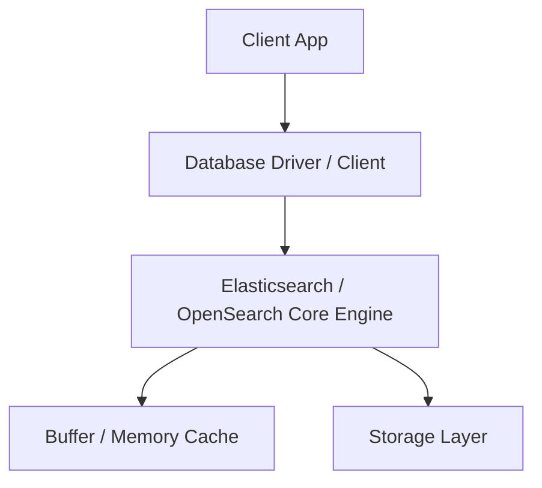
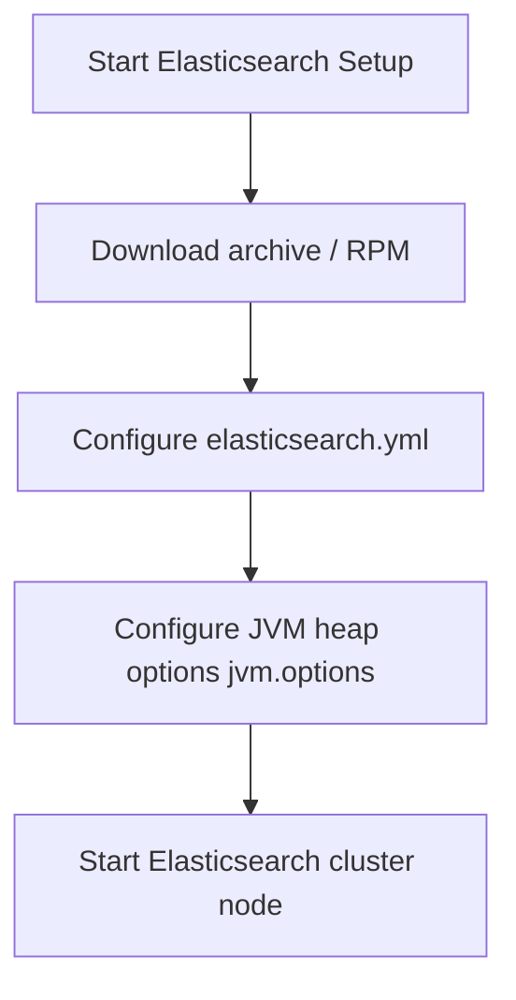

# Elasticsearch / OpenSearch Master Engineering Guide

A comprehensive, production-level, industry-grade guide to Elasticsearch / OpenSearch for software engineers, backend developers, data engineers, DevOps, and DBAs. Distributed search and analytics engine built on Apache Lucene, optimizing full-text indexing, vector similarity search, and log analytics.

---

<ProgressTracker currentSection=1 totalSections=35 />

## 1. Introduction

### 1.1 Overview & Theory
Detailed explanation of Introduction in Elasticsearch / OpenSearch. Since Elasticsearch / OpenSearch is a search database, it provides optimized strategies to solve enterprise engineering constraints.

### 1.2 Practical Operations & Best Practices
Production setup guidelines for Introduction in Elasticsearch / OpenSearch.

```bash
# Query Elasticsearch cluster health state and active shards count
curl -X GET "localhost:9200/_cluster/health?pretty"
```

---

<ProgressTracker currentSection=2 totalSections=35 />

## 2. Database Fundamentals

### 2.1 Overview & Theory
Detailed explanation of Database Fundamentals in Elasticsearch / OpenSearch. Since Elasticsearch / OpenSearch is a search database, it supports structural operations corresponding to transaction consistency models. It matches specific ACID/BASE characteristics.

### 2.2 Practical Operations & Best Practices
Production setup guidelines for Database Fundamentals in Elasticsearch / OpenSearch.

```bash
# Check JVM heap memory utilization metrics and garbage collection
curl -X GET "localhost:9200/_nodes/stats/jvm?pretty"
```

---

<ProgressTracker currentSection=3 totalSections=35 />

## 3. Internal Architecture

### 3.1 Overview & Theory
Detailed explanation of Internal Architecture in Elasticsearch / OpenSearch. Since Elasticsearch / OpenSearch is a search database, its internal architecture decouples various core processes. In Elasticsearch / OpenSearch, this handles write paths and read paths efficiently.



### 3.2 Practical Operations & Best Practices
Production setup guidelines for Internal Architecture in Elasticsearch / OpenSearch.

```bash
# List all indices with storage sizing and documents count
curl -X GET "localhost:9200/_cat/indices?v"
```

---

<ProgressTracker currentSection=4 totalSections=35 />

## 4. Installation

### 4.0 Official Resources & Installation Flow
- **Download Link**: [Official Elasticsearch Downloads](https://www.elastic.co/downloads/elasticsearch)




### 4.1 Overview & Theory
Detailed explanation of Installation in Elasticsearch / OpenSearch. Since Elasticsearch / OpenSearch is a search database, it provides optimized strategies to solve enterprise engineering constraints.

### 4.2 Practical Operations & Best Practices
Production setup guidelines for Installation in Elasticsearch / OpenSearch.

```bash
# Trigger manual index refresh to flush buffer memory
curl -X POST "localhost:9200/my-index/_refresh"
```

---

<ProgressTracker currentSection=5 totalSections=35 />

## 5. Database Creation

### 5.1 Overview & Theory
Detailed explanation of Database Creation in Elasticsearch / OpenSearch. Since Elasticsearch / OpenSearch is a search database, it provides optimized strategies to solve enterprise engineering constraints.

### 5.2 Practical Operations & Best Practices
Production setup guidelines for Database Creation in Elasticsearch / OpenSearch.

```bash
# Query Elasticsearch cluster health state and active shards count
curl -X GET "localhost:9200/_cluster/health?pretty"
```

---

<ProgressTracker currentSection=6 totalSections=35 />

## 6. Data Types

### 6.1 Overview & Theory
Detailed explanation of Data Types in Elasticsearch / OpenSearch. Since Elasticsearch / OpenSearch is a search database, it provides optimized strategies to solve enterprise engineering constraints.

### 6.2 Practical Operations & Best Practices
Production setup guidelines for Data Types in Elasticsearch / OpenSearch.

```bash
# Check JVM heap memory utilization metrics and garbage collection
curl -X GET "localhost:9200/_nodes/stats/jvm?pretty"
```

---

<ProgressTracker currentSection=7 totalSections=35 />

## 7. Tables

### 7.1 Overview & Theory
Detailed explanation of Tables in Elasticsearch / OpenSearch. Since Elasticsearch / OpenSearch is a search database, it provides optimized strategies to solve enterprise engineering constraints.

### 7.2 Practical Operations & Best Practices
Production setup guidelines for Tables in Elasticsearch / OpenSearch.

```bash
# List all indices with storage sizing and documents count
curl -X GET "localhost:9200/_cat/indices?v"
```

---

<ProgressTracker currentSection=8 totalSections=35 />

## 8. CRUD Operations

### 8.1 Overview & Theory
Detailed explanation of CRUD Operations in Elasticsearch / OpenSearch. Since Elasticsearch / OpenSearch is a search database, it offers specialized query paradigms. Let's look at code and syntax examples:

```bash
# Query example in Elasticsearch / OpenSearch
GET /users/_search?q=status:active
```

### 8.2 Practical Operations & Best Practices
Production setup guidelines for CRUD Operations in Elasticsearch / OpenSearch.

```bash
# Trigger manual index refresh to flush buffer memory
curl -X POST "localhost:9200/my-index/_refresh"
```

---

<ProgressTracker currentSection=9 totalSections=35 />

## 9. SQL Queries

### 9.1 Overview & Theory
Detailed explanation of SQL Queries in Elasticsearch / OpenSearch. Since Elasticsearch / OpenSearch is a search database, it offers specialized query paradigms. Let's look at code and syntax examples:

```bash
# Query example in Elasticsearch / OpenSearch
GET /users/_search?q=status:active
```

### 9.2 Practical Operations & Best Practices
Production setup guidelines for SQL Queries in Elasticsearch / OpenSearch.

```bash
# Query Elasticsearch cluster health state and active shards count
curl -X GET "localhost:9200/_cluster/health?pretty"
```

---

<ProgressTracker currentSection=10 totalSections=35 />

## 10. Joins

### 10.1 Overview & Theory
Detailed explanation of Joins in Elasticsearch / OpenSearch. Since Elasticsearch / OpenSearch is a search database, it provides optimized strategies to solve enterprise engineering constraints.

### 10.2 Practical Operations & Best Practices
Production setup guidelines for Joins in Elasticsearch / OpenSearch.

```bash
# Check JVM heap memory utilization metrics and garbage collection
curl -X GET "localhost:9200/_nodes/stats/jvm?pretty"
```

---

<ProgressTracker currentSection=11 totalSections=35 />

## 11. Functions

### 11.1 Overview & Theory
Detailed explanation of Functions in Elasticsearch / OpenSearch. Since Elasticsearch / OpenSearch is a search database, it provides optimized strategies to solve enterprise engineering constraints.

### 11.2 Practical Operations & Best Practices
Production setup guidelines for Functions in Elasticsearch / OpenSearch.

```bash
# List all indices with storage sizing and documents count
curl -X GET "localhost:9200/_cat/indices?v"
```

---

<ProgressTracker currentSection=12 totalSections=35 />

## 12. Indexes

### 12.1 Overview & Theory
Detailed explanation of Indexes in Elasticsearch / OpenSearch. Since Elasticsearch / OpenSearch is a search database, it provides optimized strategies to solve enterprise engineering constraints.

### 12.2 Practical Operations & Best Practices
Production setup guidelines for Indexes in Elasticsearch / OpenSearch.

```bash
# Trigger manual index refresh to flush buffer memory
curl -X POST "localhost:9200/my-index/_refresh"
```

---

<ProgressTracker currentSection=13 totalSections=35 />

## 13. Views

### 13.1 Overview & Theory
Detailed explanation of Views in Elasticsearch / OpenSearch. Since Elasticsearch / OpenSearch is a search database, it provides optimized strategies to solve enterprise engineering constraints.

### 13.2 Practical Operations & Best Practices
Production setup guidelines for Views in Elasticsearch / OpenSearch.

```bash
# Query Elasticsearch cluster health state and active shards count
curl -X GET "localhost:9200/_cluster/health?pretty"
```

---

<ProgressTracker currentSection=14 totalSections=35 />

## 14. Stored Procedures

### 14.1 Overview & Theory
Detailed explanation of Stored Procedures in Elasticsearch / OpenSearch. Since Elasticsearch / OpenSearch is a search database, it provides optimized strategies to solve enterprise engineering constraints.

### 14.2 Practical Operations & Best Practices
Production setup guidelines for Stored Procedures in Elasticsearch / OpenSearch.

```bash
# Check JVM heap memory utilization metrics and garbage collection
curl -X GET "localhost:9200/_nodes/stats/jvm?pretty"
```

---

<ProgressTracker currentSection=15 totalSections=35 />

## 15. Transactions

### 15.1 Overview & Theory
Detailed explanation of Transactions in Elasticsearch / OpenSearch. Since Elasticsearch / OpenSearch is a search database, it provides optimized strategies to solve enterprise engineering constraints.

### 15.2 Practical Operations & Best Practices
Production setup guidelines for Transactions in Elasticsearch / OpenSearch.

```bash
# List all indices with storage sizing and documents count
curl -X GET "localhost:9200/_cat/indices?v"
```

---

<ProgressTracker currentSection=16 totalSections=35 />

## 16. Locks

### 16.1 Overview & Theory
Detailed explanation of Locks in Elasticsearch / OpenSearch. Since Elasticsearch / OpenSearch is a search database, it provides optimized strategies to solve enterprise engineering constraints.

### 16.2 Practical Operations & Best Practices
Production setup guidelines for Locks in Elasticsearch / OpenSearch.

```bash
# Trigger manual index refresh to flush buffer memory
curl -X POST "localhost:9200/my-index/_refresh"
```

---

<ProgressTracker currentSection=17 totalSections=35 />

## 17. Performance Optimization

### 17.1 Overview & Theory
Detailed explanation of Performance Optimization in Elasticsearch / OpenSearch. Since Elasticsearch / OpenSearch is a search database, it provides optimized strategies to solve enterprise engineering constraints.

### 17.2 Practical Operations & Best Practices
Production setup guidelines for Performance Optimization in Elasticsearch / OpenSearch.

```bash
# Query Elasticsearch cluster health state and active shards count
curl -X GET "localhost:9200/_cluster/health?pretty"
```

---

<ProgressTracker currentSection=18 totalSections=35 />

## 18. Replication

### 18.1 Overview & Theory
Detailed explanation of Replication in Elasticsearch / OpenSearch. Since Elasticsearch / OpenSearch is a search database, it provides optimized strategies to solve enterprise engineering constraints.

### 18.2 Practical Operations & Best Practices
Production setup guidelines for Replication in Elasticsearch / OpenSearch.

```bash
# Check JVM heap memory utilization metrics and garbage collection
curl -X GET "localhost:9200/_nodes/stats/jvm?pretty"
```

---

<ProgressTracker currentSection=19 totalSections=35 />

## 19. High Availability

### 19.1 Overview & Theory
Detailed explanation of High Availability in Elasticsearch / OpenSearch. Since Elasticsearch / OpenSearch is a search database, it provides optimized strategies to solve enterprise engineering constraints.

### 19.2 Practical Operations & Best Practices
Production setup guidelines for High Availability in Elasticsearch / OpenSearch.

```bash
# List all indices with storage sizing and documents count
curl -X GET "localhost:9200/_cat/indices?v"
```

---

<ProgressTracker currentSection=20 totalSections=35 />

## 20. Security

### 20.1 Overview & Theory
Detailed explanation of Security in Elasticsearch / OpenSearch. Since Elasticsearch / OpenSearch is a search database, it provides optimized strategies to solve enterprise engineering constraints.

### 20.2 Practical Operations & Best Practices
Production setup guidelines for Security in Elasticsearch / OpenSearch.

```bash
# Trigger manual index refresh to flush buffer memory
curl -X POST "localhost:9200/my-index/_refresh"
```

---

<ProgressTracker currentSection=21 totalSections=35 />

## 21. Backup & Restore

### 21.1 Overview & Theory
Detailed explanation of Backup & Restore in Elasticsearch / OpenSearch. Since Elasticsearch / OpenSearch is a search database, it provides optimized strategies to solve enterprise engineering constraints.

### 21.2 Practical Operations & Best Practices
Production setup guidelines for Backup & Restore in Elasticsearch / OpenSearch.

```bash
# Query Elasticsearch cluster health state and active shards count
curl -X GET "localhost:9200/_cluster/health?pretty"
```

---

<ProgressTracker currentSection=22 totalSections=35 />

## 22. Monitoring

### 22.1 Overview & Theory
Detailed explanation of Monitoring in Elasticsearch / OpenSearch. Since Elasticsearch / OpenSearch is a search database, it provides optimized strategies to solve enterprise engineering constraints.

### 22.2 Practical Operations & Best Practices
Production setup guidelines for Monitoring in Elasticsearch / OpenSearch.

```bash
# Check JVM heap memory utilization metrics and garbage collection
curl -X GET "localhost:9200/_nodes/stats/jvm?pretty"
```

---

<ProgressTracker currentSection=23 totalSections=35 />

## 23. Cloud Services

### 23.1 Overview & Theory
Detailed explanation of Cloud Services in Elasticsearch / OpenSearch. Since Elasticsearch / OpenSearch is a search database, it provides optimized strategies to solve enterprise engineering constraints.

### 23.2 Practical Operations & Best Practices
Production setup guidelines for Cloud Services in Elasticsearch / OpenSearch.

```bash
# List all indices with storage sizing and documents count
curl -X GET "localhost:9200/_cat/indices?v"
```

---

<ProgressTracker currentSection=24 totalSections=35 />

## 24. Integration

### 24.1 Overview & Theory
Detailed explanation of Integration in Elasticsearch / OpenSearch. Since Elasticsearch / OpenSearch is a search database, drivers exist for popular frameworks. Here is a connection sample:

<Tabs>
  <Tab label="Syntax & Example">

```python
# Python Connection Example
# Initialize and connect client
print('Connected to Elasticsearch / OpenSearch')
```

  </Tab>
  <Tab label="Interactive Playground">
    <InteractiveExample 
      language="python"
      initialCode="# Python Connection Example\n# Initialize and connect client\nprint('Connected to Elasticsearch / OpenSearch')" 
      instruction="Execute and edit this PYTHON example."
    />
  </Tab>
</Tabs>

### 24.2 Practical Operations & Best Practices
Production setup guidelines for Integration in Elasticsearch / OpenSearch.

```bash
# Trigger manual index refresh to flush buffer memory
curl -X POST "localhost:9200/my-index/_refresh"
```

---

<ProgressTracker currentSection=25 totalSections=35 />

## 25. ORM Support

### 25.1 Overview & Theory
Detailed explanation of ORM Support in Elasticsearch / OpenSearch. Since Elasticsearch / OpenSearch is a search database, drivers exist for popular frameworks. Here is a connection sample:

<Tabs>
  <Tab label="Syntax & Example">

```python
# Python Connection Example
# Initialize and connect client
print('Connected to Elasticsearch / OpenSearch')
```

  </Tab>
  <Tab label="Interactive Playground">
    <InteractiveExample 
      language="python"
      initialCode="# Python Connection Example\n# Initialize and connect client\nprint('Connected to Elasticsearch / OpenSearch')" 
      instruction="Execute and edit this PYTHON example."
    />
  </Tab>
</Tabs>

### 25.2 Practical Operations & Best Practices
Production setup guidelines for ORM Support in Elasticsearch / OpenSearch.

```bash
# Query Elasticsearch cluster health state and active shards count
curl -X GET "localhost:9200/_cluster/health?pretty"
```

---

<ProgressTracker currentSection=26 totalSections=35 />

## 26. AI Integration

### 26.1 Overview & Theory
Detailed explanation of AI Integration in Elasticsearch / OpenSearch. Since Elasticsearch / OpenSearch is a search database, drivers exist for popular frameworks. Here is a connection sample:

<Tabs>
  <Tab label="Syntax & Example">

```python
# Python Connection Example
# Initialize and connect client
print('Connected to Elasticsearch / OpenSearch')
```

  </Tab>
  <Tab label="Interactive Playground">
    <InteractiveExample 
      language="python"
      initialCode="# Python Connection Example\n# Initialize and connect client\nprint('Connected to Elasticsearch / OpenSearch')" 
      instruction="Execute and edit this PYTHON example."
    />
  </Tab>
</Tabs>

### 26.2 Practical Operations & Best Practices
Production setup guidelines for AI Integration in Elasticsearch / OpenSearch.

```bash
# Check JVM heap memory utilization metrics and garbage collection
curl -X GET "localhost:9200/_nodes/stats/jvm?pretty"
```

---

<ProgressTracker currentSection=27 totalSections=35 />

## 27. Production Architecture

### 27.1 Overview & Theory
Detailed explanation of Production Architecture in Elasticsearch / OpenSearch. Since Elasticsearch / OpenSearch is a search database, its internal architecture decouples various core processes. In Elasticsearch / OpenSearch, this handles write paths and read paths efficiently.


### 27.2 Practical Operations & Best Practices
Production setup guidelines for Production Architecture in Elasticsearch / OpenSearch.

```bash
# List all indices with storage sizing and documents count
curl -X GET "localhost:9200/_cat/indices?v"
```

---

<ProgressTracker currentSection=28 totalSections=35 />

## 28. Real Industry Use Cases

### 28.1 Overview & Theory
Detailed explanation of Real Industry Use Cases in Elasticsearch / OpenSearch. Since Elasticsearch / OpenSearch is a search database, it provides optimized strategies to solve enterprise engineering constraints.

### 28.2 Practical Operations & Best Practices
Production setup guidelines for Real Industry Use Cases in Elasticsearch / OpenSearch.

```bash
# Trigger manual index refresh to flush buffer memory
curl -X POST "localhost:9200/my-index/_refresh"
```

---

<ProgressTracker currentSection=29 totalSections=35 />

## 29. Common Errors

### 29.1 Overview & Theory
Detailed explanation of Common Errors in Elasticsearch / OpenSearch. Since Elasticsearch / OpenSearch is a search database, it provides optimized strategies to solve enterprise engineering constraints.

### 29.2 Practical Operations & Best Practices
Production setup guidelines for Common Errors in Elasticsearch / OpenSearch.

```bash
# Query Elasticsearch cluster health state and active shards count
curl -X GET "localhost:9200/_cluster/health?pretty"
```

---

<ProgressTracker currentSection=30 totalSections=35 />

## 30. Interview Questions

### 30.1 Overview & Theory
Detailed explanation of Interview Questions in Elasticsearch / OpenSearch. Since Elasticsearch / OpenSearch is a search database, it provides optimized strategies to solve enterprise engineering constraints.

### 30.2 Practical Operations & Best Practices
Production setup guidelines for Interview Questions in Elasticsearch / OpenSearch.

```bash
# Check JVM heap memory utilization metrics and garbage collection
curl -X GET "localhost:9200/_nodes/stats/jvm?pretty"
```

---

<ProgressTracker currentSection=31 totalSections=35 />

## 31. Cheat Sheet

### 31.1 Overview & Theory
Detailed explanation of Cheat Sheet in Elasticsearch / OpenSearch. Since Elasticsearch / OpenSearch is a search database, it provides optimized strategies to solve enterprise engineering constraints.

### 31.2 Practical Operations & Best Practices
Production setup guidelines for Cheat Sheet in Elasticsearch / OpenSearch.

```bash
# List all indices with storage sizing and documents count
curl -X GET "localhost:9200/_cat/indices?v"
```

---

<ProgressTracker currentSection=32 totalSections=35 />

## 32. Hands-on Projects

### 32.1 Overview & Theory
Detailed explanation of Hands-on Projects in Elasticsearch / OpenSearch. Since Elasticsearch / OpenSearch is a search database, it provides optimized strategies to solve enterprise engineering constraints.

### 32.2 Practical Operations & Best Practices
Production setup guidelines for Hands-on Projects in Elasticsearch / OpenSearch.

```bash
# Trigger manual index refresh to flush buffer memory
curl -X POST "localhost:9200/my-index/_refresh"
```

---

<ProgressTracker currentSection=33 totalSections=35 />

## 33. Practice Exercises

### 33.1 Overview & Theory
Detailed explanation of Practice Exercises in Elasticsearch / OpenSearch. Since Elasticsearch / OpenSearch is a search database, it provides optimized strategies to solve enterprise engineering constraints.

### 33.2 Practical Operations & Best Practices
Production setup guidelines for Practice Exercises in Elasticsearch / OpenSearch.

```bash
# Query Elasticsearch cluster health state and active shards count
curl -X GET "localhost:9200/_cluster/health?pretty"
```

---

<ProgressTracker currentSection=34 totalSections=35 />

## 34. Comparison

### 34.1 Overview & Theory
Detailed explanation of Comparison in Elasticsearch / OpenSearch. Since Elasticsearch / OpenSearch is a search database, it provides optimized strategies to solve enterprise engineering constraints.

### 34.2 Practical Operations & Best Practices
Production setup guidelines for Comparison in Elasticsearch / OpenSearch.

```bash
# Check JVM heap memory utilization metrics and garbage collection
curl -X GET "localhost:9200/_nodes/stats/jvm?pretty"
```

---

<ProgressTracker currentSection=35 totalSections=35 />

## 35. Final Summary

### 35.1 Overview & Theory
Detailed explanation of Final Summary in Elasticsearch / OpenSearch. Since Elasticsearch / OpenSearch is a search database, it provides optimized strategies to solve enterprise engineering constraints.

### 35.2 Practical Operations & Best Practices
Production setup guidelines for Final Summary in Elasticsearch / OpenSearch.

```bash
# List all indices with storage sizing and documents count
curl -X GET "localhost:9200/_cat/indices?v"
```

---

---

### Knowledge Verification Check

<Quiz 
  question="How does Java achieve platform independence?" 
  options=["By compiling code directly to raw hardware machine instructions.", "By compiling source code to bytecode, which is then executed by the Java Virtual Machine (JVM).", "By dynamically translating Java into Javascript at runtime.", "By executing code directly from raw `.java` text files."] 
  answerIndex=1 
  explanation="Java code is compiled into platform-neutral bytecode (`.class` files), which the JVM translates into machine instructions for the host platform." 
/>

<Quiz 
  question="In the JVM memory model, where are objects allocated and where are local variables stored?" 
  options=["Objects on the Stack, local variables on the Heap.", "Objects and local variables are both stored on the Stack.", "Objects on the Heap, local variables on the Stack.", "Objects and local variables are both stored on the Heap."] 
  answerIndex=2 
  explanation="The Heap memory area is used for dynamic allocation of objects, while the Stack contains method frames storing local variables and reference pointers." 
/>

<Quiz 
  question="What is the primary role of the Java Garbage Collector (GC)?" 
  options=["To optimize SQL queries in databases.", "To automatically reclaim memory by deleting objects that are no longer reachable in the application code.", "To compile Java files into JAR archives.", "To monitor system file permissions."] 
  answerIndex=1 
  explanation="The JVM Garbage Collector manages memory by automatically tracking object reachability and freeing up Heap space occupied by unreachable objects." 
/>

<Quiz 
  question="Which access modifier in Java restricts visibility strictly to the declaring class itself?" 
  options=["public", "protected", "private", "default (no modifier)"] 
  answerIndex=2 
  explanation="The `private` access modifier limits access exclusively to fields, methods, or constructors within the class where they are declared." 
/>

<Quiz 
  question="What is a major difference between an interface and an abstract class in Java?" 
  options=["Interfaces can hold instance fields, abstract classes cannot.", "A class can implement multiple interfaces, but can extend only one abstract class.", "Interfaces must contain method bodies, abstract classes cannot.", "Abstract classes cannot declare constructors."] 
  answerIndex=1 
  explanation="Java supports single class inheritance (only one abstract class can be extended) but multiple interface implementation." 
/>

<Quiz 
  question="What does the `@RestController` annotation do in a Spring Boot application?" 
  options=["It registers the class as a database access repository.", "It combines `@Controller` and `@ResponseBody`, serializing return values (like objects) directly into HTTP responses (typically JSON).", "It launches a background compilation process.", "It maps a class to a container load balancer."] 
  answerIndex=1 
  explanation="`@RestController` simplifies REST API creation. It tells Spring Boot that handlers return serialized data objects rather than routing to HTML templates." 
/>

<Quiz 
  question="In Spring Boot, how does the `@Autowired` annotation facilitate dependency injection?" 
  options=["It automatically compiles dependencies on startup.", "It allows the Spring context to automatically resolve and inject matching bean dependencies into fields, constructors, or setters.", "It downloads external dependencies from Maven Central.", "It starts a new server thread for bean instances."] 
  answerIndex=1 
  explanation="`@Autowired` directs Spring Boot's dependency injection container to automatically wire matching bean components into the decorated construct." 
/>

<Quiz 
  question="What is the key difference between Checked and Unchecked exceptions in Java?" 
  options=["Checked exceptions occur at runtime, unchecked exceptions occur at compile time.", "Checked exceptions must be declared in throws or caught; unchecked exceptions (RuntimeException) do not require compile-time handling.", "Unchecked exceptions can never be caught in code.", "Checked exceptions consume more CPU cycles to process."] 
  answerIndex=1 
  explanation="Checked exceptions are verified at compile time. Unchecked exceptions extend `RuntimeException` and represent programming bugs (like NullPointerException) that are resolved at runtime." 
/>

<Quiz 
  question="How does a Java `HashMap` resolve collision when two keys have the same hash code?" 
  options=["It overwrites the old key-value pair immediately.", "It throws a RuntimeException.", "It stores colliding nodes in a linked list (or red-black tree) associated with that hash bucket.", "It resizes the map dynamically to double its size."] 
  answerIndex=2 
  explanation="HashMap uses chaining. Colliding entries are placed in a linked list at the bucket index. If the bucket exceeds a threshold (8), Java 8+ converts it to a red-black tree." 
/>

<Quiz 
  question="What are the states that a Java Thread can enter during its lifecycle?" 
  options=["Active, Inactive, Completed.", "NEW, RUNNABLE, BLOCKED, WAITING, TIMED_WAITING, TERMINATED.", "Starting, Working, Finished.", "Local, Global, Shared."] 
  answerIndex=1 
  explanation="Java threads follow a strict state diagram represented by the `Thread.State` enum: NEW, RUNNABLE, BLOCKED, WAITING, TIMED_WAITING, and TERMINATED." 
/>

<Quiz 
  question="What is the difference between method overloading and method overriding in Java?" 
  options=["Overloading is done in subclassing, overriding is done within the same class.", "Overloading is determined at compile-time (same method name, different signatures), overriding at runtime (replaces parent method in subclass).", "Overloading changes return type only, overriding changes parameters.", "There is no difference; they are synonymous."] 
  answerIndex=1 
  explanation="Method overloading is compile-time polymorphism (same name, different arguments). Method overriding is run-time polymorphism (subclass overrides parent method with identical signature)." 
/>

<Quiz 
  question="What does the `synchronized` keyword enforce in Java?" 
  options=["It forces compilation to run synchronously.", "It ensures that only one thread can execute a block or method on a locked object at any given time, preventing race conditions.", "It automatically runs code in parallel across all CPU cores.", "It updates local fields directly to database records."] 
  answerIndex=1 
  explanation="`synchronized` utilizes monitor locks (intrinsic locks) on objects, ensuring mutually exclusive thread access to critical sections of multi-threaded code." 
/>
