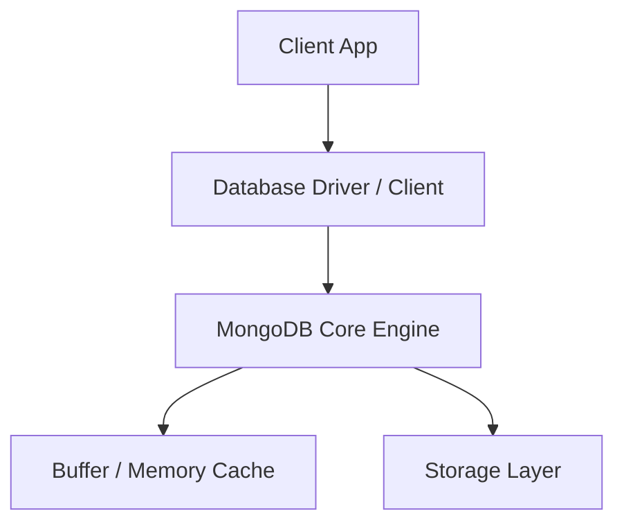
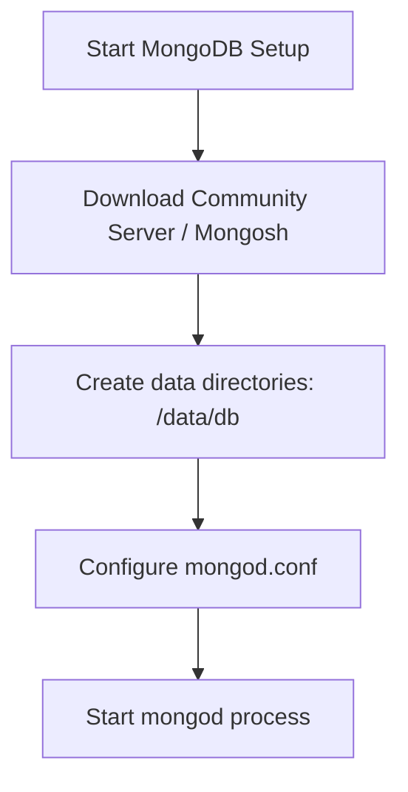

# MongoDB Master Engineering Guide

A comprehensive, production-level, industry-grade guide to MongoDB for software engineers, backend developers, data engineers, DevOps, and DBAs. Document-oriented NoSQL database storing JSON-like BSON documents, using rich aggregation pipelines and horizontal sharding.

---

## 1. Introduction

### 1.1 Overview & Theory
Detailed explanation of Introduction in MongoDB. Since MongoDB is a document database, it provides optimized strategies to solve enterprise engineering constraints.

### 1.2 Practical Operations & Best Practices
Production setup guidelines for Introduction in MongoDB.

> [!NOTE]
> Ensure you configure memory limits and monitor disk capacity when scaling MongoDB in production.

---

## 2. Database Fundamentals

### 2.1 Overview & Theory
Detailed explanation of Database Fundamentals in MongoDB. Since MongoDB is a document database, it supports structural operations corresponding to transaction consistency models. It matches specific ACID/BASE characteristics.

### 2.2 Practical Operations & Best Practices
Production setup guidelines for Database Fundamentals in MongoDB.

> [!NOTE]
> Ensure you configure memory limits and monitor disk capacity when scaling MongoDB in production.

---

## 3. Internal Architecture

### 3.1 Overview & Theory
Detailed explanation of Internal Architecture in MongoDB. Since MongoDB is a document database, its internal architecture decouples various core processes. In MongoDB, this handles write paths and read paths efficiently.



### 3.2 Practical Operations & Best Practices
Production setup guidelines for Internal Architecture in MongoDB.

> [!NOTE]
> Ensure you configure memory limits and monitor disk capacity when scaling MongoDB in production.

---

## 4. Installation

### 4.0 Official Resources & Installation Flow
- **Download Link**: [Official MongoDB Download Center](https://www.mongodb.com/try/download/community)




### 4.1 Overview & Theory
Detailed explanation of Installation in MongoDB. Since MongoDB is a document database, it provides optimized strategies to solve enterprise engineering constraints.

### 4.2 Practical Operations & Best Practices
Production setup guidelines for Installation in MongoDB.

> [!NOTE]
> Ensure you configure memory limits and monitor disk capacity when scaling MongoDB in production.

---

## 5. Database Creation

### 5.1 Overview & Theory
Detailed explanation of Database Creation in MongoDB. Since MongoDB is a document database, it provides optimized strategies to solve enterprise engineering constraints.

### 5.2 Practical Operations & Best Practices
Production setup guidelines for Database Creation in MongoDB.

> [!NOTE]
> Ensure you configure memory limits and monitor disk capacity when scaling MongoDB in production.

---

## 6. Data Types

### 6.1 Overview & Theory
Detailed explanation of Data Types in MongoDB. Since MongoDB is a document database, it provides optimized strategies to solve enterprise engineering constraints.

### 6.2 Practical Operations & Best Practices
Production setup guidelines for Data Types in MongoDB.

> [!NOTE]
> Ensure you configure memory limits and monitor disk capacity when scaling MongoDB in production.

---

## 7. Tables

### 7.1 Overview & Theory
Detailed explanation of Tables in MongoDB. Since MongoDB is a document database, it provides optimized strategies to solve enterprise engineering constraints.

### 7.2 Practical Operations & Best Practices
Production setup guidelines for Tables in MongoDB.

> [!NOTE]
> Ensure you configure memory limits and monitor disk capacity when scaling MongoDB in production.

---

## 8. CRUD Operations

### 8.1 Overview & Theory
Detailed explanation of CRUD Operations in MongoDB. Since MongoDB is a document database, it offers specialized query paradigms. Let's look at code and syntax examples:

```json
// Find query in MongoDB
db.users.find({ "status": "active" })
```

### 8.2 Practical Operations & Best Practices
Production setup guidelines for CRUD Operations in MongoDB.

> [!NOTE]
> Ensure you configure memory limits and monitor disk capacity when scaling MongoDB in production.

---

## 9. SQL Queries

### 9.1 Overview & Theory
Detailed explanation of SQL Queries in MongoDB. Since MongoDB is a document database, it offers specialized query paradigms. Let's look at code and syntax examples:

```json
// Find query in MongoDB
db.users.find({ "status": "active" })
```

### 9.2 Practical Operations & Best Practices
Production setup guidelines for SQL Queries in MongoDB.

> [!NOTE]
> Ensure you configure memory limits and monitor disk capacity when scaling MongoDB in production.

---

## 10. Joins

### 10.1 Overview & Theory
Detailed explanation of Joins in MongoDB. Since MongoDB is a document database, it provides optimized strategies to solve enterprise engineering constraints.

### 10.2 Practical Operations & Best Practices
Production setup guidelines for Joins in MongoDB.

> [!NOTE]
> Ensure you configure memory limits and monitor disk capacity when scaling MongoDB in production.

---

## 11. Functions

### 11.1 Overview & Theory
Detailed explanation of Functions in MongoDB. Since MongoDB is a document database, it provides optimized strategies to solve enterprise engineering constraints.

### 11.2 Practical Operations & Best Practices
Production setup guidelines for Functions in MongoDB.

> [!NOTE]
> Ensure you configure memory limits and monitor disk capacity when scaling MongoDB in production.

---

## 12. Indexes

### 12.1 Overview & Theory
Detailed explanation of Indexes in MongoDB. Since MongoDB is a document database, it provides optimized strategies to solve enterprise engineering constraints.

### 12.2 Practical Operations & Best Practices
Production setup guidelines for Indexes in MongoDB.

> [!NOTE]
> Ensure you configure memory limits and monitor disk capacity when scaling MongoDB in production.

---

## 13. Views

### 13.1 Overview & Theory
Detailed explanation of Views in MongoDB. Since MongoDB is a document database, it provides optimized strategies to solve enterprise engineering constraints.

### 13.2 Practical Operations & Best Practices
Production setup guidelines for Views in MongoDB.

> [!NOTE]
> Ensure you configure memory limits and monitor disk capacity when scaling MongoDB in production.

---

## 14. Stored Procedures

### 14.1 Overview & Theory
Detailed explanation of Stored Procedures in MongoDB. Since MongoDB is a document database, it provides optimized strategies to solve enterprise engineering constraints.

### 14.2 Practical Operations & Best Practices
Production setup guidelines for Stored Procedures in MongoDB.

> [!NOTE]
> Ensure you configure memory limits and monitor disk capacity when scaling MongoDB in production.

---

## 15. Transactions

### 15.1 Overview & Theory
Detailed explanation of Transactions in MongoDB. Since MongoDB is a document database, it provides optimized strategies to solve enterprise engineering constraints.

### 15.2 Practical Operations & Best Practices
Production setup guidelines for Transactions in MongoDB.

> [!NOTE]
> Ensure you configure memory limits and monitor disk capacity when scaling MongoDB in production.

---

## 16. Locks

### 16.1 Overview & Theory
Detailed explanation of Locks in MongoDB. Since MongoDB is a document database, it provides optimized strategies to solve enterprise engineering constraints.

### 16.2 Practical Operations & Best Practices
Production setup guidelines for Locks in MongoDB.

> [!NOTE]
> Ensure you configure memory limits and monitor disk capacity when scaling MongoDB in production.

---

## 17. Performance Optimization

### 17.1 Overview & Theory
Detailed explanation of Performance Optimization in MongoDB. Since MongoDB is a document database, it provides optimized strategies to solve enterprise engineering constraints.

### 17.2 Practical Operations & Best Practices
Production setup guidelines for Performance Optimization in MongoDB.

> [!NOTE]
> Ensure you configure memory limits and monitor disk capacity when scaling MongoDB in production.

---

## 18. Replication

### 18.1 Overview & Theory
Detailed explanation of Replication in MongoDB. Since MongoDB is a document database, it provides optimized strategies to solve enterprise engineering constraints.

### 18.2 Practical Operations & Best Practices
Production setup guidelines for Replication in MongoDB.

> [!NOTE]
> Ensure you configure memory limits and monitor disk capacity when scaling MongoDB in production.

---

## 19. High Availability

### 19.1 Overview & Theory
Detailed explanation of High Availability in MongoDB. Since MongoDB is a document database, it provides optimized strategies to solve enterprise engineering constraints.

### 19.2 Practical Operations & Best Practices
Production setup guidelines for High Availability in MongoDB.

> [!NOTE]
> Ensure you configure memory limits and monitor disk capacity when scaling MongoDB in production.

---

## 20. Security

### 20.1 Overview & Theory
Detailed explanation of Security in MongoDB. Since MongoDB is a document database, it provides optimized strategies to solve enterprise engineering constraints.

### 20.2 Practical Operations & Best Practices
Production setup guidelines for Security in MongoDB.

> [!NOTE]
> Ensure you configure memory limits and monitor disk capacity when scaling MongoDB in production.

---

## 21. Backup & Restore

### 21.1 Overview & Theory
Detailed explanation of Backup & Restore in MongoDB. Since MongoDB is a document database, it provides optimized strategies to solve enterprise engineering constraints.

### 21.2 Practical Operations & Best Practices
Production setup guidelines for Backup & Restore in MongoDB.

> [!NOTE]
> Ensure you configure memory limits and monitor disk capacity when scaling MongoDB in production.

---

## 22. Monitoring

### 22.1 Overview & Theory
Detailed explanation of Monitoring in MongoDB. Since MongoDB is a document database, it provides optimized strategies to solve enterprise engineering constraints.

### 22.2 Practical Operations & Best Practices
Production setup guidelines for Monitoring in MongoDB.

> [!NOTE]
> Ensure you configure memory limits and monitor disk capacity when scaling MongoDB in production.

---

## 23. Cloud Services

### 23.1 Overview & Theory
Detailed explanation of Cloud Services in MongoDB. Since MongoDB is a document database, it provides optimized strategies to solve enterprise engineering constraints.

### 23.2 Practical Operations & Best Practices
Production setup guidelines for Cloud Services in MongoDB.

> [!NOTE]
> Ensure you configure memory limits and monitor disk capacity when scaling MongoDB in production.

---

## 24. Integration

### 24.1 Overview & Theory
Detailed explanation of Integration in MongoDB. Since MongoDB is a document database, drivers exist for popular frameworks. Here is a connection sample:

```python
# Python Connection Example
# Initialize and connect client
print('Connected to MongoDB')
```

### 24.2 Practical Operations & Best Practices
Production setup guidelines for Integration in MongoDB.

> [!NOTE]
> Ensure you configure memory limits and monitor disk capacity when scaling MongoDB in production.

---

## 25. ORM Support

### 25.1 Overview & Theory
Detailed explanation of ORM Support in MongoDB. Since MongoDB is a document database, drivers exist for popular frameworks. Here is a connection sample:

```python
# Python Connection Example
# Initialize and connect client
print('Connected to MongoDB')
```

### 25.2 Practical Operations & Best Practices
Production setup guidelines for ORM Support in MongoDB.

> [!NOTE]
> Ensure you configure memory limits and monitor disk capacity when scaling MongoDB in production.

---

## 26. AI Integration

### 26.1 Overview & Theory
Detailed explanation of AI Integration in MongoDB. Since MongoDB is a document database, drivers exist for popular frameworks. Here is a connection sample:

```python
# Python Connection Example
# Initialize and connect client
print('Connected to MongoDB')
```

### 26.2 Practical Operations & Best Practices
Production setup guidelines for AI Integration in MongoDB.

> [!NOTE]
> Ensure you configure memory limits and monitor disk capacity when scaling MongoDB in production.

---

## 27. Production Architecture

### 27.1 Overview & Theory
Detailed explanation of Production Architecture in MongoDB. Since MongoDB is a document database, its internal architecture decouples various core processes. In MongoDB, this handles write paths and read paths efficiently.


### 27.2 Practical Operations & Best Practices
Production setup guidelines for Production Architecture in MongoDB.

> [!NOTE]
> Ensure you configure memory limits and monitor disk capacity when scaling MongoDB in production.

---

## 28. Real Industry Use Cases

### 28.1 Overview & Theory
Detailed explanation of Real Industry Use Cases in MongoDB. Since MongoDB is a document database, it provides optimized strategies to solve enterprise engineering constraints.

### 28.2 Practical Operations & Best Practices
Production setup guidelines for Real Industry Use Cases in MongoDB.

> [!NOTE]
> Ensure you configure memory limits and monitor disk capacity when scaling MongoDB in production.

---

## 29. Common Errors

### 29.1 Overview & Theory
Detailed explanation of Common Errors in MongoDB. Since MongoDB is a document database, it provides optimized strategies to solve enterprise engineering constraints.

### 29.2 Practical Operations & Best Practices
Production setup guidelines for Common Errors in MongoDB.

> [!NOTE]
> Ensure you configure memory limits and monitor disk capacity when scaling MongoDB in production.

---

## 30. Interview Questions

### 30.1 Overview & Theory
Detailed explanation of Interview Questions in MongoDB. Since MongoDB is a document database, it provides optimized strategies to solve enterprise engineering constraints.

### 30.2 Practical Operations & Best Practices
Production setup guidelines for Interview Questions in MongoDB.

> [!NOTE]
> Ensure you configure memory limits and monitor disk capacity when scaling MongoDB in production.

---

## 31. Cheat Sheet

### 31.1 Overview & Theory
Detailed explanation of Cheat Sheet in MongoDB. Since MongoDB is a document database, it provides optimized strategies to solve enterprise engineering constraints.

### 31.2 Practical Operations & Best Practices
Production setup guidelines for Cheat Sheet in MongoDB.

> [!NOTE]
> Ensure you configure memory limits and monitor disk capacity when scaling MongoDB in production.

---

## 32. Hands-on Projects

### 32.1 Overview & Theory
Detailed explanation of Hands-on Projects in MongoDB. Since MongoDB is a document database, it provides optimized strategies to solve enterprise engineering constraints.

### 32.2 Practical Operations & Best Practices
Production setup guidelines for Hands-on Projects in MongoDB.

> [!NOTE]
> Ensure you configure memory limits and monitor disk capacity when scaling MongoDB in production.

---

## 33. Practice Exercises

### 33.1 Overview & Theory
Detailed explanation of Practice Exercises in MongoDB. Since MongoDB is a document database, it provides optimized strategies to solve enterprise engineering constraints.

### 33.2 Practical Operations & Best Practices
Production setup guidelines for Practice Exercises in MongoDB.

> [!NOTE]
> Ensure you configure memory limits and monitor disk capacity when scaling MongoDB in production.

---

## 34. Comparison

### 34.1 Overview & Theory
Detailed explanation of Comparison in MongoDB. Since MongoDB is a document database, it provides optimized strategies to solve enterprise engineering constraints.

### 34.2 Practical Operations & Best Practices
Production setup guidelines for Comparison in MongoDB.

> [!NOTE]
> Ensure you configure memory limits and monitor disk capacity when scaling MongoDB in production.

---

## 35. Final Summary

### 35.1 Overview & Theory
Detailed explanation of Final Summary in MongoDB. Since MongoDB is a document database, it provides optimized strategies to solve enterprise engineering constraints.

### 35.2 Practical Operations & Best Practices
Production setup guidelines for Final Summary in MongoDB.

> [!NOTE]
> Ensure you configure memory limits and monitor disk capacity when scaling MongoDB in production.

---

