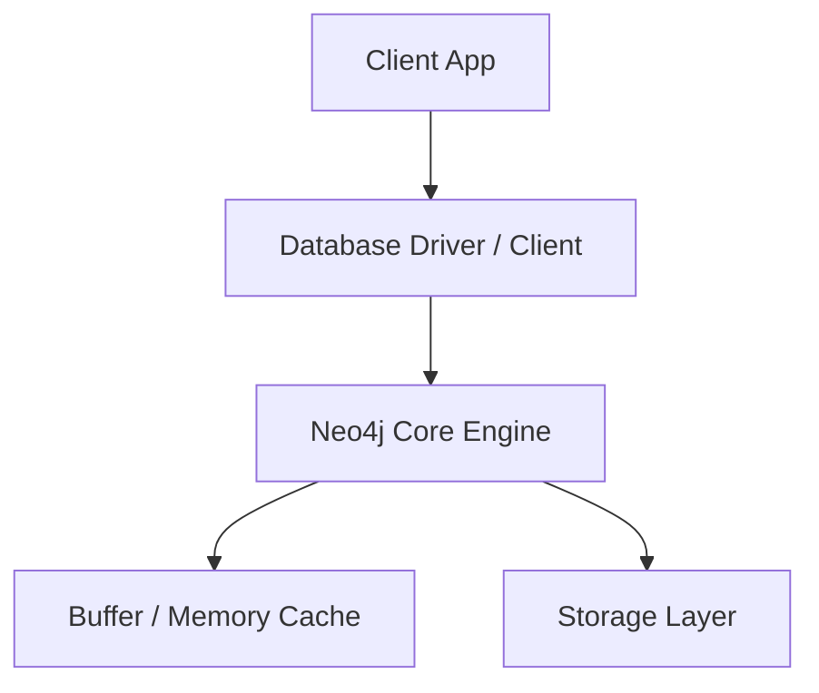
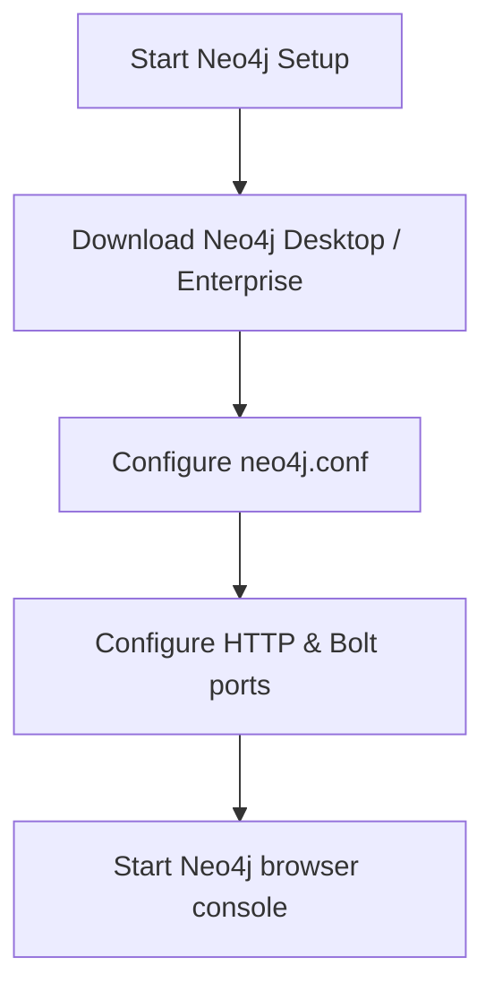

# Neo4j Master Engineering Guide

A comprehensive, production-level, industry-grade guide to Neo4j for software engineers, backend developers, data engineers, DevOps, and DBAs. Native Graph database system using Cypher Query Language to optimize relationship-traversal queries with index-free adjacency.

---

<ProgressTracker currentSection=1 totalSections=35 />

## 1. Introduction

### 1.1 Overview & Theory
Detailed explanation of Introduction in Neo4j. Since Neo4j is a graph database, it provides optimized strategies to solve enterprise engineering constraints.

### 1.2 Practical Operations & Best Practices
Production setup guidelines for Introduction in Neo4j.

```cypher
// Check active database queries and transaction locking states
SHOW TRANSACTIONS;
```

---

<ProgressTracker currentSection=2 totalSections=35 />

## 2. Database Fundamentals

### 2.1 Overview & Theory
Detailed explanation of Database Fundamentals in Neo4j. Since Neo4j is a graph database, it supports structural operations corresponding to transaction consistency models. It matches specific ACID/BASE characteristics.

### 2.2 Practical Operations & Best Practices
Production setup guidelines for Database Fundamentals in Neo4j.

```cypher
// List databases configured on the Neo4j cluster instance
SHOW DATABASES;
```

---

<ProgressTracker currentSection=3 totalSections=35 />

## 3. Internal Architecture

### 3.1 Overview & Theory
Detailed explanation of Internal Architecture in Neo4j. Since Neo4j is a graph database, its internal architecture decouples various core processes. In Neo4j, this handles write paths and read paths efficiently.



### 3.2 Practical Operations & Best Practices
Production setup guidelines for Internal Architecture in Neo4j.

```bash
# Inspect Neo4j system environment details and home directory
neo4j-admin dbms info
```

---

<ProgressTracker currentSection=4 totalSections=35 />

## 4. Installation

### 4.0 Official Resources & Installation Flow
- **Download Link**: [Official Neo4j Download Center](https://neo4j.com/download-center/)




### 4.1 Overview & Theory
Detailed explanation of Installation in Neo4j. Since Neo4j is a graph database, it provides optimized strategies to solve enterprise engineering constraints.

### 4.2 Practical Operations & Best Practices
Production setup guidelines for Installation in Neo4j.

```bash
# Take physical offline backup of the Neo4j database instance
neo4j-admin backup --database=neo4j --to=/backups
```

---

<ProgressTracker currentSection=5 totalSections=35 />

## 5. Database Creation

### 5.1 Overview & Theory
Detailed explanation of Database Creation in Neo4j. Since Neo4j is a graph database, it provides optimized strategies to solve enterprise engineering constraints.

### 5.2 Practical Operations & Best Practices
Production setup guidelines for Database Creation in Neo4j.

```cypher
// Check active database queries and transaction locking states
SHOW TRANSACTIONS;
```

---

<ProgressTracker currentSection=6 totalSections=35 />

## 6. Data Types

### 6.1 Overview & Theory
Detailed explanation of Data Types in Neo4j. Since Neo4j is a graph database, it provides optimized strategies to solve enterprise engineering constraints.

### 6.2 Practical Operations & Best Practices
Production setup guidelines for Data Types in Neo4j.

```cypher
// List databases configured on the Neo4j cluster instance
SHOW DATABASES;
```

---

<ProgressTracker currentSection=7 totalSections=35 />

## 7. Tables

### 7.1 Overview & Theory
Detailed explanation of Tables in Neo4j. Since Neo4j is a graph database, it provides optimized strategies to solve enterprise engineering constraints.

### 7.2 Practical Operations & Best Practices
Production setup guidelines for Tables in Neo4j.

```bash
# Inspect Neo4j system environment details and home directory
neo4j-admin dbms info
```

---

<ProgressTracker currentSection=8 totalSections=35 />

## 8. CRUD Operations

### 8.1 Overview & Theory
Detailed explanation of CRUD Operations in Neo4j. Since Neo4j is a graph database, it offers specialized query paradigms. Let's look at code and syntax examples:

```bash
# Query example in Neo4j
GET /users/_search?q=status:active
```

### 8.2 Practical Operations & Best Practices
Production setup guidelines for CRUD Operations in Neo4j.

```bash
# Take physical offline backup of the Neo4j database instance
neo4j-admin backup --database=neo4j --to=/backups
```

---

<ProgressTracker currentSection=9 totalSections=35 />

## 9. SQL Queries

### 9.1 Overview & Theory
Detailed explanation of SQL Queries in Neo4j. Since Neo4j is a graph database, it offers specialized query paradigms. Let's look at code and syntax examples:

```bash
# Query example in Neo4j
GET /users/_search?q=status:active
```

### 9.2 Practical Operations & Best Practices
Production setup guidelines for SQL Queries in Neo4j.

```cypher
// Check active database queries and transaction locking states
SHOW TRANSACTIONS;
```

---

<ProgressTracker currentSection=10 totalSections=35 />

## 10. Joins

### 10.1 Overview & Theory
Detailed explanation of Joins in Neo4j. Since Neo4j is a graph database, it provides optimized strategies to solve enterprise engineering constraints.

### 10.2 Practical Operations & Best Practices
Production setup guidelines for Joins in Neo4j.

```cypher
// List databases configured on the Neo4j cluster instance
SHOW DATABASES;
```

---

<ProgressTracker currentSection=11 totalSections=35 />

## 11. Functions

### 11.1 Overview & Theory
Detailed explanation of Functions in Neo4j. Since Neo4j is a graph database, it provides optimized strategies to solve enterprise engineering constraints.

### 11.2 Practical Operations & Best Practices
Production setup guidelines for Functions in Neo4j.

```bash
# Inspect Neo4j system environment details and home directory
neo4j-admin dbms info
```

---

<ProgressTracker currentSection=12 totalSections=35 />

## 12. Indexes

### 12.1 Overview & Theory
Detailed explanation of Indexes in Neo4j. Since Neo4j is a graph database, it provides optimized strategies to solve enterprise engineering constraints.

### 12.2 Practical Operations & Best Practices
Production setup guidelines for Indexes in Neo4j.

```bash
# Take physical offline backup of the Neo4j database instance
neo4j-admin backup --database=neo4j --to=/backups
```

---

<ProgressTracker currentSection=13 totalSections=35 />

## 13. Views

### 13.1 Overview & Theory
Detailed explanation of Views in Neo4j. Since Neo4j is a graph database, it provides optimized strategies to solve enterprise engineering constraints.

### 13.2 Practical Operations & Best Practices
Production setup guidelines for Views in Neo4j.

```cypher
// Check active database queries and transaction locking states
SHOW TRANSACTIONS;
```

---

<ProgressTracker currentSection=14 totalSections=35 />

## 14. Stored Procedures

### 14.1 Overview & Theory
Detailed explanation of Stored Procedures in Neo4j. Since Neo4j is a graph database, it provides optimized strategies to solve enterprise engineering constraints.

### 14.2 Practical Operations & Best Practices
Production setup guidelines for Stored Procedures in Neo4j.

```cypher
// List databases configured on the Neo4j cluster instance
SHOW DATABASES;
```

---

<ProgressTracker currentSection=15 totalSections=35 />

## 15. Transactions

### 15.1 Overview & Theory
Detailed explanation of Transactions in Neo4j. Since Neo4j is a graph database, it provides optimized strategies to solve enterprise engineering constraints.

### 15.2 Practical Operations & Best Practices
Production setup guidelines for Transactions in Neo4j.

```bash
# Inspect Neo4j system environment details and home directory
neo4j-admin dbms info
```

---

<ProgressTracker currentSection=16 totalSections=35 />

## 16. Locks

### 16.1 Overview & Theory
Detailed explanation of Locks in Neo4j. Since Neo4j is a graph database, it provides optimized strategies to solve enterprise engineering constraints.

### 16.2 Practical Operations & Best Practices
Production setup guidelines for Locks in Neo4j.

```bash
# Take physical offline backup of the Neo4j database instance
neo4j-admin backup --database=neo4j --to=/backups
```

---

<ProgressTracker currentSection=17 totalSections=35 />

## 17. Performance Optimization

### 17.1 Overview & Theory
Detailed explanation of Performance Optimization in Neo4j. Since Neo4j is a graph database, it provides optimized strategies to solve enterprise engineering constraints.

### 17.2 Practical Operations & Best Practices
Production setup guidelines for Performance Optimization in Neo4j.

```cypher
// Check active database queries and transaction locking states
SHOW TRANSACTIONS;
```

---

<ProgressTracker currentSection=18 totalSections=35 />

## 18. Replication

### 18.1 Overview & Theory
Detailed explanation of Replication in Neo4j. Since Neo4j is a graph database, it provides optimized strategies to solve enterprise engineering constraints.

### 18.2 Practical Operations & Best Practices
Production setup guidelines for Replication in Neo4j.

```cypher
// List databases configured on the Neo4j cluster instance
SHOW DATABASES;
```

---

<ProgressTracker currentSection=19 totalSections=35 />

## 19. High Availability

### 19.1 Overview & Theory
Detailed explanation of High Availability in Neo4j. Since Neo4j is a graph database, it provides optimized strategies to solve enterprise engineering constraints.

### 19.2 Practical Operations & Best Practices
Production setup guidelines for High Availability in Neo4j.

```bash
# Inspect Neo4j system environment details and home directory
neo4j-admin dbms info
```

---

<ProgressTracker currentSection=20 totalSections=35 />

## 20. Security

### 20.1 Overview & Theory
Detailed explanation of Security in Neo4j. Since Neo4j is a graph database, it provides optimized strategies to solve enterprise engineering constraints.

### 20.2 Practical Operations & Best Practices
Production setup guidelines for Security in Neo4j.

```bash
# Take physical offline backup of the Neo4j database instance
neo4j-admin backup --database=neo4j --to=/backups
```

---

<ProgressTracker currentSection=21 totalSections=35 />

## 21. Backup & Restore

### 21.1 Overview & Theory
Detailed explanation of Backup & Restore in Neo4j. Since Neo4j is a graph database, it provides optimized strategies to solve enterprise engineering constraints.

### 21.2 Practical Operations & Best Practices
Production setup guidelines for Backup & Restore in Neo4j.

```cypher
// Check active database queries and transaction locking states
SHOW TRANSACTIONS;
```

---

<ProgressTracker currentSection=22 totalSections=35 />

## 22. Monitoring

### 22.1 Overview & Theory
Detailed explanation of Monitoring in Neo4j. Since Neo4j is a graph database, it provides optimized strategies to solve enterprise engineering constraints.

### 22.2 Practical Operations & Best Practices
Production setup guidelines for Monitoring in Neo4j.

```cypher
// List databases configured on the Neo4j cluster instance
SHOW DATABASES;
```

---

<ProgressTracker currentSection=23 totalSections=35 />

## 23. Cloud Services

### 23.1 Overview & Theory
Detailed explanation of Cloud Services in Neo4j. Since Neo4j is a graph database, it provides optimized strategies to solve enterprise engineering constraints.

### 23.2 Practical Operations & Best Practices
Production setup guidelines for Cloud Services in Neo4j.

```bash
# Inspect Neo4j system environment details and home directory
neo4j-admin dbms info
```

---

<ProgressTracker currentSection=24 totalSections=35 />

## 24. Integration

### 24.1 Overview & Theory
Detailed explanation of Integration in Neo4j. Since Neo4j is a graph database, drivers exist for popular frameworks. Here is a connection sample:

<Tabs>
  <Tab label="Syntax & Example">

```python
# Python Connection Example
# Initialize and connect client
print('Connected to Neo4j')
```

  </Tab>
  <Tab label="Interactive Playground">
    <InteractiveExample 
      language="python"
      initialCode="# Python Connection Example\n# Initialize and connect client\nprint('Connected to Neo4j')" 
      instruction="Execute and edit this PYTHON example."
    />
  </Tab>
</Tabs>

### 24.2 Practical Operations & Best Practices
Production setup guidelines for Integration in Neo4j.

```bash
# Take physical offline backup of the Neo4j database instance
neo4j-admin backup --database=neo4j --to=/backups
```

---

<ProgressTracker currentSection=25 totalSections=35 />

## 25. ORM Support

### 25.1 Overview & Theory
Detailed explanation of ORM Support in Neo4j. Since Neo4j is a graph database, drivers exist for popular frameworks. Here is a connection sample:

<Tabs>
  <Tab label="Syntax & Example">

```python
# Python Connection Example
# Initialize and connect client
print('Connected to Neo4j')
```

  </Tab>
  <Tab label="Interactive Playground">
    <InteractiveExample 
      language="python"
      initialCode="# Python Connection Example\n# Initialize and connect client\nprint('Connected to Neo4j')" 
      instruction="Execute and edit this PYTHON example."
    />
  </Tab>
</Tabs>

### 25.2 Practical Operations & Best Practices
Production setup guidelines for ORM Support in Neo4j.

```cypher
// Check active database queries and transaction locking states
SHOW TRANSACTIONS;
```

---

<ProgressTracker currentSection=26 totalSections=35 />

## 26. AI Integration

### 26.1 Overview & Theory
Detailed explanation of AI Integration in Neo4j. Since Neo4j is a graph database, drivers exist for popular frameworks. Here is a connection sample:

<Tabs>
  <Tab label="Syntax & Example">

```python
# Python Connection Example
# Initialize and connect client
print('Connected to Neo4j')
```

  </Tab>
  <Tab label="Interactive Playground">
    <InteractiveExample 
      language="python"
      initialCode="# Python Connection Example\n# Initialize and connect client\nprint('Connected to Neo4j')" 
      instruction="Execute and edit this PYTHON example."
    />
  </Tab>
</Tabs>

### 26.2 Practical Operations & Best Practices
Production setup guidelines for AI Integration in Neo4j.

```cypher
// List databases configured on the Neo4j cluster instance
SHOW DATABASES;
```

---

<ProgressTracker currentSection=27 totalSections=35 />

## 27. Production Architecture

### 27.1 Overview & Theory
Detailed explanation of Production Architecture in Neo4j. Since Neo4j is a graph database, its internal architecture decouples various core processes. In Neo4j, this handles write paths and read paths efficiently.


### 27.2 Practical Operations & Best Practices
Production setup guidelines for Production Architecture in Neo4j.

```bash
# Inspect Neo4j system environment details and home directory
neo4j-admin dbms info
```

---

<ProgressTracker currentSection=28 totalSections=35 />

## 28. Real Industry Use Cases

### 28.1 Overview & Theory
Detailed explanation of Real Industry Use Cases in Neo4j. Since Neo4j is a graph database, it provides optimized strategies to solve enterprise engineering constraints.

### 28.2 Practical Operations & Best Practices
Production setup guidelines for Real Industry Use Cases in Neo4j.

```bash
# Take physical offline backup of the Neo4j database instance
neo4j-admin backup --database=neo4j --to=/backups
```

---

<ProgressTracker currentSection=29 totalSections=35 />

## 29. Common Errors

### 29.1 Overview & Theory
Detailed explanation of Common Errors in Neo4j. Since Neo4j is a graph database, it provides optimized strategies to solve enterprise engineering constraints.

### 29.2 Practical Operations & Best Practices
Production setup guidelines for Common Errors in Neo4j.

```cypher
// Check active database queries and transaction locking states
SHOW TRANSACTIONS;
```

---

<ProgressTracker currentSection=30 totalSections=35 />

## 30. Interview Questions

### 30.1 Overview & Theory
Detailed explanation of Interview Questions in Neo4j. Since Neo4j is a graph database, it provides optimized strategies to solve enterprise engineering constraints.

### 30.2 Practical Operations & Best Practices
Production setup guidelines for Interview Questions in Neo4j.

```cypher
// List databases configured on the Neo4j cluster instance
SHOW DATABASES;
```

---

<ProgressTracker currentSection=31 totalSections=35 />

## 31. Cheat Sheet

### 31.1 Overview & Theory
Detailed explanation of Cheat Sheet in Neo4j. Since Neo4j is a graph database, it provides optimized strategies to solve enterprise engineering constraints.

### 31.2 Practical Operations & Best Practices
Production setup guidelines for Cheat Sheet in Neo4j.

```bash
# Inspect Neo4j system environment details and home directory
neo4j-admin dbms info
```

---

<ProgressTracker currentSection=32 totalSections=35 />

## 32. Hands-on Projects

### 32.1 Overview & Theory
Detailed explanation of Hands-on Projects in Neo4j. Since Neo4j is a graph database, it provides optimized strategies to solve enterprise engineering constraints.

### 32.2 Practical Operations & Best Practices
Production setup guidelines for Hands-on Projects in Neo4j.

```bash
# Take physical offline backup of the Neo4j database instance
neo4j-admin backup --database=neo4j --to=/backups
```

---

<ProgressTracker currentSection=33 totalSections=35 />

## 33. Practice Exercises

### 33.1 Overview & Theory
Detailed explanation of Practice Exercises in Neo4j. Since Neo4j is a graph database, it provides optimized strategies to solve enterprise engineering constraints.

### 33.2 Practical Operations & Best Practices
Production setup guidelines for Practice Exercises in Neo4j.

```cypher
// Check active database queries and transaction locking states
SHOW TRANSACTIONS;
```

---

<ProgressTracker currentSection=34 totalSections=35 />

## 34. Comparison

### 34.1 Overview & Theory
Detailed explanation of Comparison in Neo4j. Since Neo4j is a graph database, it provides optimized strategies to solve enterprise engineering constraints.

### 34.2 Practical Operations & Best Practices
Production setup guidelines for Comparison in Neo4j.

```cypher
// List databases configured on the Neo4j cluster instance
SHOW DATABASES;
```

---

<ProgressTracker currentSection=35 totalSections=35 />

## 35. Final Summary

### 35.1 Overview & Theory
Detailed explanation of Final Summary in Neo4j. Since Neo4j is a graph database, it provides optimized strategies to solve enterprise engineering constraints.

### 35.2 Practical Operations & Best Practices
Production setup guidelines for Final Summary in Neo4j.

```bash
# Inspect Neo4j system environment details and home directory
neo4j-admin dbms info
```

---

---

### Knowledge Verification Check

<Quiz 
  question="What makes Go's goroutines much lighter than standard operating system threads?" 
  options=["Goroutines do not consume any RAM.", "Goroutines run inside the browser environment.", "Goroutines start with a very small stack (about 2KB) that grows and shrinks dynamically, and are multiplexed onto OS threads.", "Goroutines run only when the system is idle."] 
  answerIndex=2 
  explanation="Unlike OS threads which have large, fixed-size stacks (typically 1MB-2MB), goroutines start with 2KB stacks managed dynamically by the Go runtime scheduler." 
/>

<Quiz 
  question="How do goroutines communicate and synchronize data in Go?" 
  options=["Through global variables protected by thread locks.", "By using Channels to pass data and signal execution state.", "Using native operating system thread interrupts.", "Through shared database connections."] 
  answerIndex=1 
  explanation="Go uses channels as concurrency primitives to allow goroutines to pass typed data and safely synchronize without manual lock primitives." 
/>

<Quiz 
  question="What is the purpose of a pointer receiver (*StructName) in a Go method definition?" 
  options=["It automatically compiles the method as a static C binary.", "It allows the method to mutate the receiver's fields directly and avoids copying the struct's data on invocation.", "It renders the struct read-only.", "It registers the method with a garbage collection worker."] 
  answerIndex=1 
  explanation="A pointer receiver passes the memory address of the struct instance, enabling direct field modification and optimizing performance by avoiding struct copying." 
/>

<Quiz 
  question="What is the difference between an array and a slice in Go?" 
  options=["Arrays are dynamically sized, while slices have a fixed length.", "Arrays have a fixed size defined at compilation, while slices are dynamic windows pointing to an underlying array.", "Arrays are always passed by reference, while slices are passed by value.", "There is no difference; they are synonyms."] 
  answerIndex=1 
  explanation="Go arrays have a fixed size that is part of their type. Slices are flexible, dynamic wrappers containing a pointer to an underlying array, a length, and a capacity." 
/>

<Quiz 
  question="What is Go's standard approach for handling errors?" 
  options=["Using try-catch blocks to capture runtime exceptions.", "Returning an error interface as the last return value from functions, which the caller must check explicitly.", "Throwing fatal panics that terminate the program immediately.", "Writing errors automatically to a system syslog file."] 
  answerIndex=1 
  explanation="Go does not have standard try/catch blocks. Instead, functions return multiple values, including an error value, which callers inspect using `if err != nil`." 
/>

<Quiz 
  question="How does a class or struct implement an interface in Go?" 
  options=["By using the `implements` keyword in the declaration.", "Implicitly, by defining all methods declared in the interface (no explicit declaration needed).", "By inheriting from an interface helper base class.", "By wrapping the struct inside a package interface container."] 
  answerIndex=1 
  explanation="Go interfaces are implemented implicitly. A struct implements an interface simply by defining methods with matching signatures, enabling clean decoupling." 
/>

<Quiz 
  question="Which scheduling model does Go's runtime scheduler use to multiplex goroutines onto OS threads?" 
  options=["The M:N scheduler model (M goroutines onto N OS threads).", "A round-robin scheduling algorithm directly managed by the CPU.", "A single-threaded loop similar to Javascript.", "A multi-process fork scheduling model."] 
  answerIndex=0 
  explanation="The Go scheduler uses an M:N model (represented by G for goroutines, M for machine threads, and P for logical processors) to run millions of goroutines on a small pool of CPU threads." 
/>

<Quiz 
  question="When does a Go `defer` statement execute its associated function call?" 
  options=["Immediately when the defer line is parsed.", "In a separate background thread.", "When the surrounding function finishes and returns.", "Only if the program panics."] 
  answerIndex=2 
  explanation="A `defer` statement pushes a function call onto a stack. The deferred calls are executed in Last-In-First-Out (LIFO) order right before the surrounding function returns." 
/>

<Quiz 
  question="How are struct fields mapped to JSON properties during marshaling in Go?" 
  options=["By naming fields exactly the same as the JSON keys (case-insensitive).", "Using struct tags defined after field declarations, e.g. `json:\"fieldName\"`.", "By registering the struct inside an XML schema registry.", "Go automatically maps fields dynamically using reflection (no custom tags)."] 
  answerIndex=1 
  explanation="Go uses struct tags containing metadata (e.g. `json:\"id\"`) which the `encoding/json` package parses via reflection to serialize/deserialize fields." 
/>

<Quiz 
  question="How is package-level visibility (public/private) determined in Go?" 
  options=["By using the public or private keyword before declarations.", "Through directory path names.", "By capitalization: identifiers starting with an uppercase letter are public (exported), others are private.", "By declaring them in an external `package.json` configurations file."] 
  answerIndex=2 
  explanation="Go relies on capitalization for visibility. An identifier starting with an uppercase letter is exported (public) and visible outside its package; lowercase is unexported." 
/>

<Quiz 
  question="What is cap(slice) in Go?" 
  options=["The number of elements currently stored in the slice.", "The maximum length a slice can grow to before raising an exception.", "The capacity: the number of elements in the underlying array, starting from the first element of the slice.", "The memory size of the slice in bytes."] 
  answerIndex=2 
  explanation="The capacity of a slice represents the size of the underlying array allocation from the start of the slice. It is accessed via `cap(s)`, while `len(s)` returns the current item count." 
/>

<Quiz 
  question="What is the purpose of the `select` statement in Go?" 
  options=["To choose database rows from a table.", "To block execution until one of multiple channel operations (sends or receives) is ready to run.", "To implement standard switch cases for string values.", "To pick variables from system arrays."] 
  answerIndex=1 
  explanation="The `select` statement lets a goroutine wait on multiple channel communication operations. It blocks until one of its cases is ready to execute, then runs that case." 
/>
