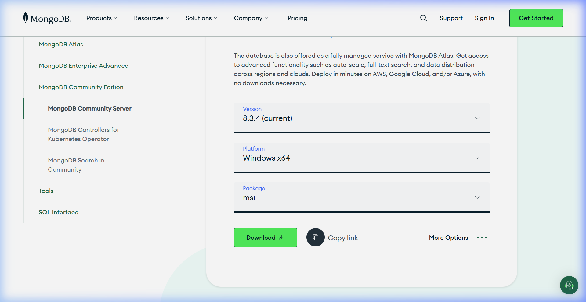
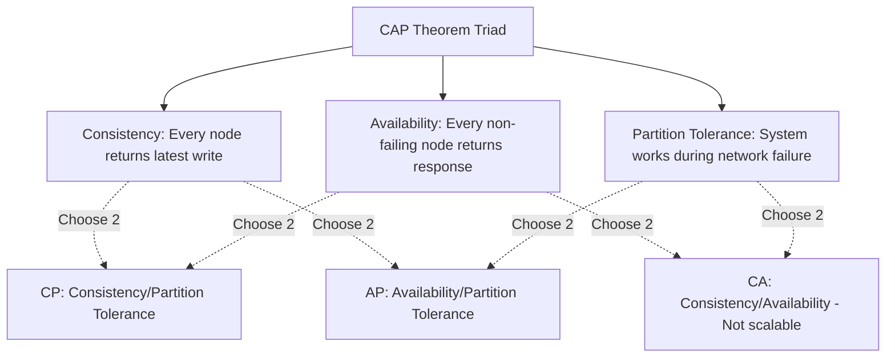

# NoSQL Databases in Backend Architectures

NoSQL (Not Only SQL) databases are non-relational storage engines designed for high scalability, flexible schemas, and low-latency storage. They are ideal for unstructured data and horizontal scaling.

<ProgressTracker currentSection=1 totalSections=4 />

## Installation & Downloads

To install MongoDB Community Server:
1. Navigate to the [Official MongoDB Community Server Download Page](https://www.mongodb.com/try/download/community).
2. Select your version, platform (e.g. Windows), package (MSI), and click **Download**.
3. Run the installer and **be sure to check "Install MongoDB as a Service"** so it runs in the background.
4. (Optional) Select "Install MongoDB Compass" during setup to install the official graphical interface for database querying.
5. Verify the installation by launching a command shell and running:
   ```bash
   mongod --version
   ```

### Official Download Portal


---

<ProgressTracker currentSection=2 totalSections=4 />

## 1. The CAP Theorem



### Explanation:
In a distributed network, a partition (network split) will eventually occur. Therefore, database systems must choose between:
* **Consistency (CP)**: Lock down writes/reads on isolated nodes to guarantee identical data states across the network, sacrificing availability.
* **Availability (AP)**: Return the local data version immediately from any accessible node, sacrificing real-time consistency (Eventual Consistency).

---

<ProgressTracker currentSection=3 totalSections=4 />

## 2. Document Stores (MongoDB)

MongoDB stores data as JSON-like documents (BSON) grouped into **collections** rather than tables.

### Code Demonstration: Document Structure
```json
{
  "_id": "60c72b2f9b1d8a23d888f011",
  "name": "Generic API Item",
  "description": "Unstructured resource metadata",
  "group": {
    "name": "General Analytics",
    "section": "Standard"
  },
  "tags": ["cloud", "serverless", "fastapi"],
  "attributes": [
    { "key": "size", "value": "large" },
    { "key": "weight", "value": 150 }
  ]
}
```

### Code Demonstration: Querying using Mongoose/Node.js
<Tabs>
  <Tab label="Syntax & Example">

```javascript
const mongoose = require('mongoose');

const itemSchema = new mongoose.Schema({
  name: { type: String, required: true },
  description: String,
  tags: [String],
  createdAt: { type: Date, default: Date.now }
});

const Item = mongoose.model('Item', itemSchema);

async function findCloudItems() {
  // Query all documents containing 'cloud' in the tags array
  const items = await Item.find({ tags: 'cloud' }).exec();
  return items;
}
```

  </Tab>
  <Tab label="Interactive Playground">
    <InteractiveExample 
      language="javascript"
      initialCode="const mongoose = require('mongoose');\n\nconst itemSchema = new mongoose.Schema({\n  name: { type: String, required: true },\n  description: String,\n  tags: [String],\n  createdAt: { type: Date, default: Date.now }\n});\n\nconst Item = mongoose.model('Item', itemSchema);\n\nasync function findCloudItems() {\n  // Query all documents containing 'cloud' in the tags array\n  const items = await Item.find({ tags: 'cloud' }).exec();\n  return items;\n}" 
      instruction="Execute and edit this JAVASCRIPT example."
    />
  </Tab>
</Tabs>

---

<ProgressTracker currentSection=4 totalSections=4 />

## 3. Best Practices
* **Avoid Joins**: NoSQL databases do not support high-performance relation joins. Embed sub-documents directly if the child data is uniquely owned by the parent document.
* **Use for Write-Heavy Loads**: NoSQL databases excel at write throughput and horizontal scaling compared to relational systems.

---

### Knowledge Verification Check

<Quiz 
  question="What is the primary characteristic of key-value stores like Redis?" 
  options=["They store data in relational schemas with strict tables.", "They store records in-memory, mapping keys to values for sub-millisecond retrieval speeds.", "They compile code snippets to native binaries.", "They require GraphQL to access properties."] 
  answerIndex=1 
  explanation="Redis stores key-value pairs in memory, which allows it to act as an extremely fast cache, session store, or queue." 
/>

<Quiz 
  question="How are records represented and structured in a document database like MongoDB?" 
  options=["As rows in contiguous tables.", "As JSON-like documents (internally serialized as BSON) with dynamic schemas.", "As nodes and edge relationships.", "As key-value byte strings only."] 
  answerIndex=1 
  explanation="MongoDB is a document-oriented database. It stores records as BSON (Binary JSON) documents, letting applications persist nested object structures directly." 
/>

<Quiz 
  question="According to the CAP Theorem, which two properties must a distributed database choose between in the event of a Network Partition (P)?" 
  options=["Security vs Performance.", "Consistency (C) vs Availability (A).", "Scalability vs Relational Integrity.", "Replication vs Indexing."] 
  answerIndex=1 
  explanation="The CAP theorem states that a distributed system cannot simultaneously guarantee Consistency, Availability, and Partition Tolerance. Under network partitions, it must trade consistency for availability, or vice versa." 
/>

<Quiz 
  question="Which cache eviction policy removes the least recently accessed items first when memory limit is reached?" 
  options=["LFU (Least Frequently Used)", "LRU (Least Recently Used)", "FIFO (First In First Out)", "TTL (Time To Live)"] 
  answerIndex=1 
  explanation="Least Recently Used (LRU) evicts the key that has not been accessed for the longest duration, optimizing cache retention for temporal locality." 
/>

<Quiz 
  question="Why is denormalization commonly practiced in NoSQL database design?" 
  options=["To enforce strict SQL constraints.", "To optimize read performance by storing related data together, avoiding expensive runtime join operations across tables.", "To decrease disk space consumption.", "To make databases ACID-compliant."] 
  answerIndex=1 
  explanation="NoSQL databases generally lack relational join features. Denormalization repeats data in single documents to allow fast, single-query reads." 
/>

<Quiz 
  question="What are the two primary persistence options provided by Redis to survive restarts?" 
  options=["SQL replication and JSON dumps.", "RDB (snapshotting at intervals) and AOF (logging write commands to an append-only file).", "Direct memory allocation and swap files.", "B-Tree index logging and caching."] 
  answerIndex=1 
  explanation="Redis provides durability through RDB snapshots (point-in-time state dumps) and AOF logs (recording every write transaction as it happens)." 
/>

<Quiz 
  question="What is the role of MongoDB replica sets?" 
  options=["To split collections into separate shard keys.", "To provide high availability and automatic failover by replicating data across primary and secondary nodes.", "To speed up local memory reads by caching records.", "To compile database functions."] 
  answerIndex=1 
  explanation="Replica sets consist of a primary node (handling writes) and secondary nodes replicating data. If primary fails, secondary nodes hold an election to promote a new primary." 
/>

<Quiz 
  question="How does Consistent Hashing benefit distributed caching clusters?" 
  options=["It encrypts hash values for data security.", "It minimizes the reshuffling of cached keys when cache nodes are added or removed from the cluster.", "It compiles string keys to integer keys.", "It distributes data evenly to one single primary node."] 
  answerIndex=1 
  explanation="Consistent hashing maps cache nodes and keys to a logical ring. Adding or removing a node only impacts a fraction of keys (K/N), preventing massive cache misses." 
/>

<Quiz 
  question="What is the difference between Cache Avalanche and Cache Breakdown?" 
  options=["Avalanche is caused by database server crashes; Breakdown is client side.", "Cache Avalanche occurs when many keys expire simultaneously, flooding the database; Cache Breakdown is when a single popular hot key expires, causing concurrent DB queries.", "They are identical terms.", "Breakdown is caused by network timeouts."] 
  answerIndex=1 
  explanation="Avalanche happens when massive key expirations send concurrent spikes to databases. Breakdown (or cache stampede) is target-focused: a single hot key expires, causing concurrent database reads." 
/>

<Quiz 
  question="What defines the data model of a Graph Database (like Neo4j)?" 
  options=["Key-value string blobs.", "Nodes (entities), Edges (relationships), and Properties (key-value attributes on nodes/edges).", "Tabular records organized in rows.", "JSON documents stored inside buckets."] 
  answerIndex=1 
  explanation="Graph databases use the Property Graph model. Entities are represented as nodes, and their connections as edges, allowing fast traversal of complex relations." 
/>

<Quiz 
  question="Which NoSQL wide-column database uses keyspaces and column families to scale horizontally across multi-master nodes?" 
  options=["MongoDB", "Redis", "Apache Cassandra", "SQLite"] 
  answerIndex=2 
  explanation="Cassandra is a distributed wide-column store designed for high-availability write workloads, utilizing partitioning keys and ring topologies." 
/>

<Quiz 
  question="What is the difference between Write-through and Write-back caching strategies?" 
  options=["Write-through is slower because it writes to cache and database synchronously; Write-back writes to cache and updates the database asynchronously.", "Write-through is for NoSQL; Write-back is for SQL databases.", "Write-back deletes keys automatically.", "Write-through bypasses the cache entirely."] 
  answerIndex=0 
  explanation="Write-through updates both cache and DB immediately, avoiding stale data but adding write latency. Write-back updates cache and returns, queueing DB updates for background processing." 
/>
