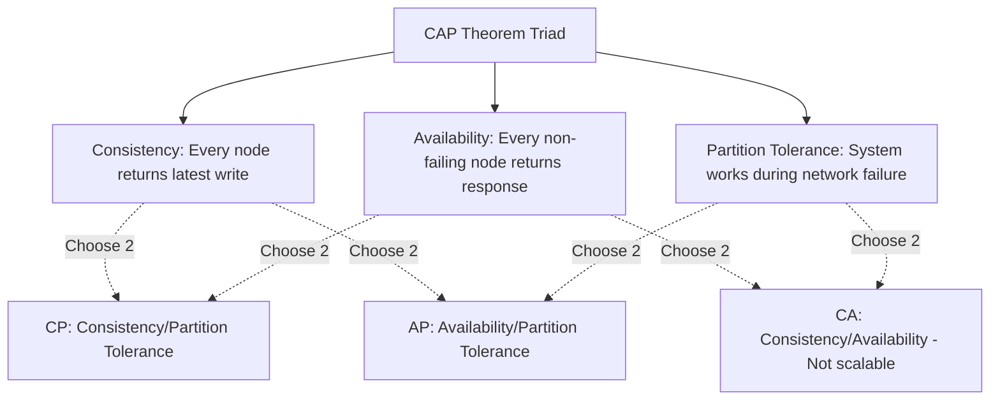

# NoSQL Databases in Backend Architectures

NoSQL (Not Only SQL) databases are non-relational storage engines designed for high scalability, flexible schemas, and low-latency storage. They are ideal for unstructured data and horizontal scaling.

## Installation & Downloads

To install MongoDB Community Server:
1. Navigate to the [Official MongoDB Community Server Download Page](https://www.mongodb.com/try/download/community).
2. Select your version, platform (e.g. Windows), package (MSI), and click **Download**.
3. Run the installer and **be sure to check "Install MongoDB as a Service"** so it runs in the background.
4. (Optional) Select "Install MongoDB Compass" during setup to install the official graphical interface for database querying.
5. Verify the installation by launching a command shell and running:
   ```bash
   mongod --version
   ```

### Official Download Portal


---

## 1. The CAP Theorem



### Explanation:
In a distributed network, a partition (network split) will eventually occur. Therefore, database systems must choose between:
* **Consistency (CP)**: Lock down writes/reads on isolated nodes to guarantee identical data states across the network, sacrificing availability.
* **Availability (AP)**: Return the local data version immediately from any accessible node, sacrificing real-time consistency (Eventual Consistency).

---

## 2. Document Stores (MongoDB)

MongoDB stores data as JSON-like documents (BSON) grouped into **collections** rather than tables.

### Code Demonstration: Document Structure
```json
{
  "_id": "60c72b2f9b1d8a23d888f011",
  "name": "Generic API Item",
  "description": "Unstructured resource metadata",
  "group": {
    "name": "General Analytics",
    "section": "Standard"
  },
  "tags": ["cloud", "serverless", "fastapi"],
  "attributes": [
    { "key": "size", "value": "large" },
    { "key": "weight", "value": 150 }
  ]
}
```

### Code Demonstration: Querying using Mongoose/Node.js
```javascript
const mongoose = require('mongoose');

const itemSchema = new mongoose.Schema({
  name: { type: String, required: true },
  description: String,
  tags: [String],
  createdAt: { type: Date, default: Date.now }
});

const Item = mongoose.model('Item', itemSchema);

async function findCloudItems() {
  // Query all documents containing 'cloud' in the tags array
  const items = await Item.find({ tags: 'cloud' }).exec();
  return items;
}
```

---

## 3. Best Practices
* **Avoid Joins**: NoSQL databases do not support high-performance relation joins. Embed sub-documents directly if the child data is uniquely owned by the parent document.
* **Use for Write-Heavy Loads**: NoSQL databases excel at write throughput and horizontal scaling compared to relational systems.
